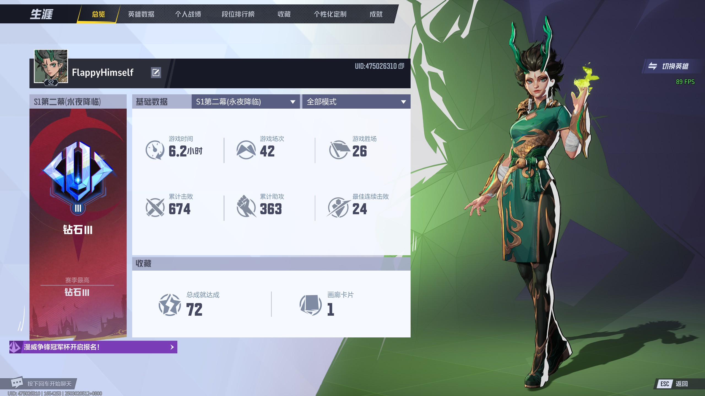

## 1.10 我不是无敌的 -- 得了一个慢性病。
从1.10开始，自己察觉到自己每天醒过来肚子都有点不舒服。一开始是便秘，后来便秘好了，就一直留下了左下腹的隐痛。因为这个去了不少次医院，胃镜也做了，都没查出是啥原因来，这种隐性的病因就很蛋疼，因为你会有'治不好'的不安感相伴。

借此思考了不少事情。

1. 第一次感觉到无力感。其实之前我一直是竞争欲望比较强烈的，总是幻想着来了这里总要赚很多的钱回去装逼。而现在我感觉因为这种病我感觉到了一种**无力感**，在朋友的照料下我才好受一些，我衷心认为有一个由爱而不是利益搭建起来的地方是非常美好的。

2. 因为得了这个慢性病我逐渐地关注到我生活中的**每个组成部分**都是很重要的，万事都不能强求。大三之前都是每天尝试压榨自己，照着csdiy上面的自己学，学校就正常去，闲的时候就玩会竞技游戏麻木自己。虽然这几乎都是我想做的事情，但是我觉得太过于单一无趣了，一些非常简单但是又至关重要的事情被我忽略了 -- 睡眠时间，一点点的社交，晒太阳的习惯，和朋友聊天，这些都被我忽略了，这些其实也是我的财产。因此养成了不间断的听健康/医疗相关播客的习惯。

## 2.10 使用工具是灵感的来源
很多工具其实承载了很多的思想。比如编程语言。

## 2.11 小事可以借用一些外部力量完成，大事则不行。
小时候，我特别不喜欢干的一件事情就是蒙题目。除了大考，小考试我遇到模棱两可的题目一般我都直接选错的，这样我就借助了“订正”的时机，搞懂了我不会的一个点。其实很多小事都是可以用外部力量来督促自己的。一些很小的习惯可以这样养成，比如报一个班，指定一个计划贴在墙上，找室友督促等等。

但是**大事情不行**。年初的时候开了一些研究生课给本科生，我直接连选了三节课，但是最近因为一门课workload太大退了，遂深刻意识到了选了课 != 真正投入时间吸收消化这门课，作出选择和实践选择中间是有非常大的鸿沟的。以此明示自己要认清自己的能力选择最适合自己的能力的事情，不要尝试去做自己做不到的事情 -- 比如说选一个自己会被卷四的学校，以及自己会被卷四的职业。人生的节奏还是适合自己最好，稳步前进才是最重要的。

## 3.01 一些杂碎：
上了钻石。

看了几部电影。

哪吒2。政治隐喻是有但是整体脉络挺糟糕的。

1. 就一些伏笔很突兀 -- 比如小豹给申公豹报信的煽情/比如三太子一开始刚做好就想着牺牲自己，我都觉得 -- “有这个必要吗？”。
2. 一些设定很纳粹。比如一开始哪吒和三太子肃清土拨鼠的时候, 土拨鼠也很可爱好吗！
3. 哪吒/三太子纯纯的脑残人设，被仙庭指哪打哪。很像法国大革命闹着玩的童子兵形象，无知又无力，放现实里大概率是坏虫。

特效很棒。剧组美术非常用心。

收获：
1. 教育是循序渐进的。少年是需要空间的/需要培养的。
2. 少看只有特效的商业片。对特效已经无感了，更加对更深的文艺作品感兴趣。

窗边的小豆豆。反战片/宣扬peace and love。给7/10吧。

听很多朋友都说这是小时候必读书。但我之前是没有看过书的，很新奇。

全片聚焦在小豆豆从战时到战后的生活变化。她在转校途中遇到了一个好朋友小男孩，一个爱孩子热爱教育的校长，和一群其他可爱的孩子们。

整体基调像波浪一样，时起时落，就像在看小说的每一篇的感觉一样，像喝茶。小豆豆和小男孩的故事其实挺触动的，作者挺用心的还原了很多只有小孩子之间才会注意到的细节，特别喜欢小豆豆这个角色。（不愧是贵族式教育出来的小朋友）爹妈三观也正。

但是可能是预先知道这个是反战片的原因，对反战的宣传给我一种无病呻吟的感觉。片中即使小豆豆的家境从阔绰到因为父亲拒绝乐团对战争宣传的邀请而家道中落。这很惨，但是这也许只是地狱的门口吧。当时的中国可是地狱十八层啊！因为我生在中国，我的太奶奶经历过抗日战争，她跟我说过鬼子来临之时的恐惧至今都记得，以及从小就被教育要时刻反抗的氛围中，我实在是无法去感同身受当时的日本。

但是是，所有平民都是牺牲品，这就是傻逼的现实。

如果是为了铭记历史，我真的觉得应该多去理解真正的历史而不是通过电影去揣测，多多去感同身受历史书上的内容，我认为现实往往比电影玄幻露骨得多。Same for 一些网传的流言蜚语，多去一个国家感受真正发生的事情而不是通过media去猜测。

## 3.15 community决定了很多
"近朱者赤，近墨者黑。"

比这句谚语更加broad的语义是你所在的社群决定了你是什么人，你是什么人也决定了你的社群。

首先我认为社群没有**好坏**之分。

比如说明星。从小我对明星都没什么感觉，但是我对追星族非常厌恶 -- 我非常不能理解这份狂热，以至于我产生了歧视，排挤的心态，直到有一天我发现我的热爱也被一个大环境狠狠歧视了 -- 会思考，会做数学的人不再是一个大环境接受的群体的时候，我发现人的热爱其实是没有好坏之分的，只有被接受和不被接受的区别，我就开始变得包容起来，我开始变得理解很多人，现在我只对那些对别人不说理由就直接杠的人/不成文的理由直接开喷的喷子抱有敌意。

但是即使社群没有好坏之分，我认为还是对自己的性格要抱有清晰的认知，对已有的社群保持感恩的心态，不要硬融入相性不一的社群。经过这么多我还是发现我是一个彻彻底底的i人，我对超出我熟悉圈子（爱好相同的人，服务业的陌生人）以外的社交都是保有一种‘付出’的态度去面对的，我不是不能做这种社交，我只是感觉极端无聊、浪费时间。

不过我感觉时间会慢慢改变这些不相容的东西，最后趋于平衡的社会环境，特别是我接触的人大多数都是20出头的人，涉世未深而且性格相对未固化，思维茧房的搭建（我认为所有人都会）会让社群更加固定。