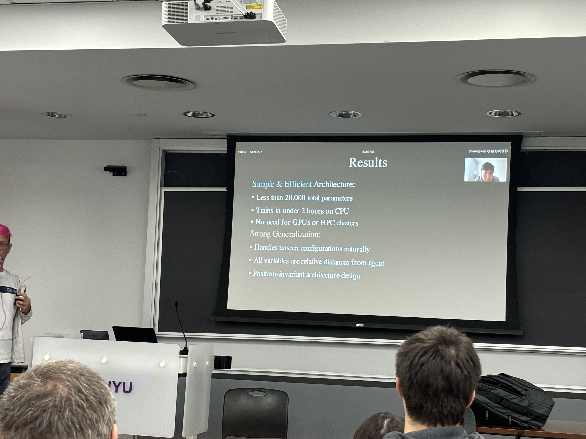

## 1.10 我不是无敌的 -- 得了一个慢性病。
从1.10开始，自己察觉到自己每天醒过来肚子都有点不舒服。一开始是便秘，后来便秘好了，就一直留下了左下腹的隐痛。因为这个去了不少次医院，肠胃镜也做了，都没查出是啥原因来，这种隐性的病因就很蛋疼，因为这个我一直有'治不好'的不安感相伴。

借此思考了不少事情。

1. 第一次感觉到比较深的无力感。其实之前我一直是竞争欲望比较强烈的，总是想着能在这里成就一番事业。而现在我感觉因为这种病我感觉到了一种**无力感** -- 每次想要专注着学习一些材料还是要跟朋友吃吃饭啥的都感觉有些力不从心的感觉，非常无力。

总有一天我会人老珠黄，总有一天我的大脑都不会那么活跃。做好这种准备 -- 不论是心理准备还是物理准备（健康习惯，一个爱你的伴侣，健康的财务状况等等）。同时我衷心认为有一个由爱搭建起来的地方是非常重要的。

2. 因为得了这个慢性病我逐渐地关注到我生活中的**每个组成部分**都是很重要的，比如说睡眠时间，一点点的社交，晒太阳的习惯，和朋友聊天。这些都是可以持续的生活方式，然而**坚持**和**纵欲**都是不可持续的。大三之前都是每天尝试压榨自己，每天尝试让自己多学一点是一点，学校就正常去，闲的时候就玩会竞技游戏麻木自己。这太过于单一无趣了。

3. 健康第一。养成了不间断的听健康/医疗相关播客的习惯。

## 2.11 小事可以借用一些外部力量完成，大事则不行。
小时候，我特别不喜欢干的一件事情就是蒙题目。除了大考，小考试我遇到模棱两可的题目一般我都直接选错的，这样我就借助了“订正”的时机，搞懂了我不会的一个点。其实很多小事都是可以用外部力量来督促自己的。一些很小的习惯可以这样养成，比如报一个班，指定一个计划贴在墙上，找室友督促等等。

但是**大事情不行**。年初的时候开了一些研究生课给本科生，我直接连选了三节课，但是最近因为一门课workload太大退了，遂深刻意识到了选了课 != 真正投入时间吸收消化这门课，作出选择和实践选择中间是有非常大的鸿沟的。以此明示自己要认清自己的能力选择最适合自己的能力的事情，不要尝试去做自己做不到的事情 -- 比如说选一个自己会被卷四的学校，以及自己会被卷四的职业。人生的节奏还是适合自己最好，稳步前进才是最重要的。

## 3.01 一些杂碎：
看了几部电影。

哪吒2。顶配爆米花电影。

除了
1. 一些伏笔突兀 -- 比如小豹给申公豹报信的煽情/比如三太子一开始刚做好就想着牺牲自己，我都觉得 -- “有这个必要吗？”

2. （个人看法）哪吒/三太子纯纯的脑残人设，被仙庭指哪打哪。很像法国大革命闹着玩的童子兵形象，无知又无力，放现实里大概率是坏虫。

其他我都很喜欢，同时剧组美术非常用心。

个人感觉：少看只有特效的商业片，对特效已经几乎无感了。

窗边的小豆豆。反战片/宣扬peace and love。给7/10吧。

听很多朋友都说这是小时候必读书。但我之前是没有看过书的，很新奇。

全片聚焦在小豆豆从战时到战后的生活变化。她在转校途中遇到了一个好朋友小男孩，一个爱孩子热爱教育的校长，和一群其他可爱的孩子们。

整体基调像波浪一样，时起时落，就像在看小说的每一篇的感觉一样，像喝茶。小豆豆和小男孩的故事其实挺触动的，作者挺用心的还原了很多只有小孩子之间才会注意到的细节，特别喜欢小豆豆这个角色。（不愧是贵族式教育出来的小朋友）爹妈三观也正。

但是可能是预先知道这个是反战片的原因，对反战的宣传给我一种无病呻吟的感觉。片中即使小豆豆的家境从阔绰到因为父亲拒绝乐团对战争宣传的邀请而家道中落。这很惨，但是这也许只是地狱的门口吧，相比之下，当时的中国可是地狱十八层。我还记得我太奶奶（她经历过抗日战争），她跟我清晰地说过鬼子来临之时的心里的恐惧；以及我从小就被教育要时刻反抗侵华日军，我实在是无法去感同身受当时的日本。

但是，排去上面这些我的主观想法。**所有平民都是牺牲品**，这是傻逼的现实。

如果是为了铭记历史，我真的觉得应该多去理解真正的历史而不是通过电影去揣测，多多去感同身受历史书上的内容，我认为现实往往比电影玄幻露骨得多。Same for 一些网传的流言蜚语，多去一个国家感受真正发生的事情而不是通过media去猜测。

## 3.15 community决定了很多
> 近朱者赤，近墨者黑。

比这句谚语更加broad的语义是你所在的社群决定了你是什么人，你是什么人也决定了你的社群。

首先我认为社群没有**好坏**之分。

比如说追星族。从小我对明星都没什么感觉，但是我对追星族非常厌恶 -- 我非常不能理解这份狂热，以至于我产生了歧视，排挤的心态。直到有一天我发现人的热爱其实是没有好坏之分的，不论你是运动还是做题，二次元死宅还是追星族，喜欢赚钱还是超脱世俗，这些爱好只有被接受和不被接受的区别，我就开始变得包容起来，我开始变得理解很多人，现在我只对那些对别人不说理由就直接杠的人/不成文的理由直接开喷的喷子抱有敌意。

尤其是进入大学之后我感觉接触的人的性格五花八门，外向/内向, 自信/自卑, 能包容/无脑歧视，并且歧视和不歧视的很多。但是即使社群没有好坏之分，我认为还是对自己的性格要抱有清晰的认知，对已有的社群保持感恩的心态，不要硬融入相性不一的社群。经过这么多我还是发现我是一个对超出我熟悉圈子（爱好相同的人，服务业的陌生人）以外的社交都是保有一种‘付出’的态度去面对的，我不是不能做这种社交，我只是感觉极端无聊、浪费时间。

不过我感觉时间会慢慢改变这些不相容的东西，最后趋于平衡的社会环境，那些相性不一的社交元素会渐渐的离你而去。特别是我接触的人大多数都是20出头的人，涉世未深而且性格相对未固化，思维茧房的搭建（我认为所有人都会）会让社群更加固定。我认为这和找对象也挺一致的，找一个爱你的相性一致的人很重要。

## 5.14 探索的收获
这个学期的课程都结束了，回顾一下这个学期的课程。

### 上课
Deep Learning -- Alfredo交，Lecun客串了4节，我觉得这节课更多的是Lecun自己的思想的介绍，包括Energy Model，World Model等等。这节课是pytorch intensive，几乎不会涉及原理，包括对算子的推导（只有第一个作业有手推），更多的是直觉的培养。最后的一个作业是训练一个world model。

ODE，数学课，老师教的偏原理但是考的还是挺简单的，包括Uniqueness theorm都会在课上简易证明，书是bruan的那本。前半部分的证明我都仔细看了。到了ode的部分发现没有分析证明的基础感觉就啃不动了，不得不说数学证明是门手艺活，是要时间去证明的。上完课个人感觉自己进化了，感觉和看完《CSAPP》的时候一样，但是学deep learning的时候却没这种感觉。

中间再上编译器的，太累了给quit了换了一堆水课。之后因为不上编译器，闲下来把不少对Deep Learning的问题思考了一下，上了一下CSE234 MLsys，UCSD的张昊老师开的，刚考完现在在搓第一个pa，一个简易的autodiff。之前也想过要不要梭哈一下all in 这个领域去做所谓research。（现在知道了，it is all about matmul）现在想想我当时的心态真的很投机，也真的很天真，在完全不知道这个领域干嘛的时候就对他产生不切实际的幻想

另外还是在当OS的TA + grader，第一次感受到重复劳动的疲惫感。。。也许这就是phd常态吧，学习怎么deal这些杂事也是生活的一部分。

### 关于DL

从寒假的231n就开始感兴趣到现在，这学期炼了不少丹。我依然认为连结主义NN-based model有很大的潜力。他能把很多信息压缩在高维空间里面。这一路上风景不少，传统encoder，autoregressive，LM，LLM，不过令我impression最深的还是最初最初知道有NN这个东西能够解决XOR问题，写的(softmax/mlp/batchnorm/selfattention...)fused layer,能past test的时候。一开始我可能专注于跑出成果了，会想起搓最后的final project的时候，我和bro干的最多的一件事情就是对World Model的Encoder和Predictor死磕，但是却对这个庞大的机器没有一个正确的认识。

中间我们只是不断地炼，拼了老命地去炼（排列组合），效果有时候会好，但是很容易就陷入瓶颈，之后换用更大的就能解决问题但这个本质都是cheating。(https://www.zhihu.com/question/347847220/answer/26536819499)

最后竞赛结果打击挺大的，

因为task过于简单，第一名是一个20000参数的模型。（就能把这个简单的task拟合的非常好，我就知道dl更值得关注的还是背后的数学/对算法的直觉理解，而不是仅仅简单的叠了几层pytorch跑通了就行，要在丹方中思考，实验，再回头佐证自己的结论。

那么冷静一下，现在对DL的主流算法基本了解了，下一步干什么呢？

**左手前沿，右手经典。** 前沿其实就是在一个很深的地方dig很深，举了例子就是dl练一个minecraftai挖出钻石，做这些就是为了兴趣，也为了找研究方向。（现在对DL对PCG的应用挺感兴趣的）经典就是数学和system的课，这是原材料，这是练功。
- 继续学DL，数学和跑实验，实验过程中多可视化/多玩/多思考。反复盯着DL的slides肯定是没卵子用，真正有用的是经验，经验是在实验中千锤百炼出来的。 
- 开图，多写精炼的好代码，而不是写一些简单的脚本。学习现成的，半衰期长的技术（Arch/PL/OS），最近还挺感兴趣，也珍惜本科这段能自由自学的时光。（https://zhuanlan.zhihu.com/p/84927997) 另一方面的考虑是，那些往往真的要你从零到一去搓出一个能够影响世界的东东的时候，最重要的就是你的工程思维，比如alexnet，比如carmack的引擎等等，他们都是凭空搓出来的，需要的就是工程经验。

我还是认为做难/新意intensive的工作是最好的。这个难度最简单的衡量尺度就是，那你身边的同事思考一下，如果他都能写出来，为什么你还要从事这份工作呢？从零到一的工作永远是很难的，累的时候不妨就想想geoffery的故事吧。