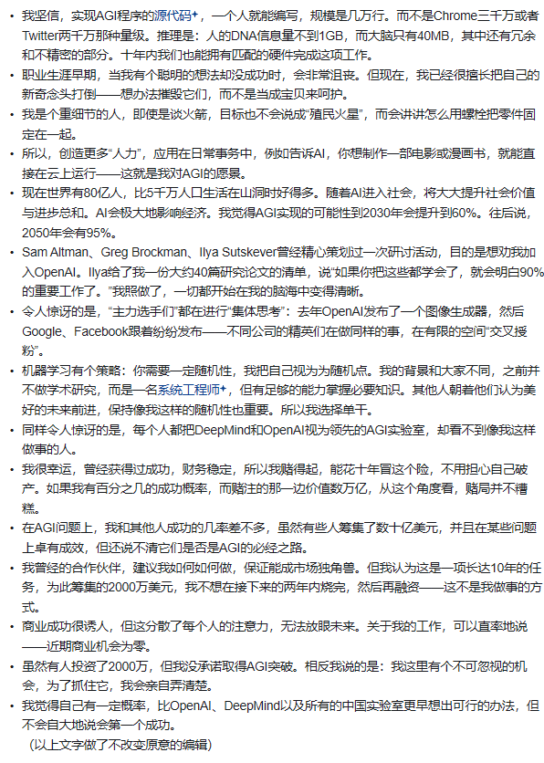

## 一些小建议

### Assignment 1 完结
* 看笔记就足够了，然后直接写作业
* 刚刚上手一门新课的时候写cheatsheet挺有用的，遇到新的东西立刻要用的话 -- 写下来比潦草看一遍进脑子有效多了，别看这方法笨，手动的快一点其实速度不差的。当然，到信手拈来的时候就没记录必要了，但是一开始学是有必要的，我脑子笨。如果要长期写某项语言，最好还是多用。 
* chatbot是好帮手，但也仅仅是好帮手了。一开始对一个项目是什么都不了解的时候，比如一开始KNN的dataload和数据的dimension我就一点都没概念。直接上手放gpt里，一行一行读，gpt不详细的就google，然后写cheatsheet，这样效率非常高。
* 然后写代码的时候也多多以矩阵思维思考，写代码的时候先考虑能不能先broadcast。比如这种的`dscores = probs; dscores[range(num_examples),y] -= 1; dscores /= num_examples`，how to vectorize calculation？see this: https://cs231n.stanford.edu/vecDerivs.pdf
* 手算softmax loss导的时候挺struggle的（虽然结果很简洁），估计之后也有不少，可以看下知乎上的`矩阵求导术`。

保姆级！

整个课程的流程从architecture(svm/softmax loss到gradient到network forward/backward，到最后用这些积木搭建一个简化的NN)的设计，到设计优化过程（sgd, validation set来tune超参），然后对这些步骤逐步模块化(从全部塞在notebook里，到, 塞进layers.py然后用layer的积木搭fc_net/ 到最后的solver.py / optim.py的调参炼丹术，并且彻底模块化)的过程都让我这个新手感觉非常保姆，因为这节课也是工程导向的，我认为设计得非常的好。

### Assignment 2 完结
* 看笔记就足够了，然后直接写作业
* 作业有很多子模块。对于正确性的测试都是课程方有一个绝对正确的版本。这也给了不少之后自己写算法的时候尽量模块化，不是为了美观，而是为了方便测试，循序渐进。
* 炼丹（优化hyperparam）中循序渐进的例子。优化的时候一般一开始都是epoch非常小确保正确性和速度之后再调回来，先确保模块正确再优化，这是可以应用在所有代码实践中的基本素质。
* 有了assignment1的基础之后，实现非常简单，大部分代码甚至可以在lecture notes里找到。我认为assignment2的重心在于大规模实验中理解paper的insight。而我感觉这节课也是花了很多时间培养这些insight的，加了bn,dropout之后的实验observation，大量观察所带来的认知基础是非常有价值，很像做物理实验的赶脚。
* 除了实验部分很喜欢之外，我认为最有趣的部分是自己手写batch normalization图和在纸上复现那些算子的时候。

### Assignment 3 完结
到了这部分就是离最research最近的部分了，大多数都和Net架构有关。
* 还是以作业/读代码/自我思考/看paper为主。lecture可以当小品看（让我记得最牢的是一个学生问怎么想出LSTM这种架构，justin说“这就是research” xswl）别人讲的记得不牢。
* 多在纸上画图。RNN一开始我非常不理解，但是画下来一切就在脑海中浮现出来了。以此看来记下东西的确学的更深，大脑的存储更加persistent。
    * 我感觉很多论文intuition来自对gradient flow的感知，比如LSTM和resnet的“highway”架构就解决了gradient爆炸和gradient消失的问题，而没有观察是很难“感受”到这些问题的。多多观察计算图。

#### Transformer
大部分参考的这个,transformer: https://jalammar.github.io/illustrated-transformer/
* 最好还是先学下NLP，熟悉下wordvec这些概念，一开始的word_to_idx,vocab_size,word_size搞得我头昏眼花的，
* 遇到常数差异的方程不要用for loop，多用broadcast功能来简化。
``` python 
div_term = torch.exp(torch.arange(0, embed_dim, 2) * (-torch.log(torch.tensor(10000.0).reshape(1, 1)) / embed_dim))
pe[0, :, 0::2] = torch.sin(position * div_term)  # Even dimensions
pe[0, :, 1::2] = torch.cos(position * div_term)  # Odd dimensions
```
* 这作业开始就没手动backpropagation要求了，全是pytorch实现了，我还愣了一下。虽然课程没有要求实现，但是个人觉得收获最大的在于看transformer和它的solver的实现有很多案例学习.

decoder的forward实现
``` python
class TransformerDecoderLayer(nn.Module):
    """
    A single layer of a Transformer decoder, to be used with TransformerDecoder.
    """
    def __init__(self, input_dim, num_heads, dim_feedforward=2048, dropout=0.1):
        """
        Construct a TransformerDecoderLayer instance.

        Inputs:
         - input_dim: Number of expected features in the input.
         - num_heads: Number of attention heads
         - dim_feedforward: Dimension of the feedforward network model.
         - dropout: The dropout value.
        """
        super().__init__()
        self.self_attn = MultiHeadAttention(input_dim, num_heads, dropout)
        self.multihead_attn = MultiHeadAttention(input_dim, num_heads, dropout)
        self.linear1 = nn.Linear(input_dim, dim_feedforward)
        self.dropout = nn.Dropout(dropout)
        self.linear2 = nn.Linear(dim_feedforward, input_dim)

        self.norm1 = nn.LayerNorm(input_dim)
        self.norm2 = nn.LayerNorm(input_dim)
        self.norm3 = nn.LayerNorm(input_dim)
        self.dropout1 = nn.Dropout(dropout)
        self.dropout2 = nn.Dropout(dropout)
        self.dropout3 = nn.Dropout(dropout)

        self.activation = nn.ReLU()


    def forward(self, tgt, memory, tgt_mask=None):
        """
        Pass the inputs (and mask) through the decoder layer.

        Inputs:
        - tgt: the sequence to the decoder layer, of shape (N, T, W)
        - memory: the sequence from the last layer of the encoder, of shape (N, S, D)
        - tgt_mask: the parts of the target sequence to mask, of shape (T, T)

        Returns:
        - out: the Transformer features, of shape (N, T, W)
        """
        # Perform self-attention on the target sequence (along with dropout and
        # layer norm).
        tgt2 = self.self_attn(query=tgt, key=tgt, value=tgt, attn_mask=tgt_mask)
        tgt = tgt + self.dropout1(tgt2)
        tgt = self.norm1(tgt)

        # Attend to both the target sequence and the sequence from the last
        # encoder layer.
        tgt2 = self.multihead_attn(query=tgt, key=memory, value=memory)
        tgt = tgt + self.dropout2(tgt2)
        tgt = self.norm2(tgt)

        # Pass
        tgt2 = self.linear2(self.dropout(self.activation(self.linear1(tgt))))
        tgt = tgt + self.dropout3(tgt2)
        tgt = self.norm3(tgt)
        return tgt
 ```

以及他们怎么叠起来的。
``` python
class TransformerDecoder(nn.Module):
    def __init__(self, decoder_layer, num_layers):
        super().__init__()
        self.layers = clones(decoder_layer, num_layers)
        self.num_layers = num_layers

    def forward(self, tgt, memory, tgt_mask=None):
        output = tgt

        for mod in self.layers:
            output = mod(output, memory, tgt_mask=tgt_mask)

        return output
 ```

solver的使用：loss_history怎么管理，optim怎么用。。
``` python
def _step(self):
        """
        Make a single gradient update. This is called by train() and should not
        be called manually.
        """
        # Make a minibatch of training data
        minibatch = sample_coco_minibatch(
            self.data, batch_size=self.batch_size, split="train"
        )
        captions, features, urls = minibatch

        captions_in = captions[:, :-1]
        captions_out = captions[:, 1:]

        mask = captions_out != self.model._null

        t_features = torch.Tensor(features)
        t_captions_in = torch.LongTensor(captions_in)
        t_captions_out = torch.LongTensor(captions_out)
        t_mask = torch.LongTensor(mask)
        logits = self.model(t_features, t_captions_in)

        loss = self.transformer_temporal_softmax_loss(logits, t_captions_out, t_mask)
        self.loss_history.append(loss.detach().numpy())
        self.optim.zero_grad()
        loss.backward()
        self.optim.step()
 ```

#### GAN
课程的过于细节了，感觉参与感欠佳，遂知乎上找了一个dcgan for anime generation自己实现了一下。

dcgan for anime generation: 
github repo: https://github.com/FlappyBob/dcgan_anime

### 完结体验

log：除了最后的自监督学习之外没写，其他都完全写完了。slides没怎么看。除去休息日外大概花了两周左右吧。

设计的好的点：

* 整体难度曲线非常好，几乎是保姆级的入门dl。

again这门课的精华是前两个作业，在实现算子中理解最核心的back propagation是怎么work的，当然，也只是感性的认识。第三个作业和之后的lecture我纯当小品看了。

设计的不太好的点：
* 这门课对dataset触及不是很多，在assignment里面有但是，我认为dataset在监督学习的过程中占的比重是巨大的。在train dcgan的时候我是自己爬的图片，但是提取头像过后，仍然会有不少的pollution，会异常输入天狗族脸，有的猫猫也会输入进去，导致最后的输出图片的噪音还是很大。

最大的感受：
1. 训练这么多network之后最直观的感受还是dataset太重要了。作业都是完美的dataset，但是到了自己爬dataset的时候就花费了巨额的时间。而且工业界往往会非常多的人力和资源投入到pretraining中去。
2. NN training的paper insights还是以大量的实验和观察为基础的。不论是dropout, batchnorm，还是相对最新的transformer都是这样。
3. 更加深入的理解到了: machine learning是app/impact driven，理论是要给工程实践让路的。而实践是需要时间，和钱的。
4. colab有点屎。

最大的问题：
1. 整门课都是再调黑箱。无疑NN是一个非常好的发明，但是它究竟是怎么work的呢？
2. 真的需要对ai非常乐观吗？仅仅写一些toy让我对scaling law的成立还是没有非常“直观”的体验，最好是找一些初创ai公司实习一下。


感兴趣的dlc(tierN to tier0)?
1. 做完DCGAN之后发现自己对工程细节非常的菜，遂打kaggle。
2. 之后有空希望写下224N作业，复现一波。再学DCGAN的时候看到了https://github.com/carpedm20，挺inspire我的。
3. 之后学习? RL？自监督？