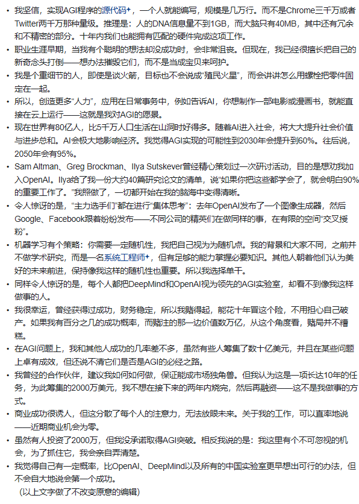

## 摸爬滚打的学习小tip
* 写cheatsheet挺有用的，遇到一个module想把它存到自己脑子的cache里，写下来比潦草看一遍有效多了，别看这方法笨，手动的快一点其实速度不差的。
* 如果要长期写某项语言，最好还是自己开个online terminal用下（数值计算课还真是大爹），当然，拿blog写个cheatsheet。 
* chatbot是好帮手。一开始对一个项目是什么都不了解的时候，比如一开始KNN的dataload和数据的dimension我就一点都没概念。直接上手放gpt里，一行一行读，gpt不详细的就google，然后写cheatsheet，这样效率非常高。
* 当然，到信手拈来的时候就没记录必要了，但是一开始学是有必要的，我脑子笨。
* 先在纸上演算再写代码。
* 然后写代码的时候也多多以矩阵思维思考，写代码的时候先考虑能不能先broadcast。比如这种的`accuracy = np.sum(y_val_pred == y_val_fold) / len(y_val_fold)`，要脱离一直写C的习惯。
* Evaluate on the test set only a single time, at the very end.

* 看笔记就足够了，然后直接写作业
* 笔记最后有精华
* how to vectorize calculation。see this: https://cs231n.stanford.edu/vecDerivs.pdf。
* 求gradient of loss的导的时候挺struggle的，看下知乎上的`矩阵求导术`。

### Assignment 1 体验
感觉就是专门为np新手设计的啊。。从fully for loop codes to vectorized codes的实现。做的过程中能很直观的理解为什么要写矩阵code（快）

整个课程的流程从architecture(svm/softmax loss到gradient到network forward/backward，到最后用这些积木搭建一个简化的NN)的设计，到设计优化过程（sgd, validation set来tune超参），然后对这些步骤逐步模块化(从全部塞在notebook里，到, 塞进layers.py/ 然后用layer的积木搭 fc_net/ 到最后的solver.py / optim.py)的过程都让我这个新手感觉非常保姆，因为这节课也是工程导向的，我认为设计得非常的好。

