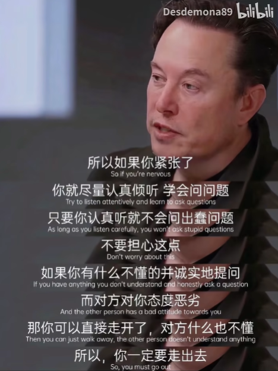

## 有关求职

今年花了不少时间求职的，从7月开始投简历投到10月份，大概投了150份左右，没收到过一个interview。

中间去了一个求职会。求职我是一直不太了解情况的，只是大概听过申请swe是什么“49年入国军”，“03年入dotcom”这种说法。于是这节求职会给我做了一些value alignment： 自己吹的牛逼真的是远远不够，link的人还远远不够

1. 自己的简历写的太垃圾了，连最基础的 STAR 模板都没有，之后得好好改改，HC 可能看到直接认为你不够 professional 直接扔进垃圾桶了。 
2. 经历不够 solid。课程 project 完全不够看好吗，research 能否多一些。。 
3. 政治太正确了。

虽然是一个盈利的求职机构，但是最后一段话给我感触蛮深的，那个主持人说：

> 你要把求职看作一段经历而不是一个目标。在人生中求职这件事情对大部分人来说都是主旋律。在这段旅途中你会认识不少不同性格的人，发生不少事情（coffeechat，meeting 等等），这些都是独一无二的回忆和经验。

然后又去了一些Event：

* JP morgan 的 event 来了个开源组组长，前面讲了一堆开源 licence 的东西有点杂，也没咋听懂，但是他 keynotes 用来结尾的话我记得蛮牢的，最近对我很有共鸣 -- Since you are young, whenever you meet a someone's invitation, **always say yes**. 我觉得确实，如果有好机会，不要管自己行不行，先上再说，之后再补。

其他大大小小的都去过了，没啥实质收获。

结论就是：**自己想要的太多了**。自己是 sde 就约 sde，research 就好好找 research，不要羡慕别人 analyst 的那一份。不属于自己的再追求也是浪费自己的时间。自己学校 research event可以多去，挺有意思！自己学校 research center和竞赛是一个良好的 filter！

所以过了这个求职会和events我其实大概放弃求职了，我认为现在这条路太正确了，我毕竟没有强到那些高中拿牌的神仙们，所以继续这条路有点自废自己武功。合理发展自己的兴趣，再领域认识大牛，合理的connection才是制胜的关键，所以最近一段时间一心research了。

<!-- ## 10.19 XUN真他妈牛逼

真的好久没有看到 xun 上场打比赛了。昨天一把真的打的太漂亮了。我感觉 blg 有点找到队伍作为一个整体的感觉了，而不是一直三路对线优赢游戏，越来越像韩国队打游戏了。

[英雄麦克疯](https://www.bilibili.com/video/BV1exCoYeE3T/?)

从我玩守望先锋竞技开始，我就一直喜欢玩那种能够一个人 c 全场的角色，谁不是呢 -- 源氏，麦克雷，铁拳，之后玩 r6 又是 ash，zofia，ace，尝试一个人把队伍里能做的事情全自己做了。但就是问题在于，这是一个团队游戏，你不能只考虑你自己。这就是团队游戏的魅力，个人能力固然重要，但是也得有军心，有 bp 各种东西混杂在一起的因素奠定胜局。（但是我自己已经弃坑了，玩这游戏血压太高）
 

我是一直粉 xun 子的 -- 我看到 xun 不爽的操作也喷；他的指挥有时候会过勇了，效果也不会好。但是我还是衷心希望 xun 子能越打越好，带队伍赢游戏。他操作不是世界第一，甚至在队内都是垫底的，但他绝对想队伍好而不是只想自己打出神操作的那种人 -- 我觉得他绝对是一个懂队友的好朋友。
  
 

这张照片真的是有点大圣那味**欢迎回来，大圣XUN。**

## 11/4 BLG 2:3 T1

我也粉 T1 的，恭喜 T1。但是还是特别特别难受，主要是因为 BLG 比分真的真的太接近了。

这次真的不一样。先说说左手，从 BLG 进世界赛的时候我还是甚至还是左手的黑粉，但是这次就像改变了人格一样变态。塞拉斯天神下凡，神挡杀神佛挡杀佛；一手加里奥实乃正义巨像本人，成为 BLG 最可靠的大山。XUN 子我也不说啥，一到世界赛就开始节奏带的飞起，一血率特高。（主要是会玩蝎子，英雄池match了）上下路除了 ON 都很稳，至少没有明显漏洞。这一路坎坷啊，斩了 G2 又是韩华，横扫自家 4 号种子，却棋差一着倒在了奖杯前，换谁都会失望吧。

S7 的时候我还没有看比赛，也许这就是当年皇族粉丝的感受吧。这种深深的绝望感，最后的一手加里奥反开真的是太伤了。Faker 真的是亲手拯救了 t1 这个家，这个男人是最大的责任神，这个游戏中永远的巨像。从 s3 到 s14，故事的开始是 faker，结尾还是他。也许这就是竞技体育的残酷吧。

BLG还是不要放弃，就跟 22 年的 T1 一样，重整旗鼓绝对有机会的。也许满怀期待的人们大多也都黯然神伤，但是我相信还远远没有绝望。虽然全网都骂你是吹j8，但是真的有人不希望你站出来吗？ -->

## 我，（大家）喜欢科研吗?

我不知道。因为我都没做过啊。

学期初到学期中期的时候感觉我和身边很多朋友都非常浮躁，所有身边的人几乎都急着进lab，做所谓'科研'，但是大多数甚至都没开始。

现在想想从导师的眼里估计蛮搞笑的，毕竟就像麻瓜进了霍格沃兹。因为大多数都是ai方向，大家其实心里都有数，知道nyu有meta背书这个方向资源不会差，会有大量的money流进来，你是个麻瓜，然后找一些传奇魔法师来攒发大的爆出来，但是你真的会魔法吗？你真的对魔法学感兴趣吗？

只是‘想攒发大的爆’出来，这是没有用的，因为你只是喜欢的是这个钱而不是真正的体会到了这些工作的美，也就是，**你没有梦想**，我最近深刻领悟到了这一点 --- **而没有梦想的人是做不好research的**。假如说你喜欢科研，自然会去读phd。但是如果你不喜欢，也会再读的时候自然的quit。

我要时时刻刻提醒自己：过好自己的每一天，每一天我都要尝试学习更多，因为不只是计算机，光光是机器学习还是分布式就可以给我喝好几壶的，潜心练功，找准喜欢的方向就行，尝试以一个研究者/客观的造物主的身份去关注一些课程而不是仅仅做输入。最重要的是**不要分心，认真的去做**。

 

在学期末的时候社交上回归到了大一的节奏了，只想和好朋友说说话。之前一段时间还挺想多多建立社交以此走上人生巅峰。我的评价是真的是中二病犯了，在米国这里又不是什么白二代官二代富二代，真心不如好好放心思在自己身上。

是看了这篇博客改观的。[现在的大学生是什么样子的呢?](https://www.zhihu.com/question/623983985/answer/11042537772)

一定要以问题为导向做research，为解决一个问题而兴奋是最好的mindset，而不是goal oriented，你一定要记住这一点。希望自己之后的work能有点impact吧。

## 3rd year fa的完结

我认为闲/放假的时候一定要多多开展兴趣，多元化丰富自己的生活不是说说的，不然很容易陷入一潭死水。即使是把学习换成游戏也缓解不了，一开始我以为我是不喜欢计算机了，后来我只是发现我实在是在这上面花的时间太多了而已，相当喜欢干的事情做多了也会变得特别无聊。这个时候去散散步&晒阳光/发发呆/跑步会好很多。

另外，这个年末没有往常像小孩一样的兴奋，内外糟糕的事情反倒是越来越多。果然人到了一定的岁数就会改变不少想法。对很多事情的看法也变得悲观/现实了不少。我由衷的发现“向死而生”是非常好的态度，它会让人非常乐观地看待当下。

*刚刚看到的，说的真的很好*
 

眼见为实。
