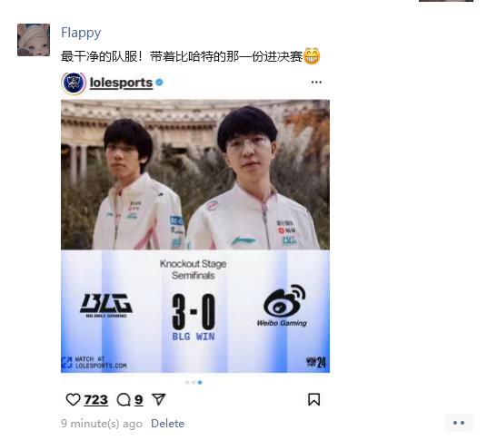
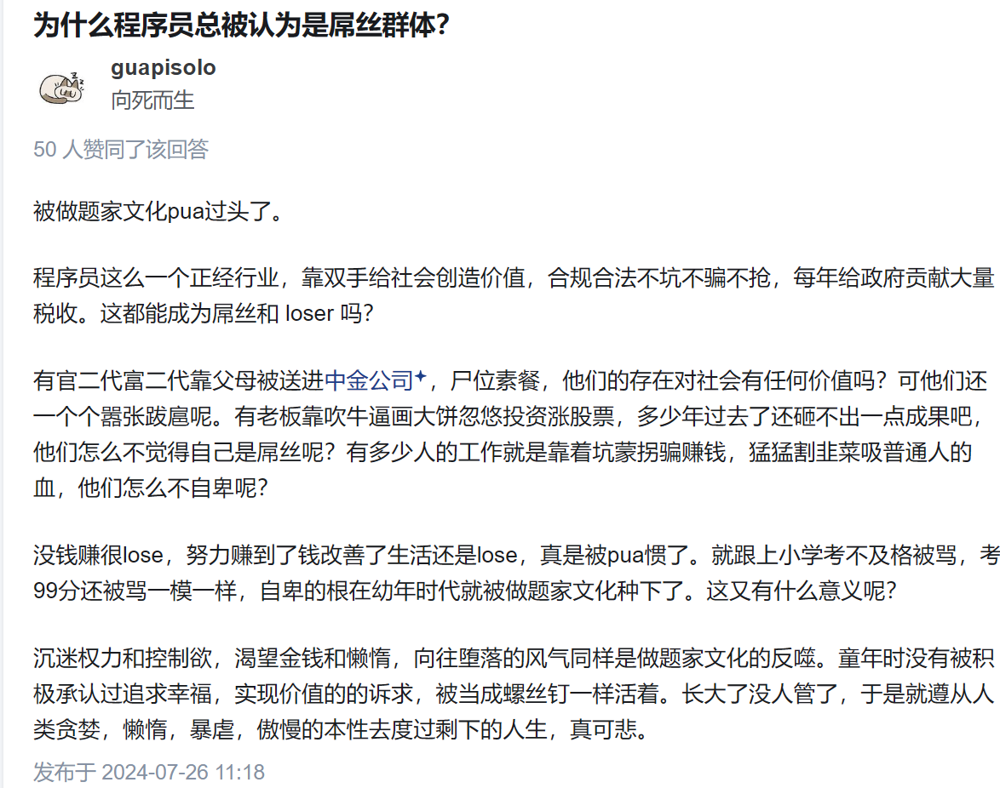
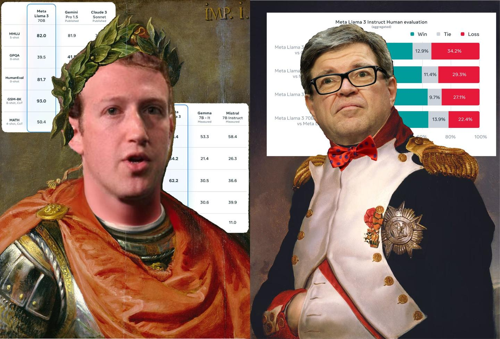

**学期期待**。（虽然也是白写就是了 D:

1. 克服一下，少打无脑竞技游戏而多多社交，有不会的问题直接找能接触到的大牛问而不是闭门造车。社交更多之后，不经意间就会知道更多的机会，同时在这段旅途中一些人会成为你的偶像和标杆，另一些人你会本能的讨厌。而这都会逐渐让你成为最真实的自己。

2. 希望能体验更多不同事情吧，一直想出cos的，更偏实操落地的实验项目，去更多地方玩和不同性格人聊聊天。

3. 保持之前一些不错的习惯，社交和生活上的习惯。请见[地球online中的良性资产](./地球online中的超良性资产)一文。

## 9.28 一场求职会

求职我是一直不太了解情况的，只是大概听过申请swe是什么“49年入国军”，“03年入dotcom”。

于是这节求职会给我做了一些value alignment： 自己吹的牛逼真的是远远不够，link的人还远远不够

1. 自己的简历写的太垃圾了，连最基础的 STAR 模板都没有，之后得好好改改，HC 可能看到直接认为你不够 professional 直接扔进垃圾桶了。 
2. 经历不够 solid。课程 project 完全不够看好吗，research 能否多一些。。 
3. 政治太他妈正确了。你为什么不能是个女生啊，真的听过太多神仙故事比如什么intern10个9女1男的故事了。

虽然是一个盈利的求职机构，但是最后一段话给我感触蛮深的，那个主持人说：

> 你要把求职看作一段经历而不是一个目标。在人生中求职这件事情对大部分人来说都是主旋律。在这段旅途中你会认识不少不同性格的人，发生不少事情（coffeechat，meeting 等等），这些都是独一无二的回忆和经验。

## Event都是神马鬼啊

最近去了不少 events，point72 的 talk 和 JP morgan，google research， morgan stanley target to analyst， cerebras demo会。我一个个讲： 

point72。没啥收获，倒是我感觉金融领域我能参加的领域也许只有买方像 hedge fund 这种。。中间 presenter 放了一张金融这个大机器怎么运作的图我还是比较好奇的，希望以后能有一些愿意教我的金融朋友给我科普一下。

JP morgan 的 event 来了个开源组组长，前面讲了一堆开源 licence 的东西有点杂，也没咋听懂，但是他 keynotes 用来结尾的话我记得蛮牢的，最近对我很有共鸣 -- Since you are young, whenever you meet a someone's invitation, **always say yes**. 我觉得确实，如果有好机会，不要管自己行不行，先上再说，之后再补。

Google research。这个是很有价值的，不出意外可以弄到不少好吃的。内容整体还是扯皮，主要看有没有神仙speaker，略了。

Morgan stanley target to analyst intern 的。**没空的话，不推荐**。进来就是一帮人笔笔唠唠感觉也没学到啥，之后又是可以比作没有的 network，这能 network 到啥？一帮子人全部拥上去了，那能 share 到每个人的时间有多少？这种 event 真的是看上去鲜美实则毒瘤，有这空最好还是别去的好，不如自己约 coffee chat 有效。

cerebras demo。**没空的话，极其不推荐**。分为 speaker keynotes/live demo 和之后的 party。**Do not attend, especially for a event host by some dramatizer**。尤其是没有主办方没有过审的环节，嘉宾质量是参差不齐，难绷的一批，就是你只要是一个 random developer / 或者是网红。最后是自己竹篮打水一场空，发现 speaker 把网上都找得到的信息反复说了好几遍，其实都是为了向场下的投资者装逼罢了。不过中途看到不少 cmu junior 或者是 current phd，所以当自己做出来一些能装逼的东西之后，是可以拿上去装逼的。But for a researcher and a dev, you can get nothing out of it but some random stikers and a cupnoodle。
 

最近也是感觉自己想要的太多了。每个人都有自己爱好，但是要知道在企业或者学校老板那里自己就是一个**技术工种**罢了。自己是 sde 就约 sde，research 就好好找 research，不要羡慕别人 analyst 的那一份。不属于自己的再追求也是浪费自己的时间。对我来说，我认为

1. 非 mle/sde 的 network 不去。对标 morgan stanley 这种，尤其是 analyst intern 这种。
2. entrepreneur event 不去。对标 cerebras 这种，去的基本都是混子 dev 和爱装逼的 dev，可能聊一百个才能找到对胃的，而 tech share 又很少，除非自己当 ceo 上去装逼会爽一点，有用一点。
3. 非自己学校 research event，正式 tech 公司的竞赛不去。选 event 的时候一定要选正规机构，另有竞争力筛子的那种 event。例如自己学校 research event，正式 tech 公司的竞赛都是可以 reach out 的。一般全网开放的 event 都会进来不少只会装逼的混子，找不到任何有价值的信息。自己学校 research center 和竞赛是一个良好的 filter，能筛掉不少混子。

总的来说，虽然说眼光要放的宽，但是也要放的对。

*所以过了这个求职会和events我其实大概放弃求职了，我认为现在这条路太正确了，我毕竟没有强到那些高中拿牌的神仙们，所以继续这条路有点自废自己武功。合理发展自己的兴趣，再领域认识大牛，合理的connection才是制胜的关键，所以最近一段时间一心research了。*

## 10.19 欢迎回来，彭立勋

真的好久没有看到 xun 上场打比赛了。昨天一把真的打的太漂亮了。我感觉 blg 有点找到队伍作为一个整体的感觉了，而不是一直三路对线优赢游戏，越来越像韩国队打游戏了。

[英雄麦克疯](https://www.bilibili.com/video/BV1exCoYeE3T/?)

男生不善言辞的相对还是多，有些情感男的很难直接察觉到而且也是浪费时间。但是回到有竞争性的游戏和组内工作里我能明显察觉到大家的情感 --
士气。只要军心稳定，有人一直真正地，发自内心的相信，队内打架/信心真的不一样，诺手直接勇敢手。因为大家说到底，不论是男的女的，都不是机器人，大家是活生生的人 -- 你知道永远有人在你身后。

从我玩守望先锋竞技开始，我就一直喜欢玩那种能够一个人 c 全场的角色，谁不是呢 --
源氏，麦克雷，铁拳，之后玩 r6 又是 ash，zofia，ace，尝试一个人把队伍里能做的事情全自己做了。这就是我，但是只要是个人都会想装逼，想要自己吃掉所有资源当大哥，然后享受其他人的仰慕；但就是问题在于，这是一个团队游戏，你不能只考虑你自己。这就是团队游戏的魅力，个人能力固然重要，但是也得有军心，有 bp 各种东西混杂在一起的因素奠定胜局。所以这就是为什么能俯下身子为你加油的人很重要，他们少了自己的那一份台下的聚光灯，但是鼓舞了队友。

我是一直粉 xun 子的 --
我看到 xun 不爽的操作也喷；他的指挥有时候会过勇了，效果也不会好。但是我还是衷心希望 xun 子能越打越好，带队伍赢游戏。他操作不是世界第一，甚至在队内都是垫底的，但他绝对想队伍好而不是只想自己打出神操作的那种人
-- 他绝对是一个懂队友的好朋友。
 

**欢迎回来，彭立勋。**

## 10/26 网络热传 event 鉴定 / 热传 NYU 学生鉴定。

今早看比赛了，恭喜**BLG 进决赛**！加油啊带着 WBG 的那一份！

### 进入第二个正题： 热传 NYU 学生鉴定。

看这篇回答。 [如何评价 US News 全美综合大学排名 NYU 从 25 掉到 35？](https://www.zhihu.com/question/622671319/answer/3219237491)

这学期因为 TA，和一些课的缘故又见了不少人，只能说这篇回答太全面了。

在稍微 solid 的课里面，相对 nerdy 的 mathcs 人偏多，nyush 的人最多，这是我认识最多的群体。因为就是我。当然不同能力的方差也是很大。一些人数学特强但是一到 coding 就头疼，有些人就特别会硬件但是数学难绷，有些人万能。。。which
is gooodd. You don't need to know a lot of system to do ml 这种。

还有一些群体是想做纯数/应数 （还稍微多些）甚至 system 研究（极少）的。我致以崇高敬意，在这个嘈杂的环境里能沉下心来做喜欢的事情的真的不容易。

CAS 其余专业/stern/tisch/steinhart 我不评价，没啥熟人。可看这个回答参考，但是我认识一些 stern 和 tisch 哥都挺有 ideas，而且我听说 stern 的 top
clubs 筛人特别严，人也特别有想法。但是关于这些想法到底如何，我没资格也不懂如何评价，因为去的 event 的真的太多了，感觉吹 j8 真的很多，所以对于评估一个想法，真的感觉不出来吹逼成分有多少，better show the
result。不过听室友 game design 人说，大部分是主见特别多但是真实实现的实力依托，当然也有 top 20%的大佬。

大部分 econ 人我感觉确实是人均 stern 弃子，当然也有 top 20%的大佬，但是大多数都是读个 math econ 选最好拿分的课最后 end up with some university start with a `C`。

最后我接触不到的群体几乎纯混子偏多，选那种最简单的专业混过去本科。

难绷群体：

特别难绷的是都 tm 大三了，在 NYU 这个学校里，还是有对自己未来特别没有主见的（这算正常），而且也不愿意思考的（那种本土学生偏多，还有二代哥）

最后说下最难绷的群体。有些人确实有种何不食肉糜的感觉，一方面自己极大的践行消费主义买买买，一方面又把圣母心大行其道，这是我最难绷的。真的是美国本土自信教育的糟粕，特别 zz。

## 11/4 BLG 2:3 T1

我也粉 T1 的，恭喜 T1。但是还是特别特别难受，主要是因为 BLG 比分真的真的太接近了。

这次真的不一样。先说说左手，从 BLG 进世界赛的时候我还是甚至还是左手的黑粉，但是这次就像改变了人格一样变态。塞拉斯天神下凡，神挡杀神佛挡杀佛；一手加里奥实乃正义巨像本人，成为 BLG 最可靠的大山。XUN 子我也不说啥，一到世界赛就开始节奏带的飞起，一血率特高。上下路除了 ON 都很稳，至少没有明显漏洞。这一路坎坷啊，斩了 G2 又是韩华，横扫自家 4 号种子，却棋差一着倒在了奖杯前，换谁都会失望吧。

S7 的时候我还没有看比赛，也许这就是当年皇族粉丝的感受吧。这种深深的绝望感，最后的一手加里奥反开真的是太伤了。Faker 真的是亲手拯救了 t1 这个家，这个男人是最大的责任神，这个游戏中永远的巨像。从 s3 到 s14，故事的开始是 faker，结尾还是他。也许这就是竞技体育的残酷吧。

BLG 还是不要放弃，就跟 22 年的 T1 一样，重整旗鼓绝对有机会的。也许满怀期待的人们大多也都黯然神伤，但是我相信还远远没有绝望。

BLG 加油

## 11/5

这两个月一直挺摆的。倒不是说整个人停滞了，只不过是停止的时候连自己都不带思考了，整天鬼混（打游戏/刷视频/刷小红书）做这种很没意义的事情。 [锦恢](https://www.zhihu.com/people/can-meng-zhong-de-che-xian)

**社交**：认清自己的道路。最近总是发现有些人 99%的人的能力/智商真的是远远不如（不跟他们社交），与其花费一堆时间建立所谓兄弟情谊不如好好打磨自己，或者花更多时间找志同道合的人。CS 的可以看看知乎同步一下节奏，多花点时间在自己身上，做些 proj 学点东西自己玩玩学学是真的。

之前一段时间还挺想换个人设的 --
想多多建立社交以此走上人生巅峰。我的评价是真的是中二病犯了，大多数只是个打酱油的罢了，在米国这里又不是什么白男二代，真心不如好好放心思在自己身上，拒绝一些无用的社交。好好打理自己的形象也好，cos 也好，练拳健身也好，窝在家里打 R6，写爬虫 ml 搭分布式读论文也好。最重要的是不要分心，找到自己喜欢干的事情一心冲，认真的做事情，而不是随波逐流。

从懒笔只社交的节奏回到卷王节奏是因为总是能在网上发现一些能够沉下心来的人，不论是单纯喜欢还是名利。我也想发光发热啊。。于是还是回到了**大二**的宅男节奏，好好沉淀吧。

[现在的大学生是什么样子的呢?](https://www.zhihu.com/question/623983985/answer/11042537772)

共勉，好好活出自己。

## 11/12

random update 一下。

生活中加入一些这样的 flavor 会更加健康：

- 最近发现**收集知识**是一个很有趣的行为 -- 就是把自己当作**博物馆**的感觉。感觉从**历史**的眼光，带着欣赏的角度去学习还是很爽的，体会她的美而不是一味的钻研。
- **人机感**。平时学会拒绝一些你**早就厌倦**的东西，直接拒绝就行；
- **把人生当作游戏**。尝试给自己的 task 加入一些奖励机制，适当幻想可以增强学习效率。
- 我发现我对某些词有应激反应，比如**主线任务**，**支线任务**，**限时任务**。。。 我感觉可以加入我的日程让我更有效率xswl /w/

## 11/13

上课太无聊水会纸呼。。

comment: harsh一点没毛病，减少点社交，对自己好点是真的

comment:想起来感觉学一下 arch 的确是有帮助的。。。有点后悔在实习的时候没跟导师多读点 arch paper。。。感觉得多多沉淀了，不要太急，打好基础确实是比较重要的。

comment：自信确实很重要

comment：能共情。。

另外：写代码之前需要思考。

## 11/16 

**双城第二季**：

有关金克斯：金克斯主观角度上来肯定同情，但是她绝对该死。

我觉得这个世界下几乎所有人做的事情几乎都是合情合理的。这就是为什么我觉得这个动漫大大的牛皮，他精准塑造了角色并且没有几乎都有自己在这个世界下的思考。

