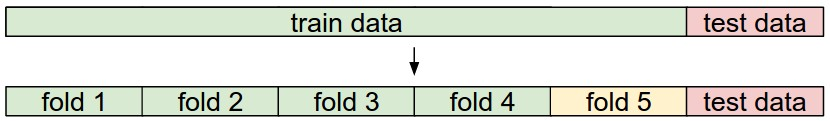
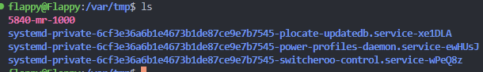

开坑6.824！

## lab1 mapreduce 

流程log：
1. 看一遍go tour，先看个眼熟，之后在看代码的时候边查边改改试验一下go的特性。（比如defer这个关键词在worker.go的使用）
2. 理解理论/代码框架：推荐通读一遍mapreduce paper，然后看instruction，instruction写的很详细。
3. 然后直接看mrsequential.go，花点时间理解。
4. `rc/worker.go`， `rc/coordinator.go`中就有Example的使用, 理解，看rpc怎么用。see`What is RPC? `
5. init coordinator, 分配map任务，分配参数，这个map没有split，直接filename拿来做成一个task，理想的情况应该是coordinator有一个split机，evenly split后output出一个个filename之后再分配，不过懒得实现了。

### misc help
* 注意RPC的命名机制，例如函数签名大写，变量名大写等等搞了我好久debug，这些规范性的东西如果不知道直接GPT就行
* 自己的命名规则尽量统一：`Typedef <type_t>`后面尽量用驼峰 + _t的方式命名。（当然如果有社区规范那之后再改）
* 在熟悉一门语言之前，尽量先少写一些，慢慢测。 
* 对于这种理论based工程，先花时间写写思路再写是可以提高效率的。
* 不要一开始就追求模块化，分好自己要测的功能测好之后，逐步实现和模块化。
* 这个lab更多的是训练你的并行思维，而不是真正的多处理器性能优化。看reference
> This lab relies on the workers sharing a file system. That's straightforward when all workers run on the same machine, but would require a global filesystem like GFS if the workers ran on different machines.
 
### What is RPC? 
https://waylau.com/remote-procedure-calls/



很清晰易懂的理解就自己跑一下这个Example, network细节不需要追究。 

worker.go 
``` go 
func Worker(mapf func(string, string) []KeyValue,
	reducef func(string, []string) string) {
	CallExample()
}
func CallExample() {
	args := ExampleArgs{}
	args.X = 99
	reply := ExampleReply{}
	ok := call("Coordinator.Example", &args, &reply)
	if ok {
		fmt.Printf("reply.Y %v\n", reply.Y)
	} else {
		fmt.Printf("call failed!\n")
	}
}
 ```

coordinator.go 
``` go 
func (c *Coordinator) server() {
	rpc.Register(c)
	rpc.HandleHTTP()
	sockname := coordinatorSock()
	os.Remove(sockname)
	l, e := net.Listen("unix", sockname)
	if e != nil {
		log.Fatal("listen error:", e)
	}
	go http.Serve(l, nil)
}

func (c *Coordinator) Example(args *ExampleArgs, reply *ExampleReply) error {
	reply.Y = args.X + 1
	return nil
}
 ```
master进程会开始接听，并且接受request！ 链接成功是在这一步：worker`sockname := coordinatorSock(); c, err := rpc.DialHTTP("unix", sockname)`，master`sockname := coordinatorSock(); l, e := net.Listen("unix", sockname)`。

rpc.go
``` go 
func coordinatorSock() string {
	s := "/var/tmp/5840-mr-"
	s += strconv.Itoa(os.Getuid())
	return s
}
 ```
rpc.go中的实现是在`/var/tmp/5840-mr-`中建立，并且返回这个string


能发现有個file在coordinator process喚醒的時候生成了，具体怎么生成的不追究了，之后学network再补吧。


### test sh
``` sh 
go build -buildmode=plugin ../mrapps/wc.go
rm mr-out*

# test
go run mrcoordinator.go pg*.txt &

for i in {1..3}
do
    go run mrworker.go wc.so &
done
# go run mrworker.go wc.so &

# cat mr-out-* | sort | more

# sleep for now... after finish done can uncommnet
sleep 10
ps aux | grep mrworker

pkill mrworker
pkill mrcoordinator
```
<!-- time：10h + 读论文时间 -->