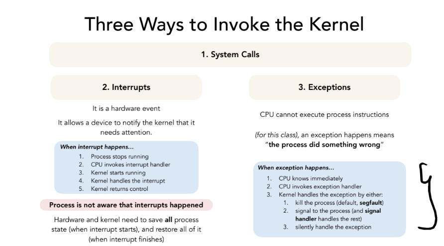
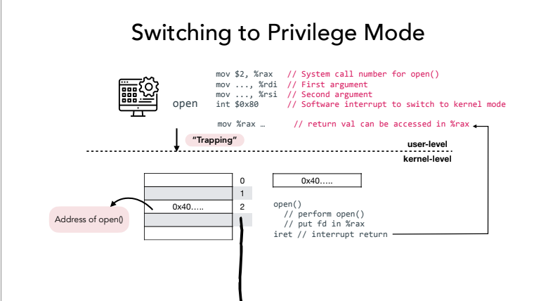
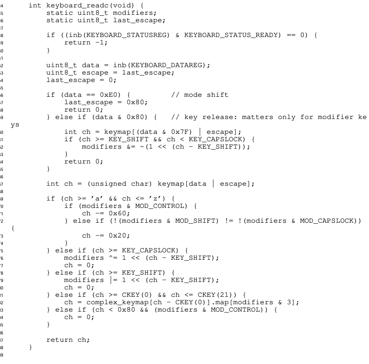
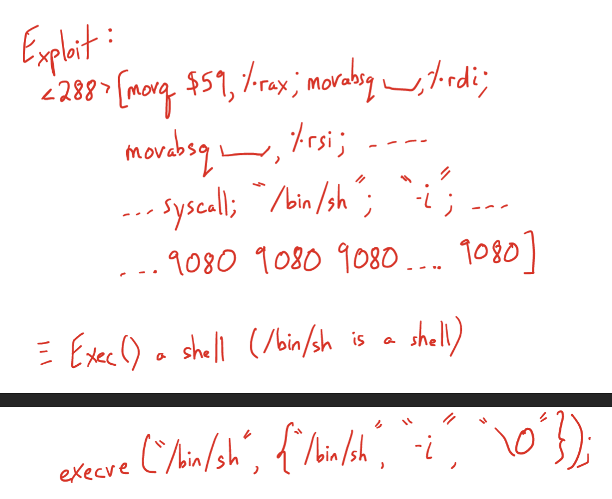
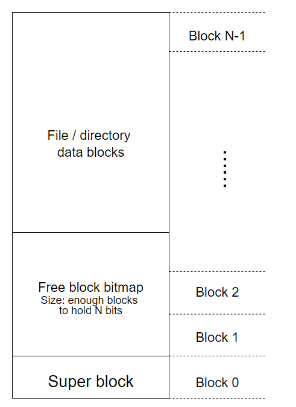

可以看一下课程主页，作业的环境是docker里配好的。
webpage: https://cs.nyu.edu/~mwalfish/classes/24sp/
lab： https://github.com/nyu-cs202/labs

## Lecture 1

Abstraction that os did:

- file system:
  abstraction: seq of bytes.
  isolation: hiding user's files.

- text input:
  abstraction: linear stream
  isolation: chars go to the intended app

- memory:
  abstraction: very large conceivable memory
  isolation: processes cannot access each other's memory

- scheduling:
  abstraction: continuous execution  
  isolation: one heavy consumer cannot dominate the cpu.

### Why should we learn OS? 

1. 一张梗图。“我们都是要成为AI engineer的，为什么要学os?" mike说正是AI engineer需要和硬件交朋友。首先require大算力的应用只会越来越被需要，这个时候学会和真正的物理资源打交道是很有必要的，这种只会被无限的需求，因为在抽象层是充满了很多细节要被优化的。最要被替代的是那些只会照猫画虎调参的。这是从实用角度为什么要学os/sys的原因。**算力本身是电力，学会如何和算力打交道是大势所趋**，因为他相当基础且需求大，它很少会被替代。

2. Hardware是ugly的，从软件工程师的角度。如果没有好的design，那么deal with hardware everyday无疑是一个劳动密集的工作。正是因为有这层抽象，让写码本身变得优雅了很多。这是从美学的角度的一个为什么学os的原因。它**简单，强大，优雅。**

3. OS demonstrate了不少软件工程中重要的概念。比如scheduler是经典的调度问题/ 在和processes打交道的时候会接触到并行。

## Lecture 2/3 Review of assembly


Process is key of abstraction of OS 

1. Process is the machine code running on computers. 
2. OS as resource manager will manage processes as resources. 

What does a process construct of?



How a process is loaded? 


### x86-64 assembly
https://cs61.seas.harvard.edu/site/2024/Asm/#gsc.tab=0


Review stack: 
https://cs.nyu.edu/~qc1127/classes/24fa/lectures/handout03.pdf

### design of assembly 

重新想了一下，Caller和Callee的设计很精妙。相当于用了一层人类的简单的规约去释放了很多设计空间，因为正常的temporary variable不可能不用，不可能全用stack的空间；但是又不能全部都搞成temporary variable，这样要saved variable太几把多了。所以干脆搞一个规约，让一半去负责特定的东西，frame ptr，stack ptr这种，而且callee得负责回去的时候全部的值都不变，让另外一半register让callee随便用，但是回到caller的时候让caller自己搞定。

### syscall



## Lecture 4: Shell I

- What does fork do?
fork很简单不赘述了。

- what does execve do?

> execve() executes the program referred to by pathname. This causes the program that is currently being run by the calling process to be replaced with a new program, with newly initialized stack, heap, and (initialized and uninitialized) data segments

execve(“/bin/sh”,0,0)是个系统调用，执行后，即使他发生在某个线程中，整个进程的程序也会被换掉，但进程号保留。

我们先来看一个简单的shell模型。

```c
while (1) {
    write(1, "$", 2);
    readcmd(cmd, args);
    // child
    if ((pid = fork()) == 0) {
        execve(command, args, 0);
    } else if (pid > 0) {
        wait(0);

        // error
    } else {
    }
}
```

原料：fork execve.

实现：让一个parent process来manage i/o，然后创造子进程来跑用户想跑的程序。

目的：为了脱离原始的batch computing，让用户有操作多个任务的能力。

**fs** -- file descriptor:  


接下来我们来看redirection和后台运行的实现

```c
while (1) {
    write(1, "$", 2);
    readcmd(cmd, args);
    // child
    if ((pid = fork()) == 0) {
        if (redirected) {
            close(1);
            open(redirected_file);
        }
        execve(command, args, 0);
    } else if (pid > 0) {
        if (fore_ground) {
            wait(0);
        }
        // error
    } else {
    }
}
```

**Redirection**: 它的实现踩在了file descriptor的肩膀上。只不过就是把fs的1的指针从指向terminal到指向了新的file。注意write这个syscall完全不知道发生了什么，他一样写入了fs为1的地方，只不过这次是用户指定的file而不是terminal。

**background**：它的实现是 --- 如果shell parse到了&，parent processes直接不等了，直接让execve在后台运行。

Question:

- 为什么fork和exec要隔离开来?为什么不直接有一个craeteprocess？难道这样不更方便？

**ans**: 其实这样给了用户更多的操作空间，一个用来创造新process，然后用户可以在fork中的函数中疯狂配环境，就像redirection是怎么实现的一样。

```sh
# 奇怪的脚本，赶紧试试吧！
$ :(){:1:&};:
```

**pipeline**.

```c
while (1) {
    write(1, "$", 2);
    readcmd(cmd, args);
    // child
    if ((pid = fork()) == 0) {
        if (redirected) {
            close(1);
            open(redirected_file);
        }
        execve(command, args, 0);
    } else if (pid > 0) {
        if (fore_ground) {
            wait(0);
        }
        // error
    } else {
    }
}

void handle_piepeline(left_cmd, right_cmd) {
    int fdArr[2];
    if (pipe(fdArr) < 0) //error
    if ((pid = fork()) == 0) {
        dup2(fdArr[1], 1); // now fd 0 -> dev, 1 -> write end, 2 -> dev
        close(fdArr[0]);
        close(fdArr[1]);
        // execute.
    } else if (pid > 0) {
        dup2(fdArr[0], 0); // now fd 0 -> dev, 1 -> write end, 2 -> dev
        close(fdArr[0]);
        close(fdArr[1]);
     // error
    } else {
    }
}
```

例子：

- left cmd = `ls -l`的输出原本是1，which is defaulted set to the terminal windo.
- right cmd = `grep 'pattern'`，grep在没有第三个arg的实现是用fd 0 作为自己的input，如果有第三个arg输进去，那他就会吧0 关闭，然后在调用open syscall。

然鹅我们再shell的实现中 -- 直接关闭ls -l side的1， 然后打开grep side的0，就可以实现pipe了。于是`ls -l | grep "hello"` 就会从ls -l 输入到管道中，然后grep再从fd=0读取（管道的输出）内容。

我们来深入理解一下pipe的机制，以下是ls lab的内容：

```c
 void hack()
{
    int status;
    // pipe from child to parent
    int c2p[2];
    pipe(c2p);
    printf("c2p[0] = %d\n", c2p[0]);
    printf("c2p[1] = %d\n", c2p[1]);

    // child
    if (fork() == 0)
    {
        // so instead of writing to terminal, it will write to the pipe.
        close(1);
        // let write end be assiged to fd=1
        dup(c2p[WRITEEND]);

        // close these two ends since we only needs the fd=1(write end) as the output.
        close(c2p[READEND]);
        close(c2p[WRITEEND]);
        char *lala[] = {"/usr/bin/ls", NULL, NULL};
        execve("/usr/bin/ls", lala, 0);
        printf("exec failed!\n");
        exit(1);
    }
    // parent
    else
    {
        // close it since we dont need it in parent process
        close(c2p[WRITEEND]);
        char buf[BUFSIZE];
        int n = read(c2p[READEND], buf, sizeof(buf));
        while (n)
        {
            write(1, buf, n);
            n = read(c2p[READEND], buf, sizeof(buf));
        }
        wait(&status);
    }
    exit(0);
}
```

### Process -- 从OS的角度

Proc就是一个一堆Proc表，每次booting的时候都用表里的信息来load进去，表如下，可以看看xv6的代码。


### thread -- 从OS的角度

Thread从proc的角度来看，其实和proc差不多。


每个thread都会维护自己的registers和stack space，甚至在process的视角里，每个thread的不同只不过是它们的registers罢了。但是他们指向的.text and .data area都是一样的（也就是，他们share的code，和global variable是一样的）。这样程序员会觉得觉得他们在“同时”执行一些操作。


**线程写的问题**。当x是一个global的时候，两个线程同时都可以access到一个地方，所以会造成线程写的问题。


## HW 1/2

- Operations on files, such as read(), write(), and close(), are typically implemented as system calls. Describe two of the benefits of having these operations managed by the operating system instead of individual processes.

**ans**:
(1) Prevent user level processes from manipulating hardware
(2) Program will have good portability across machines
(3) Processes do not have to have redundant code

- What do you think are the differences between the implementation of thread_create(func) and the implementation of fork()? (here, func is the address of the function that the thread should begin at).

**ans**:

D1: thread_create doesn't need to make a copy of the invoking thread's memory. It will make both the original thread and created thread share the invoking thread's memory. By contrast, fork will make a copy of the parent process's memory, and the child will run using this copy.

D2: Both thread_create and fork will give the created thread/process a new stack. fork creates this stack from the parent process's stack, while thread_create creates a brand new stack. In other words, fork will set %esp to a copy of the current bottom of the stack, thread_create will set %esp to the top of a new stack within the same address space.

D3: As indicated in the interface, thread_create takes a function pointer as the parameter. thread_create will set the created thread's %eip to func, while fork will not touch %eip, since parent and child are running the "same" code located at the "same" address.

## Lab1/ Lab2 ls

**Unix Utilities**.

- basic shell command

* echo "echo hello \$world"? \$world will expand
* echo 'echo hello $world' world will not expand in single quote.
* echo \`echo hello $world\`? what is inside \`\` will be evaluted first.

```sh
echo a && echo b # it cares whether echo a execuets successfully
echo a ; echo b # it does not care whether echo a execuets successfully]

# Explanation: & will put 'echo a' in background and run 'echo b' in foreground.
echo a & echo b
```

- **find**: `find [flags] [path...] [expression]; `

```sh
find . -name "sched.h"
find . -name "sched.*"
find . -name "*.h" | wc -w


# 一些组合 output
cat member.txt | grep "^Name:[a-zA-Z']\+$" |  head -n100 | cut -d':' -f 2 | sort > name.txt
```

Personal Note for lab2

What I learnt:

- **磨刀不误砍柴工**。在我们既有的抽象层细细的去了解自己的工具。在 lab2 我们的工作是 base on system calls -> implement user functions. So understanding those tools deeply has value in it.

- 学习一个api最好的方式就是玩它. And That's it and even more sophisticated syscall needs testing. Learning by playing is the most interesting and the most valuable when learning some apis.

- **心态上不要恐惧**。很多时候依附于某种语言的特性都会有一些 trick 让原本的代码变得难读。不要着急，一步一步调试后你就能理解其中的优美之处。所以，多多阅读优秀的源码并且理解是可以比读书收获很多的。

### Argument parsing

本质上get_opt 和getopt_long差不多。
getopt_long();

```c
int main(int argc, char **argv)
{
    int c;
    int digit_optind = 0;

    // start parsins flags
    while (1)
    {
        // set optind to 1 if it is not set
        int this_option_optind = optind ? optind : 1;
        int option_index = 0;

        // this struct maps long options into int 0.
        // first is long option name
        // second is argument requirement?
        // third is flag
        // fourht is the short option it maps to.

        /**
         * struct option {
         *   const char *name;
         *   has_arg can't be an enum because some compilers complain about
         *   type mismatches in all the code that assumes it is an int.
         *   int has_arg;
         *   int *flag;
         *   int val;
         *   };
        */

        static struct option long_options[] = {
            {"add", required_argument, 0, 0},
            {"append", no_argument, 0, 0},
            {"delete", required_argument, 0, 0},
            {"verbose", no_argument, 0, 0},
            {"create", required_argument, 0, 'c'},
            {"file", required_argument, 0, 0},
            {0, 0, 0, 0}};

        // return the flag option, it turns long options into short option through struct option mapping
        c = getopt_long(argc, argv, "abc:d:012",
                        long_options, &option_index);
        if (c == -1)
            break;

        switch (c)
        {
        case 0:
            // option_index is used to indexing the option struct .
            printf("option %s", long_options[option_index].name);

            // 在跑过之后，如果有会生成一个optarg, 如果读成功 -- 返回那个string
            if (optarg)
                printf(" with arg %s", optarg);
            printf("\n");
            break;

        // Short options
        case '0':
        case '1':
        case '2':
            if (digit_optind != 0 && digit_optind != this_option_optind)
                printf("digits occur in two different argv-elements.\n");
            digit_optind = this_option_optind;
            printf("option %c\n", c);
            break;

        case 'a':
            printf("option a\n");
            break;

        case 'b':
            printf("option b\n");
            break;

        case 'c':
            printf("option c with value '%s'\n", optarg);
            break;

        case 'd':
            printf("option d with value '%s'\n", optarg);
            break;

        case '?':
            break;

        default:
            printf("?? getopt returned character code 0%o ??\n", c);
        }
    }

    // optind should be checked since remember
    // c does not have limit check but it is leaves to you
    // we needs to ensures that optind is not pointing to other memory.
    if (optind < argc)
    {
        printf("optind -> %d\n", optind);
        printf("argc -> %d\n", argc);
        printf("non-option ARGV-elements: ");
        while (optind < argc)
            printf("%s ", argv[optind++]);
        printf("\n");
    }

    exit(EXIT_SUCCESS);
}
```

```sh
# 一些例子。
cs202-user@ac03bcbbed6b:~/cs202-labs/test$ ./exec --create 1
option c with value '1'
cs202-user@ac03bcbbed6b:~/cs202-labs/test$ ./exec --c 1
option c with value '1'

cs202-user@ac03bcbbed6b:~/cs202-labs/test$ ./exec -ab -c 123 123
option a
option b
option c with value '123'
non-option ARGV-elements: '123'
```

### Read Directories/ file systems api

Dir Stream 其实就是 an ordered sequence of all the directory entries in a particular directory，跟打开一个 fd 的感觉一样，都是抽象成一个流。从用户层面理解没有什么意义，会调用能跑就行了。

- **opendir**

```c
#include <sys/types.h>
#include <dirent.h>
// open dir stream.
DIR *opendir(const char *name);
// Filename entries can be read from a directory stream using readdir(3).
```

- dirp 是一个指针指向了这个流。（This stream can be specified as a linear sequence of struct directory）。

- 用readdir返回struct dirent

```c
struct dirent {
    ino_t          d_ino;       /* Inode number */
    off_t          d_off;       /* Not an offset; see below */
    unsigned short d_reclen;    /* Length of this record */
    unsigned char  d_type;      /* Type of file; not supported
                                    by all filesystem types */
    char           d_name[256]; /* Null-terminated filename */
};
```

```c
void display(struct dirent *dp)
{
    printf("d_ino -> %ld\n", dp->d_ino);
    printf("d_off -> %ld\n", dp->d_off);
    printf("d_reclen -> %d\n", dp->d_reclen);
    printf("d_type -> %d\n", dp->d_type);
    printf("d_name -> %s\n", dp->d_name);
    putchar('\n');
}
int main(int argc, char **argv)
{
    DIR *dirp = opendir(".");
    struct dirent *dp;
    int errno;
    // Read as null it reaches end
    while ((dp = readdir(dirp)) != NULL)
    {
        display(dp);
    }
    printf("We've finished reading! \n");
    closedir(dirp);
    exit(0);
}

```

输出是下面：

```sh
d_ino -> 39986
d_off -> 2122451233231811000
d_reclen -> 32
d_type -> 8
d_name -> main.c

d_ino -> 29864
d_off -> 6629703606815583833
d_reclen -> 24
d_type -> 4
d_name -> ..

d_ino -> 31553
d_off -> 7336315452623241479
d_reclen -> 24
d_type -> 8
d_name -> exec

d_ino -> 39987
d_off -> 8301092125137062404
d_reclen -> 24
d_type -> 4
d_name -> .

d_ino -> 39988
d_off -> 9223372036854775807
d_reclen -> 32
d_type -> 8
d_name -> test.sh

We've finished reading!
```

```c
static void lookup(const char *arg)
{
    DIR *dirp;
    struct dirent *dp;

    if ((dirp = opendir(".")) == NULL) {
        perror("couldn't open '.'");
        return;
    }

    do {
        // set errno to 0 to enforce checking error
        errno = 0;
        if ((dp = readdir(dirp)) != NULL) {
            if (strcmp(dp->d_name, arg) != 0)
                continue;

            (void) printf("found %s\n", arg);
            (void) closedir(dirp);
            return;
        }
    // end if dp is NULL
    } while (dp != NULL);

    if (errno != 0)
        perror("error reading directory");
    else
        (void) printf("failed to find %s\n", arg);
    (void) closedir(dirp);
    return;
}

int main(int argc, char *argv[])
{
    int i;
    for (i = 1; i < argc; i++)
        lookup(argv[i]);
    return (0);
}
```

**stat 调用**。

```c
int main(int argc, char *argv[])
{
    struct stat sb;

    if (argc != 2)
    {
        fprintf(stderr, "Usage: %s <pathname>\n", argv[0]);
        exit(EXIT_FAILURE);
    }

    if (lstat(argv[1], &sb) == -1)
    {
        perror("lstat");
        exit(EXIT_FAILURE);
    }

    printf("ID of containing device:  [%jx,%jx]\n",
           (uintmax_t)major(sb.st_dev),
           (uintmax_t)minor(sb.st_dev));

    printf("File type:                ");

    switch (sb.st_mode & S_IFMT)
    {
    case S_IFBLK:
        printf("block device\n");
        break;
    case S_IFCHR:
        printf("character device\n");
        break;
    case S_IFDIR:
        printf("directory\n");
        break;
    case S_IFIFO:
        printf("FIFO/pipe\n");
        break;
    case S_IFLNK:
        printf("symlink\n");
        break;
    case S_IFREG:
        printf("regular file\n");
        break;
    case S_IFSOCK:
        printf("socket\n");
        break;
    default:
        printf("unknown?\n");
        break;
    }

    printf("I-node number:            %ju\n", (uintmax_t)sb.st_ino);

    printf("Mode:                     %jo (octal)\n",
           (uintmax_t)sb.st_mode);

    printf("Link count:               %ju\n", (uintmax_t)sb.st_nlink);
    printf("Ownership:                UID=%ju   GID=%ju\n",
           (uintmax_t)sb.st_uid, (uintmax_t)sb.st_gid);

    printf("Preferred I/O block size: %jd bytes\n",
           (intmax_t)sb.st_blksize);
    printf("File size:                %jd bytes\n",
           (intmax_t)sb.st_size);
    printf("Blocks allocated:         %jd\n",
           (intmax_t)sb.st_blocks);

    printf("Last status change:       %s", ctime(&sb.st_ctime));
    printf("Last file access:         %s", ctime(&sb.st_atime));
    printf("Last file modification:   %s", ctime(&sb.st_mtime));

    exit(EXIT_SUCCESS);
}
```

```sh
ID of containing device:  [8,20]
File type:                directory
I-node number:            39987
Mode:                     40755 (octal)
Link count:               2
Ownership:                UID=1000   GID=1000
Preferred I/O block size: 4096 bytes
File size:                4096 bytes
Blocks allocated:         8
Last status change:       Sat Feb  3 01:36:49 2024
Last file access:         Sat Feb  3 01:36:53 2024
Last file modification:   Sat Feb  3 01:36:49 2024
```

**inode**
Each file has an inode containing metadata about the file. An application can retrieve this metadata using stat(2) (or related calls), which returns a stat structure, or statx(2), which returns a statx structure.

在 manual 里写的最重要的无非是 -- `stat`中返回的 struct 中`st.mode`是 type, filemode 的 bitmask。我们可以通过一些 manual 中提供的 marco 去轻易获得。

```c
// S_IFMT     0170000   bit mask for the file type bit field
 stat(pathname, &sb);
if ((sb.st_mode & S_IFMT) == S_IFREG) {
    /* Handle regular file */
}

// if we want to check S_IRWXU     00700   if owner has read, write, and execute permission
if ((sb.st_mode & S_IFMT) == S_IFREG) {
    /* Handle  */
}

```

### Implementation

_2024/02/03_
写了不少了，但是还是有很多常识的错误。
BUG：

- implement目录的时候，想当然的把自己当成用户了（以为系统会自己帮我把前目录名加上，但是还是要自己手动加上的）。这个bug找了我30min。
  
  ans: 在找到发现另一个目录前，请把目录名append到源路径后面并且加上‘/’。
  e.g. : 如果源路径是`./filesystem`，如果你在其中发现了一个dir，那么就是`./filesystem/<dirname>`.

- 我神奇的静态示例一直把strcmp看成strcpy，内存反复爆炸。。。下次看到这种内存写
  
  的错误大概就是strcpy这种写入方程的参数错误了，大概率是往指针里写。。所以最好还是定义成const预防一下。。（没想到之前书里看到了错误自己全部踩了一遍。。

神奇之处：

- 在root文件夹中的`..`并不是上一级目录，而是他自己，自己指向了自己。

感受：

- 最绝望的时候通常是无路可走的时候，而不是有一条艰辛的路的时候。前者像是在等死，后者有希望。但是在我相信在之后系统开发的过程中一定会有更看不懂的bug出现，而让自己成为编译器是不可能的，尽自己全力掌握debug tricks并汲取经验好好成长才是可行之道。心态是 --- 在找bug的时候一定要相信是自己的问题，而这种问题绝对是可以被解决的。

- 如何debug：尽可能地在自己能确认的地方打log。ex：看前面两行就是我在理解getopt这个api的时候加入的log，这样其实更加清晰，少了自己人肉编译的过程。所以这种方便自己理解的log越多越好。。
  
  

基本逻辑打好了，现在剩下

- 重新看一遍lab2，了解test（bats）的framework。
- 优化
  - -n有无更好的方法?
  - overflow的问题。（字符串怎么使用的更好）
  - recursive？检查。
  - 其余代码检查

_2024/02/12_
没想到下一次写lab居然是一周之后了啊。。。上周实在是太水了。。

#### Testing framework

mktest.sh

```sh
#!/bin/bash
set -e
TEST_DIR=$1
if [ -e ${TEST_DIR} ]; then
    echo "Cowardly refusing to change an existing directory ${TEST_DIR}"
    exit 1
fi
# Create base directory.
mkdir ${TEST_DIR}
# Create some files.
touch ${TEST_DIR}/a
touch ${TEST_DIR}/b
touch -t 1912301230.03 ${TEST_DIR}/c
touch -t 1810251600.00 ${TEST_DIR}/d
dd if=/dev/urandom of=${TEST_DIR}/s1 bs=1024 count=1 status=none > /dev/null
dd if=/dev/urandom of=${TEST_DIR}/s2 bs=1024 count=2 status=none > /dev/null
dd if=/dev/urandom of=${TEST_DIR}/s3 bs=1024 count=3 status=none > /dev/null
dd if=/dev/urandom of=${TEST_DIR}/s4 bs=1024 count=4 status=none > /dev/null
mkdir ${TEST_DIR}/in0
mkdir ${TEST_DIR}/in0/in1
mkdir ${TEST_DIR}/in0/in1/in2
touch -t 1912301230.03 ${TEST_DIR}/in0/a
touch  ${TEST_DIR}/in0/b
touch ${TEST_DIR}/in0/in1/in2/x
touch ${TEST_DIR}/.boo
mkdir ${TEST_DIR}/bad
touch ${TEST_DIR}/bad/bad_user
sudo chown 2002 ${TEST_DIR}/bad/bad_user
touch ${TEST_DIR}/bad/bad_group
sudo chown :2220 ${TEST_DIR}/bad/bad_group
touch ${TEST_DIR}/bad/bad_ugroup
sudo chown 2002:2220 ${TEST_DIR}/bad/bad_ugroup
mkdir ${TEST_DIR}/.hidden
touch ${TEST_DIR}/.hidden/a
touch ${TEST_DIR}/.hidden/b
touch ${TEST_DIR}/.hidden/c

touch ${TEST_DIR}/ungrwx
chmod 070 ${TEST_DIR}/ungrwx
touch ${TEST_DIR}/urwxgn
chmod 700 ${TEST_DIR}/urwxgn
touch ${TEST_DIR}/urwgrwarw
chmod 666 ${TEST_DIR}/urwgrwarw
touch ${TEST_DIR}/urwgrar
chmod 644 ${TEST_DIR}/urwgrar

```

_ls lab用时约12小时_。

## Lecture 5/6/7/8: Concurrency I/II/III/IV

在介绍处理并行的方法前，先介绍一个常见的硬软件错误：

Q1：Can data be called with 0?
assumption:

1. compiler produce sequential code
2. single cpu

```c
int data = 0, ready = 0;
void p1() {
    data = 2000;
    ready = 1;
}

int p2 () {
    while (!ready) {}
    // can data be called with 0?
    use(data);
}
```


Mike：这个例子并不会出现在单核cpu中，介绍这个example只是为了介绍concurrency的真正问题不只是存在程序员的设计的threadprogramming中，并且存在硬件中（multicore）。但是之后介绍的control primitives会优雅地解决这些硬软件并行问题。

### 第一个措施：**lock**

**note：注意虽然被夹在lock中间的代码是“atomic”，但是实际上他们的执行顺序依旧是不固定的，取决于scheduler。**

也就是说acquire() 和release() 之间，只能有一个thread running。

锁的作用是配合了programmer设计的invariant。他能保证“某些shared memory中”会被executed atomicaly, 保证了invariant的正确性。

**lock的机制**：

- if a lock wants to acquire a lock: it needs to wait for the lock to be unlocked by some other threads.
- only the thread who acquire the lock can unlock it.


```c
pthread_mutex_tlock = PTHREAD_MUTEX_INITIALIZER;
pthread_mutex_lock(&lock);
x= x + 1;
pthread_mutex_unlock(&lock);
```


小问题：为什么这里的yield()还要require() 和acquire()？
因为如果一个进程似了，他还拿着lock，别的进程如果要进入critical section，只能陪它一起似了。（当然，更好的还是使用wait primitive）

### 第二个措施：**cv**

**Why do we learn Conditional variable?**

- 通常是因为两个thread之间有dependency形成了一种拓补关系。
- 但是通常的spin等待太铸币了，需要一种硬件上的解决方式，直接让thread sleep。

因此就有了以下的api。

```c
intpthread_cond_wait(pthread_cond_t *cond, pthread_mutex_t *mutex);
intpthread_cond_signal(pthread_cond_t *cond);
```

一个thread执行的状态有：

1. sleep：似了。CPU不管这个，省clock cycle。
2. ready：被lock挡住了。CPU不管这个，省clock cycle。要么是被wait之后叫醒，要么是要锁的时候被block了，但是已经排在queue中了。如果锁一开，有可能哥们直接上。
3. run：正在跑的thread。
   **multithread的目的：就是让parallelism好好执行/ 但是不让相关逻辑的critical section影响。**

- wait：一个thread觉得自己进行不下去了，release自己的lock（这也是为什么wait要带一个mutex作为argument的原因）然后hold一个约定（conditional variable）。
- signal：另一个thread想要唤醒持有规约的那个睡觉的thread（可能有很多个）。

* 为什么要有done？
  ans：如果没有，若signal比wait先call，那么父进程会永远进入睡眠。所以我们要维护一个状态变量（in this case，it is `done`）

* 为什么signal的时候还是要有lock？
  ans：下面的例子：child会再parent执行公务的时候，sleep的时候，立马interupt，然后把done给改了。这样当parent搞完sleep之后，会发现他永远wait了。这是一个围绕signal wait的race condition。所以我们要做的是在
  - parent: check done之前，wait之后
  - child：改done之前，signal之后。

1. either child先执行完，parent发现了已经done了。
2. or parent先执行完，child在中途signal。

这是一个好的synchronization。

```c
pthread_cond_t  c = PTHREAD_COND_INITIALIZER;
pthread_mutex_t m = PTHREAD_MUTEX_INITIALIZER;
int done = 0;

void *child(void *arg) {
    printf("child: begin\n");
    sleep(1);
    done = 1;
    printf("child: signal\n");
    Cond_signal(&c);
    return NULL;
}
int main(int argc, char *argv[]) {
    pthread_t p;
    printf("parent: begin\n");
    Pthread_create(&p, NULL, child, NULL);
    Mutex_lock(&m);
    printf("parent: check condition\n");
    while (done == 0) {
	sleep(2);
	printf("parent: wait to be signalled...\n");
	Cond_wait(&c, &m);
    }
    Mutex_unlock(&m);
    printf("parent: end\n");
    return 0;
}

```

- 为什么这里是while包住？
  ans:
  
  仔细观察，如果c1在buffer空的时候wait了，之后因为buffer被p1填满进入了ready状态。如果锁之后开了第一个被唤醒的是这个蠢蠢欲动的，但是无处可拿（因为buffer空）的c1，那么是不是很尴尬？因此我们要在wait唤醒之后继续进行while check。

- 为什么要使用不同的conditional variable？
  
  ans: 会导致如上的consumer唤醒consumer的情况，这样我们就进入了死process中。我们需要让conditional variable具有指向性，让合理的逻辑动起来。
  

note in class:

- why wait() releases mutex and goes into waiting states atomically?

**ans**: if not, when mutex is released, the other thread can executes immediately and signals, so when current thread tries to wait, it will always in waiting state.

- Will it be good to replace broadcast with signal?

**ans**: Since we want multiple threads qualified to work together.

### Combined primitive: monitor

_SKIP_

### 一些练习。

### **Implementation of lock**

Perterson's algorithm? See textbook.

Disable Interrupts? Not work for multicpu.

Note: User cannot turn off interrupts because of monopolizing the resources.

critiria:

- mutual exclusion.
- fairness: 所有ready threads都能有相等的机会被唤醒吗？
- performance。

### spin lock

我们用硬件提供的testandset可以写个spinlock.

相当于：我们用了一个隐形的硬件锁同时完成了比较和赋值。

testandset:

1. get oldval
2. return oldval
3. setnewval into oldval

你也可以用更加强大的comandset。
testandset(\*oldptr, testval, newval)

1. get oldval from oldptr
2. return oldval
3. if oldVal == testVal, setnewval into oldptr, else do nothing.

```c
typedef struct lock {
    int flag;
} lock_t

int init(lock_t *lock) {
    lock->flag = 0;
}

// using testandset.
int lock(lock_t *lock) {
    while (testandset(lock->flag, 1) == 1) {
        // spin()
    }
    lock->flag = 1;
}

// using compareandset.
int lock(lock_t *lock) {
    while (compareandset(lock->flag, 0, 1) == 1) {
        // spin()
    }
    lock->flag = 1;
}


int unlock(lock_t *lock) {
    lock->flag = 0;
}
```

还有彩票lock, 用的是fetchandadd primitive
fetchandadd:

1. fetch from oldptr
2. add one to it
3. return oldval

```c
typedef struct lock {
    int turn;
    int ticket;
} lock_t

int init(lock_t *lock) {
    lock->turn = 0;
    lock->ticket = 0;
}

// using fetchandadd.
int lock(lock_t *lock) {
    while (fetchandadd(lock->ticket) != lock->turn) {
        // spin()
    }
}

int unlock(lock_t *lock) {
    lock->turn ++;
}
```

mutual exclusive? yes
fair? yes since every locked thread is in a queue.
performance? still no because of spinning.

一个较为符合直觉的方法是与其spin不如直接让cpu停用那个thread。

cpu -> thread1
cpu -context switch--> thread2
yield()
thread2 go into ready state.
cpu -context switch--> thread1
thread1 running.

但是它的cost依旧很高因为context switches。

### spinlock -- Lecture stuff

xchg --> load and store atomically

```c
struct Spinlock {
    int locked;
}
void acquire(Spinlock *lock) {
    while (1) {
        // spin ;
        if (xchg_val(&lock->locked, 1) == 0) {
            break;
        }
    }
}
void release(Spinlock *lock) {
    lock->locked = 0;
}
```

When two threads try to acquire the lock (write 1 to a lock):

only read a 0 ---> can proceed.

only one will read 0 and write 1 at a time.

### Spinlock-based mutex

```c
struct Mutex {
    // helper
    thread_t *owner;

    // Queue of threads that wait the lock -- ensrues fairness
    STAILQ(thread_t) waiters;

    // ensures atomicity
    struct Spinlock splock；
}

void acquire(struct Mutex *m) {
    acquire(&m->splock);
    if (m->owner == 0) {
        // if no one waiting, i admit it.
        m->owner = tid_of_this_thread;
        release(&m->splock);
    } else {
        // if someone owns it, i wait
        // it is the scheduler that actually blocks
        sched_mark_blocked(&id_of_this_thread);
        release(&m->splock);
        sched_swtch();
        // continue executes when waking up
    }
}

void release(struct Mutex *m) {
    acquire(&m->splock);
    // owner must be in critial section
    // because owner will be waked all at once.

    m->owner = STALIQ_GET_HEAD(&m->waiters);
    // if we do get some waiting thread, wake that thread, since
    // invariant here is all the waiters are sleeping in perspective of scheduler.
    if (m->owner) {
        sched_wake(&m->owner);

        // And that is officially executing
        STALIQ_REMOVE_HEAD(&m->waiters);
    }
    release(&m->splock);
}
```

## HW 3/4/5

### 1. The uses of threading

"For a given workload, a multi-threaded process has lower time-to-completion than the equivalent single-threaded process." Explain your answer in 2-3 sentences.

**ans**: Depends on how the overhead-synchrnozation takes.
single cpu: multithread < single thread
multiple cpu: multithread (maybe) > single thread because of parallelism.

### 2. practice

```c
/* ADD SOME THINGS HERE */
mutex
cond
bool if_foo = 0;

void
foo(void *)
{
    printf("I am foo!!!\n");
    if_foo = 1;
    // if_foo 必须在signal前面为了防止死机。

    signal(cond, mutex);
    /* ADD SOME CODE HERE */
}

void
boo(void *)
{
    /* ADD SOME CODE HERE */
    while (!if_foo) {
        wait(cond, mutex);
    }
    printf("I am boo!!!\n");
}

int
main(int argc, char** argv)
{
    create_thread(foo);
    create_thread(boo);

    // wait for threads to finish
    // before exiting
    join_thread(foo);
    join_thread(boo);

    exit(0);
}
```

### 3. Time-of-check-to-time-of-use (TOCTTOU) bugs

```c
bool
transferBob2Alice(double trans) {
  if (bob_balance > trans) {
    smutex_lock(&mtx);
    bob_balance = bob_balance - trans;
    alice_balance = alice_balance + trans;
    smutex_unlock(&mtx);
    return true;
  }
  return false;
}
```

- lock should be outside.
- interleaving: pass if twice?

### 4. Deadlock

The bank decides to use fine-grained locking. Here is its implementation:

```c
double balance[2]; // 0 for alice, 1 for bob
smutex_t mtx[2];    // 0 for alice, 1 for bob

bool transfer(int from, int to, double trans) {
  smutex_lock(&mtx[from]);
  smutex_lock(&mtx[to]);

  bool result = false;
  if (balance[from] > trans) {
    balance[from] = balance[from] - trans;
    balance[to] = balance[to] + trans;
    result = true;
  }

  smutex_unlock(&mtx[to]);
  smutex_unlock(&mtx[from]);
  return result;
}
```

- to ensure correctness of the mutex acquires --

```c
// make sure the order is from large to small.
if (from > to) {
    smutex_lock(from)
    smutex_lock(to)
} else {
    // to > frome
    smutex_lock(to)
    smutex_lock(from)
}
```

### 5. Priority Inversion

前提条件是：

- The system runs one task a time (so assume a single CPU).
- All three tasks are begun before the first task ends.
- If a task with higher priority is ready to run, it will preempt the running task (note that if a thread is waiting on a mutex that is owned by another thread, then the waiting thread is NOT ready to run!)， 所以scheduler会直接跑最高优先级的，假设这是个完全不fair的scheduler。
- Preemption can happen inside the critical section (just as when you code using mutexes in application space).
- If a thread cannot continue (for example because it is waiting for a mutex), it yields.

```c
smutex_t res;

void highPriority() {
  ... // do something
  smutex_lock(&res);
  ... // handle resource
  smutex_unlock(&res);
  printf("A ");
}

void mediumPriority() {
  ... // do something
  printf("B ");
}

void lowPriority() {
  smutex_lock(&res);
  ... // handle resource
  smutex_unlock(&res);
  ... // do something
  printf("C ");
}
```

**ans**：
这一题 -- 阐释了一个倒霉蛋high-priority依旧因为lock被反超的故事。
因为它assume了三个threads已经同时开始：

- 如果A比C快一步先跑完 --> 拿到锁之后然后跑B再跑C。
- 如果C比A先拿到锁 --> B接着跑 --> 然后是A --> 然后是C.

### 6. Reader Writer Spinlock (Challenge)

```c
 // we are giving you the code for the first of the four functions:
  void reader_acquire(struct sharedlock* lock) {
    int curr_val;
    while (1) {

      // spin while a writer owns the lock
      while ((curr_val = lock->value) == -1) {}

      assert(curr_val >= 0);

      // try to atomically increment the count, based on our best
      // guess of how many readers there had been. if we were
      // wrong, keep looping. if we got it right, then we
      // succeeded in incrementing the count atomically, and we
      // can proceed.
      if (cmpxchg_val(&lock->value, curr_val, curr_val + 1) == curr_val)
        break;
    }
    // lock->value now contains curr_val + 1
  }


  void read_release(struct sharedlock* lock) {
    atomic_decrement(&lock->value);
  }
  void writer_acquire(struct sharedlock* lock) {
    // if it does not equal to 0, just spin.
    while (cmpxchg_val(&lock->value, curr_val, -1) != 0) {};
  }
  void writer_release(struct sharedlock* lock) {
    xchg_val(&lock->value, 0);
  }
```

### 一个典型的c bug

```c
// Insert box: places the box "inner" inside of the box "outer".
// Since "outer" is being modified, we pass a pointer to "outer".
// Since "inner" is not being modified, we pass in "inner" directly.
void insert_box(struct box* outer, struct box inner) {
    printf("insert box: placing id %d inside id %d\n", inner.id, outer->id);
    outer->inner_box = &inner;
}
```

**ans**: The struct box inner lives on the _stack_ and will go out of scope when the function returns.

## Lecture 9 Therac 25

## Lecture 10 Scheduler

processes有以下几种状态，简洁明了不多说了：

- ready：就是scheler的候选。
- running：cpu在跑它。
- waiting：反正就是在等一个状态，非常像thread在等一个condition variable的状态。
  

以下是preemptive的scheduler。


nonpreemptive-preemptive的scheduler：只会在process wait或者exit的时候做出选择，否则就一直死磕在一个process上。

最简单的例子：**FIFO**
throughput: always 0.1, (number of processes) / time = 3 / 30 = 0.1s
avg turnaround time = time (first 1, then 2, then 3) = time / processes = (24 + 27 + 30) / 3 = 27s


例子：**SJF**


例子：**Round Robin**

这个问题是：太长了导致就失去了协调工作的特性，导致turnaround time太长了，太短了也会导致context switch的成本变大很多。

加入以下的机制：I/O
Intuition是：大多数时间个人用户不会拿电脑来一直做computational intensive的工作，而是和互联网交互，等待文件传输，邮件，code editing等等。（一个例子就是vscode）

我们进行以下分析：disk utilization -- Scheduler的决策怎么影响到disk使用率的。


FIFO明显不行：等的太久了。

RR(100ms/break)明显不行：disk utilization = 5%.

RR(1ms/break)行：disk utilization = 10/11 = 90%.
--------------------IO-------------10ms ------------------------------------------------
A(1ms) -> B(1ms) -> C(1ms) -> A(1ms) -> B(1ms) -> c waiting -> ... A -> B->... -> c

SJF行：disk utilization = 10/11 = 90%.


## Lecture 11/12/13/15 Virtual Memory I/II/III/IV/


_掺杂一些小想法_：
Mike在课程中反复的用戏谑的语气来嘲讽fullstack的一些工作，我从中其实也感觉也是。现实就是发展越来越快的世界并不需要多高的智商就能做的一些事情就能赚到钱。不过我总的来说高智商歧视蛮有毒的，大家各取所需，过好自己的生活就行了吗。

但不可否认的是，对我来说，理解这些底层逻辑对我有一种自然的快乐感，我想这就是好奇心被满足的感觉吧。类似的感觉也出现在初探CSAPP，理解计网的大概逻辑的时刻，理解这些伟大设计让我感到愉悦。

迫于生活大多数人都大概率是会去做那些简单无趣但是又重要的工作，所以放平心态吧 -- 仅仅为了愉悦和内功去选择这些系统课吧！

_我其实觉得其实是CSAPP chap9的总结。。_
a. **万物之初**：


- 因此，CPU在每次fetch execute的时候都要做一次翻译。

VM好处：

- 不用担心physical mem的分配，VM是自动化的。

b. **有了页表之后。。**

这个世界很天真：

1. 首先判断是不是NULL，就是啥也没有的
2. 如果没有，kernel会更新自己的页表，先让页表存储这个映射。
3. 缺页和命中页：
   1. MMU首先判断valid bit，确认是否缓存在RAM中。
   2. 如果hit，那就hit，直接从RAM中取。
   3. 如果发生缺页，内核缺页程序会被调用，在RAM中牺牲一个页，从disk上缓存过来。

**Note**: 局部性works well, 因为用户程序基本只会在一小部分的addr上来回使用，确保他们在一小部分的虚拟页来回使用。
note: thrashing(抖动)，页面换进换出，导致的性能下降。

c. **引入进程隔离**：

好处：

- 加载：这层内存的抽线简化很多kernel程序的实现：linux加载器可以直接做一个内存从虚拟地址的.text和.data区域中映射到磁盘上的文件位置。
- 共享：大家可以同时指向同一块pa，比如OS的metadata。使得用户可以更加直接的access到os。
- 链接：本质是规范了内存空间的格式，每个process的内存的结构都几乎一样了，比如stack，heap，代码总是从0x400000开始。。。

d. **内存保护**


- 引入在PTE上的bit，使得用户无法随便access敏感数据。

### 页表是怎么工作的 <==> kernel中的代码逻辑是什么样的？

首先看看理论，在大脑中过一遍：
[vm-csapp.pdf](vm-csapp.pdf)


a. **引入TLB**

- 简单来说就是PTE的cache，如上所示，我们也有PTE找不到的情况。在这个时候就必须得从disk中找到存储PTE的地方fetch回来，如果是RAM的话会稍慢一点，但是如果是disk就慢得多了。但是这样显然不如一个更快的存储单元靠近MMU来cache一部分PTEs。
  

1. 先在TLB找。
2. 如果没有就从cache/disk找，fetch回TLB，并且返回给MMU。

b. **引入多级页表**

怎么work不讲了，讲讲设计哲学：

- 树状结构减轻了存储压力，如果没有需求就完全不会有未分配页。
- 加速：只有一级页表需要一直在RAM中，和经常使用的次级页表RAM，这样可以更快的fetch数据。

Notes：

- %cr3 is the address of the top-level directory, 是**Physical address**, 如果是VA的话，那岂不是自己也要通过一个pagetable去做翻译？这显然是错的。
- Bits
  

- size

  > --each entry in the L1 page table corresponds to 512GB of virtual address space ("corresponds to" means "selects the next-level page tables that actually govern the mapping").
  > --each entry in the L2 page table corresponds to 1 GB of virtual address space
  > --each entry in the L3 page table corresponds to 2 MB of virtual address space
  > --each entry in the L4 page table corresponds to 1 page (4 KB) of virtual address space

- 作为os使用者，我们能调整pagesize大小吗？

        Can get 2MB (resp, 1 GB pages) on x86: each L3 (resp, L2) page
        table now points to the page instead of another page table

        + page tables smaller, less page table walking

        - more wasted memory

        to enable this, set bit 7 (PS) bit

        example: set bit PS in L3 table
            result is 2MB pages
            page walking is L1, L2, L3; no L4 page tables

- What is the minimum number of physical pages required on x86-64 to allocate the following allocations? Draw an example pagetable mapping for each scenario (start from scratch each time).

**Question**: 2^18 + 1 allocations of size 2^12 bytes of memory each

**ans**:

- (2^18 + 1) data pages
- (ROUNDUP(2^18 + 1, PAGESIZE) / 2^9) = 2^9 + 1 level 4 pages
- (ROUNDUP(2^9 + 1, PAGESIZE) / 2^9) = 2 level 3 pages
- 1 for level 2
- 1 for level 1

**all** = [1 (L1) + 1 (L2) + 2 (L3) + (2^9 + 1) (L4) + (2^18 + 1) (the memory)] ]

c. **Page fault: kernel的介入**。

1. 什么时候发生？ **ans**:
   1. PTE没找到的时候，invalid
   2. protection被激活的时候，只读page被写的时候。
2. 怎么发生？
   --processor constructs a trap frame and transfers execution to an interrupt or trap handler

```
    ss     [stack segment; ignore]
    rsp    [former value of stack pointer]
    rflags [former value of rflags]
    cs     [code segment; ignore]
            rip    [instruction that caused the trap]
%rsp --> [error code]
```

用一个trapframe，然后调用程序。注意最后的rip是指向的导致调用的code。所以当我们回去执行那行cause fault的代码的时候，handler理应完成任务了。

Note: `%cr2`是存了产生page fault的register. 3. Uses
_ large memory: 这也是VM的经典用处，RAM很小的时候给用户一个很大的幻象。page不久就可以塞满RAM的kernel page section的时候，可以调用fault去换page。
_ network: 在调用interrupt的handler的时候，我们可以从网上传输page而不是通过disk。\* copy-on-write: copy on write是和别的进程一起用pagetable，比如说fork的实现进程2会copy进程1的pagetable并且mark它为只读。如果之后你要写其中一个page，那就触发copy-on-write handler，然后申请一个其他的physical page map一下，改成可写，再写。copy-on-write用了最稀有的RAM！！省空间！！

4.  Costs? 只有小于1/10^6的概率发生page fault才能保证在 10%的performace的损失之内。

5.  Page replacement policies

    - Some algor?

      - **MIN** (also known as OPT). throw away the entry that won't be used for the longest time. this is optimal.
        Proof:

              Choose any other scheme. Call it ALT. Now let's sum the
              number of misses under ALT or OPT, and induct over the
              number of references. Four cases at any given reference:
              {OPT hits, ALT hits}, {OPT hits, ALT misses}, {OPT misses,
              ALT misses}, {OPT misses, ALT hits}.

              In the first three cases, OPT does as well or better than
              ALT, so OPT keeps pace with, or beats, the competition at
              every reference. Now focus on the last case; say that it
              happens at a reference, r. By the induction hypothesis, OPT
              was optimal right up until the *last* miss OPT experienced,
              at reference, say, r - a.  After that reference, there has
              been only one miss (the current one, at r). The alternative,
              ALT, couldn't have done better than OPT up until r-a (by the
              induction hypothesis). And since r-a, OPT has had only one
              miss. But ALT could not have had 0 misses between r-a and
              now because if it did, it means that OPT replaced the wrong
              entry at r-a (another way to say the same thing: OPT chose
              which page to evict so that a is maximal). Thus, OPT is no
              worse than ALT at r. Since OPT was no worse than ALT at
              every step prior to r, and since there were no constraints
              on ALT (besides not being OPT), then OPT is indeed optimal
              at memory reference r. By induction, OPT is optimal.

    - evaluating?
      - number of cache evictions
    - examples
    - FIFO
    - LRU
    - Notes:
    - 加了更多的phys_slots并不会代表FIFO会表现的更好。
      
    - LRU -- Least recently used Algorithm实现！
      Notes
      1. 在set dirty bit的时候并不是真的要在hardware里写这种电路逻辑。而是可以set所有的pages只读，在kernel中的pagefault handler里改成遇到这种就直接set它成可写。
      2. Same for Use bit, 只要set所有的page成不可用就行。

6.  **Thrashing**：就是因为内存使用超过了界限导致的page fault变多。
    - 解决方案：保持working sets在fixed amount.

## hw 6/7/8

TODO

## Lecture 16 I/O in general

1. I/O 总览 && cpu如何和I/O设备进行交互
   

作为最经典的一个嵌在总线上的通用设备，disk。我们来看看cpu怎么和disk进行互动的。（自然，“我们”指的是kernel）
a. explicit I/O **instructions** -- `outb, inb, outw, inw`.通过特殊权限的指令集来读写io。


我们习以为常的敲键盘：也就是interrupt加上读端口的过程，中间都是kernel的软件来handle的。


b. Memory mapped I/O：Low-memory addresses (650K-1MB) actually refer to other things. 通过特殊的内存映射，by kernel，来直接写入相应的物理内存。

> note: 但是我们不是真的在physical memory 650K-1MB上写东西，而是通过总线操作硬件register，硬件的memory。

**Example**: writing to VGA or CGA memory makes things appear on the screen.

c. interrupt

d. through memory: both CPU and the device see the same memory,so they can use shared memory to communicate.

2. 上述代码中，一直使用的是busy waiting，但是cpu如何和I/O设备进行交互时候绝不可能浪费cpu的这么多资源。那么，经典tradeoff（如何实现其中的交互？）

a. Polling vs. interrupts (vs. busy waiting)

- Polling: check back periodically
  Disadvantages: wasted CPU cycles (if device not busy) and higher latenc

- I/O devices ---Interrupts---> CPU when its status changes (for example, data is ready, or data is fully written).
  Disadvantages: livelock. (when cpu receives so many interrupts from io devices, like almost infinite request from network card)

> How to design systems given these tradeoffs? Start with

        interrupts. If you notice that your system is slowing down
        because of livelock, then switch to polling. If polling is chewing
        up too many cycles, then move towards an adaptive switching
        between interrupts and polling. (But of course, never optimize
        until you actually know what the problem.) A classic reference
        on this subject is the paper
            "Eliminating Receive Livelock in an Interrupt-driven
            Kernel", by Mogul and Ramakrishnan, 1996.

b. DMA vs. programmed I/O

- Programmed I/O: 就是这个`outb, inb, outw, inw`。device直接写入cpu。
- DMA：通过cpu在RAM中留好的空间，device写入内存中。这通常适用于大文件，比如说大文件从disk传输到RAM中。
  

device driver： TODO

3. Synchronous vs asynchronous I/O
   **Notes**: kernel never blocks when issuing I/O. We're discussing the interface presented to user-level processes.

- blocking interface leads to more readable code, when considering the code that invokes that interface
- but blocking interfaces BLOCK, which means that the code _above_ the interface cannot suddenly switch to doing something else. if we want concurrency, it has to be handled by a layer _underneath_ the blocking interface.

4. mmap()


**mmap**：功能是 -- 直接把磁盘上的内容映射到用户的虚拟空间中，并且返回一个mem ptr.

> the "disk image" here is the file we've mmap()'ed, not the process's usual backing store. The idea is that mmap() lets the programmer "inject" pages from a regular file on disk into the process's backing store (which would otherwise be part of a swap file).

mmap的优点是什么？

- 读写省了一步：disk -> ram(buffer cache) -> read to use space（这是省了的那一步） -> write to terminal

如何实现：kernel中维护了一个buffer cache，然后kernel做映射从process pagetable的VA到kernel buffer cache的PA中去。这样在user space如果要读一个大文件，直接mmap，就直接可以从kernel buffer中直接读了。


更详细的解释大概是这样：


## Lecture 17: Context Switch

_5.7：复习os的感觉要比ait好多了。。。有种在学黑魔法的感觉。。_

Context Switch本身太依赖实现来讲lecture，我就直接post这个ppt了。

> man，what can i say?
> [context-swtich.pdf](scribble17.pdf)

黑魔法1：user level thread package是怎么实现的?


没错，因为thread重要的只有reg。仅仅是通过经典的push pop，当涉及向rsp这样的需要双方thread都要用的reg的时候，则bookkeep一下，借用一下kernel的内存缓存一下在tcb(thread control block中存好)。

黑魔法2：  

在user level实现blocking的时候，其实为了性能当然不是真正的blocking拉。

背后还是会swtch一下的。

## Lecture 18: Disks

热知识：

- Google, Facebook, etc. historically packed their data centers full of cheap, old disks.
- large cloud infrastructures还是在用disk。


--a **seek** consists of up to four phases:
--_speedup_: accelerate arm to max speed or half way point
--_coast_: at max speed (for long seeks)
--_slowdown_: stops arm near destination
--_settle_: adjusts head to actual desired track


### Performance 计算：

- Spindle Speed: 7200 RPM
- Avg Seek Time, read/write: 10.5ms / 12 ms
- Maximum seek time: 19ms
- Track-to-track seek time: 1ms
- Transfer rate (surface to buffer): 54-128 MB/s
- Transfer rate (buffer to host): 375 MB/s\*

(a) How long would it take to do 500 sector reads, spread out randomly over the disk (and serviced in FIFO order)?

**ans**:
_一圈多久: 60s/1min _ 1 min/7200 rotations = 8.33 ms
*rotation delay（求期望值取平均） = 4.165 ms
*seek time: 10.5 ms (given)
_transfer time: 512 bytes _ 1 s/54 MB \* 1MB/10^6 bytes = .0095 ms

_asawhole--oneread = 14.66ms
ans: (rotation delay + seek time + transfer_time) _ 500 = 7.3 seconds

(b) How long would it take to do 500 requests, SEQUENTIALLY on the disk? (FIFO order once more)
**ans**:
_一圈多久: 60s/1min _ 1 min/7200 rotations = 8.33 ms
*rotation delay（求期望值取平均） = 4.165 ms
*seek time: 10.5 ms (given)
_transfer time: 512 bytes _ 1 s/54 MB \* 1MB/10^6 bytes = .0095 ms

*asawhole--oneread = 14.66ms
ans: rotation delay + seek time + transfer_time *500 = 8.33 + 4.165 + 0.0095 \* 500 = 19.5 ms

throughput = 500 \* 512 B / 19.5 ms = 13.1 MB/s

> --"The secret to making disks fast is to treat them like tape (John Ousterhout).

## hw9

### 1. mmap()

Consider the following code excerpt that uses mmap():

```c
// The signature of mmap is:
//
//   void* mmap(void *addr, size_t len, int prot, int flags, int fd, off_t offset);
//
// If addr is NULL, the kernel chooses the start virtual address.
//
// If not already in memory, disk blocks are fetched into physical pages on access.
//
// Each separate call to mmap() with the same fd maps the file in a separate
// location and does not undo prior mappings. This means that in the example
// above, the file can be read and written from multiple virtual addresses
// within the same address space.
int main(int argc, char* argv[]) {
    // ...
    // readme.txt is a file that is 5KB in length.
    int fd = open("readme.txt", O_RDWR, 0);

    char *map1 = (char*)mmap(NULL, 5120, PROT_READ | PROT_WRITE, MAP_SHARED, fd, 0);
    char *map2 = (char*)mmap(NULL, 4096, PROT_READ | PROT_WRITE, MAP_SHARED, fd, 0);

    // assume that neither mmap call fails

    char x = 0;
    char y = 0;
    // Line 1
    for (int i = 0; i < 5120; i++) {
        x = map1[i];
        y = map2[i % 4096];
    }
    // Line 2
    // ...
}
```

Assume the operating system minimizes the number of virtual and physical pages required in order to implement mmap().

1. How many last-level (level-4) page table entries are created or modified as a result of the two mmap() calls?
   **ans**: 3.

   1. 第一个map两个VP -> PA1 & PA2
   2. 第二个map用了一个VP -> PA1.

2. At line 2, how many physical pages are mapped into the process as a result of the mmap() calls?
   **ans**: 2个PA. 综上。

### 2. Context switches

In this question, you will implement **swtch**(), which switches between two user-level threads. You will do so for a user-level threading package, running on the TeensyArch processor. TeensyArch has 4 general registers, %r0-%r3, a stack pointer, a base (or frame) pointer, and an instruction pointer %rip. Assume the same stack frame structure as the architecture we’ve been covering in class (x86); further, all registers need to be saved by a function’s callee (that is, registers are callee-saved, also known as call-preserved).

Fill out swtch(). Below are definitions, declarations, and utility functions that you can use.

```c
struct thread {
    int thread_id;
    uint64_t stack;
    /* ... */
};

enum register {
    R0,
    R1,
    R2,
    R3,
    RBP,
    RSP
};

// Push CPU's register r to the stack
void push_register(register r);

// Pop from the stack and into the CPU's register r
void pop_register(register r);

// Returns the CPU's current value of register r.
uint64_t read_register(register r);

// Update the CPU's register r so it holds value `value`.
void write_register(register r, uint64_t value);

// Context switch from thread t1 to thread t2.
void swtch(struct thread *t1, struct thread *t2) {
    // On entry this function is run by thread t1.

    // Your code here. We have started it for you.
    push_register(RBP);
    push_register(R0);

    // YOUR CODE HERE
    // **ans**
    push_register(R1);
    push_register(R2);
    push_register(R3);

    // swtch rsp
    // 1. save to tcb 2. swtch to t2's rsp
    t1->stack = read_register(RSP);
    write_register(RSP, r2->stack);

    pop_register(R3);
    pop_register(R2);
    pop_register(R1);
    push_register(R0);
    push_register(RBP);


    return; // The function should return to the
            // point where thread t2 called swtch().
}
```

### 3. Polling vs. interrupts

As discussed in class, two ways for an operating system to become aware of external events associated with a device are **interrupts** and **polling**. We observed that if a computer were receiving many interrupts, it might spend all of its time processing them and not get other work done; in that case, the operating system should switch to polling the device. Now consider the following:

- A computer has an attached keyboard. The keyboard has a **1024**-byte internal memory buffer to hold the codes of recently-pressed keys, each of which consumes 2 bytes of buffer space. (The buffer is a FIFO, which for our purposes means that the OS simply reads from it and doesn’t manage the memory; if this parenthetical confuses you, you can ignore it.)

- This computer and its OS take **1 microsecond** ($10^{−6}$ seconds) to handle an interrupt from the keyboard. That duration includes everything: reading from the keyboard’s buffer, determining which key was pressed, and painting the appropriate letter to the screen.

- Assume that polling requires a fixed cost of **1 microsecond per poll**. Further assume that, per poll, the operating system can read an arbitrary amount of the keyboard’s internal memory buffer, up to the **entire size of that buffer**.

- Assume that, if polling, the operating system checks the device in question every **200 milliseconds**.

- Assume that humans are sensitive to lags of **100 milliseconds or greater**. Specifically, if a human types a letter, that letter must appear on the screen less than 100 milliseconds after the human types it, to avoid annoyance.

- You type exceptionally quickly: 200 words per minute. Assume that the average word has 7 letters, including the space at the end of the word.

Each key code (each letter, in other words) generates a separate interrupt.

1. How many interrupts per second would your typing generate on average? Show your work.
   **ans**:
   \# of interrupts = 1400 /60 = **23**

2. Should the computer use polling or interrupts to handle your fast typing? Explain why your choice is acceptable and the other choice is not. Do not use more than three sentences.
   **ans**: **interrupt**. 23us << 200 ms

### 4. Disk performance

- The disk rotates at 12,000 RPM (rotations per minute)
- The disk has 10 platters (and 10 corresponding heads); the cost to change which head is active is zero
- Each sector is 512 bytes
- There are 1024 sectors per track (we are ignoring the fact that the number of sectors per track varies on a real disk)
- There are 4096 tracks per platter
- The average seek time is 15 ms.
- Ignore the time to transfer the bits from the disk to memory; that is, once the disk head is positioned over the sector, the transfer happens instantaneously.

1. What is the storage capacity of the disk in bytes or gigabytes? (Explain briefly.)
   **ans**:

10 _ 4096 _ 1024 \* 512 B = 20GB

2. What is the sequential transfer bandwidth, expressed in bytes/second or megabytes/second? (Explain briefly.)
   **ans**:

rotation time per rotation = 60s / 12000 rotations = 1 / 200 s

bandwidth = 1024 \* 512 B / (1/ 200 s) = 100 MB / s

3. Now assume that the disk with the above characteristics is given a never-ending stream of requests to read one sector at a time, with each request chosen randomly from all possible **sectors** on the disk. Assume that these read requests are scheduled in FIFO order. State the effective long-term transfer rate that the disk can sustain, expressed in bytes/second or kilobytes/second, and explain briefly.
   **ans**:

512 bytes / 17.5 ms ≈ 525 / 17.5 bytes/ms = 30,000 bytes/second

**hint**: In doing the third question, the following may be useful:

- You can (and probably should) make several percentage point approximations, for example 4096 can be represented as 4000, and 13 × 7.5 is approximately 100.
- The term "long-term transfer rate" refers to R/X, where R is the number of bytes to transfer in each read, and X is the average length of time that a read takes.

### 5. Disk scheduling

TODO

## Lecture 19/20: File systems I/II

_File system, 启动！_

### file system的功能:

1. **它的功能**：

- **provide persistence**: data never goes away
- **提供抽象**：
  - 用户认为是一个存东西的name ---fs--> {disk blocks, sectors}
  - `create(file)`,
  - `delete(file)`,
  - `read()`,
  - `write()`
  - 一些相关的我们在system中见过的translation
    
    标准：operations have as few disk accesses as possible and minimal space overhead

想象一个用户的使用场景：
(i) Sequential:
--File data processed in sequential order
--By far the most **common** mode
--Example: editor writes out new file, compiler reads in file, etc

(ii) Random access:
--Address any block in file directly without passing through the rest of the blocks
--Examples: large data set, demand paging, databases

**helpful observations**:

- All blocks in file tend to be used together, sequentially
- All files in directory tend to be used together
- All _names_ in directory tend to be used together
- Most files are small
- Much of the disk is allocated to large files
- Many of the I/O operations are made to large files
- Want good sequential and good random access

### Files Implementations:

1. contiguous
   --when creating a file, make user pre-specify its length, and allocate the space at once
   --file metadata contains location and size

最大的缺点:

- 会有文件碎片，不好回收。

2. linked files
   --keep a linked list of free blocks
   --metadata: pointer to file's first block
   --each block holds pointer to next one

缺点：

- random access cost高。

3. indexed files
   --Each file has an array holding all of its block pointers like a page table, so similar issues crop up
   
   优点很大: 方便维护，random access，可回收都很棒。

缺点：

- 大小不好控制。

  3.1 优化成多层树。
  缺点：

- data access太烦了，每次都要像多级页表那样读四次。
  

  3.2 优化成一些direct, 一些indirect，最后一些double block。

  > system is about compromise.
  > 
  > Notes:

- metadata?
  - inodes? 存在了fixed-sized array里面，这个具体看fs实现方式。

### Implementation of Directories

**links**:

1.  hard link: multiple dir entries point to same inode;
2.  soft link: synonym for a _name_
    `"ln -s /d/a b"`:

        --creates a new inode, not just a new directory entry

        --new inode has "sym link" bit set

        --contents of that new file:

            "/d/a"

**Case Study -- FFS**:
[file-ffs.pdf](file-ffs.pdf)

## HW 10 FS

### 1. File systems

Consider a file system that has the following description:

- The disk is divided into **1024**-byte blocks.
- The beginning of the disk contains an array of **216** inodes, each of which can represent a **file** or be unallocated.
- A file has an **indexed** structure: an inode contains
  (a) 8 data block pointers, each of which is 4 bytes and each of which points to a disk block and
  (b) a pointer to ONE indirect block, which is a disk block that itself contains data block pointers.
- The inode also contains a userid (2 bytes), three time stamps (4 bytes each), protection bits (2 bytes), a reference count (3 bytes), and the size (4 bytes).
- A directory contains a list of (file_name, inode_number) pairs, where the file_name portion is always exactly 14 bytes, including the null terminator (if the file_name would otherwise be fewer than 14 bytes, it is padded to 14 bytes).

  1.1 State the maximum file size, and explain briefly, for example by showing your work. You may express your answer as a sum of powers-of-two.
  **ans**: 1024B _ 8 + (1024 / 4) _ 1024B = 8KB + 256KB = 264KB

  1.2 State the maximum number of files in a directory, and explain briefly, for example by showing your work. Again, you may express your answer as a sum of powers-of-two.
  **ans**: 264KB / 16 = 16.5KB

### 2. File systems

Consider a UNIX-like file system with multi-level indexing. For more reliability, the inode array is replicated on the disk in two different places. The intent is that if one or a group of sectors that are storing either replica of the array becomes corrupted, the system can always recover from the other replica. Discuss the effect of having this replicated data structure on performance.

**ans**: Every operation of the file system except Reed opeartion requries updating inode array twice on separate two directories.

### 3. Zero-copy I/O

In some operating systems, IO from/to disk is done directly to/from a buffer in the user process's memory. The user program does a system call specifying the address and length of the buffer (the length must be a multiple of the disk sector size). The disk controller needs a physical memory address, not a virtual address. Your friend proposes that when the user does a write system call, the operating system should check that the user's virtual address is valid, translate it into a physical address, and pass that address and the length (also checked for validity) to the disk hardware.

q: This won't quite work. In no more than two sentences, what did your friend forget?

**ans**:
Contiguous VA does not map to contiguous PA. So a user sending a VA and a specified length may write to different PA.

## Lecture 21: Crash recovery

Solution: the system requires a notion of atomicity

1. Ad hoc -- 用一种fsck的unix 工具，在每次crash之后的重启都进行一遍consistency的检查。
   - 缺点
     - **慢**。遍历所有太慢了。
     - **浪费空间**。会有垃圾文件。

### 2. copy on write

在文件系统中，COW的使用比较花内存 -- 就是系统花更多的空间先写入一份copy，直到最后的commit阶段（文件系统维护的Uberblock指向根目录的时候）才算结束。


[Copy-on-write技术在fork实现中的应用](https://imageslr.com/2020/copy-on-write.html)

### 3. Journaling

- Committed file system operations are reflected in on-disk data structures.
- Uncommitted file system operations are not visible after crash recovery.

Record enough information to finish applying committed operations (_redo operations_) and/or roll-back uncommitted operations (_undo operations_).

#### redo logging:

Step 1: fs事先计算好要有哪些数据结构的变化。

Step 2: fs在log里写入transaciton begin record (with an id).

Step 3: fs在log里写入准备变化的数据结构。

Step 4: fs在log里写入transaciton end record (with an id).

Step 5: Once the TxnEnd record has been written, the filesystem asynchronously performs the actual file system changes; this process is called **checkpointing**.

- Crash recovery: During crash recovery, the filesystem needs to read through the logs, determine the set of **committed** operations, and then apply them. Observe that:

-- The filesystem can determine whether a transaction is committed or not by comparing transaction IDs in TxnBegin and TxnEnd records.

-- It is safe to apply the same redo log multiple times.

Operationally, when the system is recovering from a crash, the system does the following:

Step 1: The file system starts scanning from the beginning of the log.

Step 2: Every time it finds a TxnBegin entry, it searches for a corresponding TxnEnd entry.

Step 3: If matching TxnBegin and TxnEnd entries are found -- indicating that the transaction is committed -- the file system applies (checkpoints) the changes.

Step 4: Recovery is completed once the entire log is scanned.

Note, for redo logs, filesytems generally begin scanning the log from the **start of the log**.

#### undo logging:

undo相较于redo logging的优势在于它可以只执行一次计算，如果顺利的话。

Step 1: fs在log里写入transaciton begin record (with an id).

Step 2: fs计算好要有哪些数据结构的变化，fs写入一条sub-operation之后，fs马上开始执行它。

Step 3: Wait for in-place changes (what we referred to as checkpointing) to finish for all blocks.

Step 4: Write a TxnEnd entry into the block, thereby committing the transaction.

_Note_: 当commit阶段结束的时，在磁盘上的data structure就被顺利修改了.

- During crash recovery:

Step 1: Scan the log to find all uncommitted transactions, these are ones where a TxnBegin entry is present, but no TxnEnd entry is found.

Step 2: For each such transaction check to see whether the undo entry is valid. This is usually done through the use of a checksum.

Why do we need this? Remember a crash might occur before the undo entry has been successfully written. If that happened, then (by the procedure described above), the actual changes corresponding to this undo entry have not been written to disk, so ignoring this entry is safe. On the other hand, trying to undo using a partially complete entry might result in data corruption, so using this entry would be **unsafe**.

Step 3: Apply all valid undo entries found, in order to restore the disk to a consistent state.

Note, for undo logs, logs are generally scanned from the **end of the log**.

- Advantage: Changes can be checkpointed to disk as soon as the undo log has been updated. This is beneficial when the amount of buffer cache is low.

- Disadvantage: A transaction is not committed until all dirty blocks have been flushed to their in-place targets.

## HW 11: File systems reliability

### 1. File systems

Is it fundamentally necessary to store on disk information about the unallocated disk sectors (the bitmap, etc.)? Explain why or why not.

**ans**: No, since we can traverse the disk by its block numbers. (extremely inefficient)

### 2. File systems

Suppose you have a file system with: multi-level indexing (with 14 direct pointers, 1 indirect inode, 1 doubly indirect pointer, and 1 triple indirect pointer in the inode), directories, and inodes statically allocated in an array [0..MAX_INUM] in a known location on disk. Also assume there is an on-disk bitmap of free inodes and free blocks. Assume that the file containing the root directory is stored in a well-known inode with inumber ROOT_INUM.

Assume each inode consumes exactly one block.

Consider creating a new file "/foo/bar" in an existing directory "foo" and writing one block of data to that file.

Assume no in-memory cache.

1. List the reads and writes that must be executed to accomplish this task (and explain how each disk address is determined.)
   **ans**:

- R / inode
- R /foo inode
- R free inodes
- W free inode not free
- W /foo inode
- R free sectors
- W /foo/bar inode
- W data in sectors
- W data block not free

总的来说：关注以下的数据结构：

- inode blocks
- data blocks

以及以下对他们的操作：

- R \< which block\>
- W (mark free or not)
- W \< which block\> (写入数据或者是加入bookkeeping)

2.  Write down the writes in the order they should occur.
    **ans**: 1. W data to the data block 2. W inode to reference the data block 3. W mark the inode not free 4. W mark the data block not free 5. W inode of '/foo' (add <bar,ino> )

3.  List the actions that the FSCK program must take to ensure the disk is brought to a correct state on recovery, and argue that these actions guarantee file system consistency.
    **ans**:

        1. examine all allocated inodes, check the pointers, if it points to a block marked as free in the free block bitmap, modify the bitmap.
        2. examine the direcotory hierarchy, any unreachable and allocated inode will be freed.

4.  Suppose we want to ensure reliable updates using logging (as in a journaling file system). List the series of writes (to the disk and log) in the order they should occur. Also describe what actions (if any) must be taken on recovery after a crash.
    **ans**:
    Assume redo-only logging

        1  W (Log) BEGIN_TX
        2  W (Log) log a write to data block, need to log blk# and data written to the blk
        3  W (Log) log a write to an inode, need to log i-number and values written to this inode
        4  W (Log) log a write to free inode bitmap (Not necessary)
        5  W (Log) log a write to free disk blk bitmap (Not necessary)
        6  W (Log) log a write to inode of ‘/foo’, need to log the blk# and content written to it
        7  W (Log) END_TX
        8  W data to the data block
        9  W inode to add the data block
        10 W mark the inode not free
        11 W mark the data block not free
        12 W inode of ‘/foo’ (add /foo/bar)

        In terms of the ordering:
        (1 || 2 || 3 || 4 || 5 || 6) < 7 < (8 || 9 || 10 || 11 || 12)

        by which we mean:

        1-6 can be done in any order, but all have to happen before 7.
        8-12 can be done in any order, but all have to happen after 7.

        4, 5 are not necessary since 2 and 3 have already logged enough
        information for 4, 5.

        For recovery:

        The system should scan through all log entries. Starting from the
        beginning of the log towards the end, the system should replay all
        log entries for transactions that have an END_TX record with an id
        that matches the BEGIN_TX record.

### 3. Crash recovery: Copy-on-write

Consider a copy-on-write filesystem. Alice executes rm /home/alice/lab.c, where lab.c has 2 data blocks. Assume all directory entries are in direct blocks. List the operations performed by the filesystem when deleting lab.c, and specify any ordering constraints that must be obeyed between operations. Additionally, state any assumptions you make about how directory inodes are stored.

**ans**:

    Assume that directories store their entries inside the directory
    inode. Further assume that the FS performs garbage collection in the
    background (to recycle inodes and data blocks), so we don't have to
    worry about bitmaps. Then the operations are:

    - write a new directory inode for /home/alice that is a copy of the
      old one (call the old one D), except removing the entry <lab.c,
      NUM>, where NUM is the inode number. Call this new directory inode
      D'.

    - write a new directory inode for /home that is a copy of the old
      one, except <alice,D> is replaced with <alice,D'>. call the new
      directory inode for /home E' and the old one E.

    - likewise for /: write a copy of the inode for / (call the old one
      F), replacing <home,E> with <home,E'>.  Call the new inode F'.

    - *rewrite* (not copy) the uberblock to point to F', rather than F.

#### 4. Crash recovery: Undo-redo logging

Consider the redo-undo logging protocol from class. Why can’t we eliminate the undo pass, and just have a redo pass in which we redo only sub-operations from committed transactions?

**ans**: The redo-undo logging protocol allows the file system to checkpoint (flush to the file system data structures) updates from _uncommitted_ operations. If there were a crash during an uncommitted operation, which the file system had partially applied, then a recovery protocol without the undo pass would leave the file system in an inconsistent state (with the uncommitted operation partially applied).

## Lecture 22: NFS

[l22.txt](https://cs.nyu.edu/~mwalfish/classes/24sp/lectures/l22.txt)
[scribble22](https://cs.nyu.edu/~mwalfish/classes/24sp/lectures/scribble22.pdf)

## Lecture 23: stack smashing

**bug in server**:


这是服务器的代码，他会把默认的fs 0， 1，2指向的monitor改成network connection。


bug：没有check n的value导致溢出攻击的可能性。

correction: `n > sizeof(buf) ? sizeof(buf): n`

**如何攻击？** ans: shell code

在exploit.c中实现的功能是：把要注入的code写好并且把buffer注满ret addr。


而在server的栈上表现出来就是这样，最后ret的时候因为会先init %rsp到原先%rbp的地方，然后ret出来的就是9080了。最后就会导致server端执行shell codes，让exploit user来操作server权限的shell。


## Lecture 24: Reflection on trusting trust

[scribble24.pdf](https://cs.nyu.edu/~mwalfish/classes/24sp/lectures/scribble24.pdf)

## Lecture 25 UNIX

[scribble25.pdf](https://cs.nyu.edu/~mwalfish/classes/24sp/lectures/scribble25.pdf)

- -- _real_ is user who launched the program
- -- _effective_ (if different from _real_) is owner/group of executable, used in access checks
  > for a program marked "setuid", on exec() of binary, kernel sets
  > effective uid = file uid. NOTE: kernel would (for
  > non-setuid) mark effective uid = real uid.

--/usr/bin/passwd: change a user's passwd. User needs to be able to run this, but only root can modify the password file. (所以这个program需要setuid来提升自己的 _effective_ uid到root来使得自己能够改变自己的password（也就是改变evt/shadow这个文件）的时候有root的权限)。

```sh
cs202-user@d1d26b015839:~/cs202-labs$ ls -l `which passwd`
-rwsr-xr-x 1 root root 59976 Nov 24 12:05 /usr/bin/passwd
```

> 我们可以看见passwd确实是root拥有的，并且set好了`s`位，s位保证了setuid可以正常运行，把当前user的effective uid改成这个binary的owner（这个例子里是`root`）。

--/bin/su: change to new user ID if correct password is typed. （就是改变当前的user的权限）

### 第一种attack：小偷小摸 之 `lunch break attack`

Imagine you leave your terminal unattended, and some other user ("attacker") sits down and types:

```sh
% cp /bin/sh /tmp/break-acct
# 最关键的是这一步：4 sets the setuid bit --> 这个直接让所有人都可以以cs202-user的effective userid来执行shell。
% chmod 4755 /tmp/break-acct
```

Note:

> the leading 4 sets the setuid bit.
> the 755 means "rwxr-xr-x"

所以，
Attacker later runs (from their own account):

```sh
$ /tmp/break-acct -p
```

### 例子：第二种attack：`fd table attack`

-- Close fd 2 before exec()ing program
-- now, setuid program opens a file, for example the password file.... (normally, would be fd=3, but because fd 2 was closed, the file will be given fd 2).

-- then, the program later encounters an error message
and does fprintf(stderr, "some error msg").

--result: the error message goes into the password file!

--fix: for setuid programs, kernel will open dummy fds for 0,1,2 if not already open

--Set maximum file size to zero (if, say, setuid program changes a password and then rebuilds some password database), which means the setuid program is now running in an adverse environment

解释：这里的突破口是在于Unix如何管理自己的fd table的。

### 例子：第三种attack：`奇葩preserve程序`

--"system" uses the shell to parse its argument

--now if IFS (internal field separator) is set to "/" before running vi, then we get the following:

IFS的作用是：set parse的时候用的delimiter

--vi forks and execs /usr/lib/preserve (IFS is still set to '/', but exec() call doesn't care)

--preserve invokes system("/bin/mail"), but this causes
shell to parse the arguments as: ` bin mail`

-- 这个时候eviluser就可以写一个evil program叫`bin` _卧槽bin_

```sh
# redefine IFS back to be tab, space, newline
#
# then:
cd /homes/mydir/bin
cp /bin/sh ./sh
chown root sh  # this succeeds because 'bin' is running as root
chmod 4755 sh  # this succeeds because 'bin' is running as root
```

解释：这里有俩错误：

1. 一个是preserve给到的setuid root的权限太夸张了。
2. 第二个是preserve的实现中有IFS这个所有人都可以modify的东西。

--fix:

1. shell has to ignore IFS if the shell is running as root or if EUID != UID.
2. (also, "preserve" should not have been setuid root; there should have been a special user/group just for this purpose.)

Note: --also, modern shells refuse to run scripts that are setuid. (the issue there is a bit different, but it is related.)

### TOCTTOU attacks (time-of-check-to-time-of-use)

-- say there's a setuid program that needs to log events to a file, specified by the caller. The code might look like this, where logfile is from user input

```c
fd = open(logfile, O_CREAT|O_WRONLY|O_TRUNC, 0666);
```

--what's the problem?

ans：setuid program shouldn't be able to write to file that user can't. thus:

```c
if (access(logfile, W_OK) < 0)
    return ERROR;
fd = open(logfile, ....)
```

解释： attacker runs setuid program, passing it `/tmp/X`

        setuid program                          attacker
    				            creat("/tmp/X");

      check access("/tmp/X") --> OK

    				            unlink("/tmp/X");
    				            symlink("/etc/passwd", "/tmp/X")

        open("/tmp/X")

## HW 12 NFS, security and review

### 1. Crash recovery

Your friend wants to build a file system that tolerates crashes. Your friend proposes write-behind journaling. In this proposal, there is a journal, but the file system writes to the journal only after checkpointing (“checkpointing”, recall, means applying an operation to the on-disk data structures). Specifically, (1) the file system writes a TxnEnd record for a given transaction only after the TxnBegin record and all journal entries for the given transaction are written, and (2) the file system writes individual journal entries only after checkpointing the operation described by that entry. The recovery protocol looks for incomplete operations (those that are part of a transaction that lacks a TxnEnd record) and undoes those operations, similar to the way that recovery works for undo-only logging.

Assume that a crash can happen at any time. Does your friend’s proposal work? If so, argue that it is correct. If not, explain why not. Use no more than four sentences.

**ans**：
This does not work. It violates the golden rule of atomicity (never modify the only copy). In more detail, there are certain operations that require writing to more than one place on the disk, for example, appending to a file (which might require writing to an indirect block, updating a bitmap, and updating the inode itself). If the machine crashes in between these different disk updates, then because the operation is not complete, the system never got to the point of writing a journal entry. Thus, the on-disk data structures are now inconsistent, and there is no indication in the logs. The recovery process as described does not detect or fix this issue.

### 2. Buffer overflow vulnerabilities

For the statements below, please state whether they are true or false. Justify each answer.

"If a server has a buffer overflow vulnerability, that means the server definitely has a bug."
"Buffer overflow vulnerabilities can be ruled out by making the stack non-executable."
"Buffer overflow vulnerabilities can be ruled out by making program text read-only."
"Buffer overflow vulnerabilities can be ruled out with the W XOR X security policy."
"Buffer overflow vulnerabilities can be eliminated with ASLR (address space layout randomization)."
"Buffer overflow vulnerabilities are not possible on a 64-bit architecture."
"If a buffer overflow vulnerability is exploited, this implies that the attacker has changed %cr3."

**ans**：
2.1. True
2.2. False (counter-example: ROP)
2.3. False (counter-example: ROP)
2.4. False (counter-example: ROP)
2.5 False (counter-example: BROP attacks, discussed in class)
2.6. False (our demo platform is a 64-bit machine)
2.7. False

## Lab 5: File system

### 前置知识：

1. 本project的构成：
   

大白话解说：

首先我们先看左边，


VFS在根据user process用的系统调用来决定用什么file system的接口，这个通常是再kernel中实现的file system。

但是为了让user也能做些事情，神奇的架构出现了，我们来看右边：


FUSE (Filesystem in Userspace) 这个软件就是用来让user来实现filesystem然后传给VFS作为接口的。之后VFS在根据user process用的系统调用来决定用什么file system的接口。

> VFS asks the software below it to do things like "read", "write", etc.;

因此，整体我们要做的的事情是：写一个新的file system到FUSE KERNEL MODULE -- 这些file system 会使用disk driver的接口。

> Meanwhile, a FUSE driver can use whatever implementation it wants. It could store its data in memory, across the network, on Jupiter, whatever. In the setup in this lab, the FUSE driver will interact with a traditional Linux file (as noted above), and pretend that this file is a sector-addressable disk

2. 我们的file system提供什么功能？

inode regions and data regions.

- Directory entries的data是：array of file names and inode numbers;
- inode block和data block是一起的。



- 一些杂的数据：block size = 4KB； 每个inode一个disk block
- Superblock：包含（block size, disk size, meta-data required to find the root directory, the time the file system was last mounted, the time the file system was last checked for errors, and so on）-- 有关filesystem自身的数据都会存在这里。 --- 我们存在block 0。逻辑是：`superblock.s_root.reftoblock`就是指向的root block。

- 管理disk内存使用：bitmap -- one block for bitmap: 4KB -> 32768 bits -> represents 32768 blocks的使用。

```c
struct inode {
	uid_t		i_owner; // Owner of inode.
	gid_t		i_group; // Group membership of inode.
	mode_t		i_mode; // Permissions and type of inode.
	dev_t		i_rdev; // Device represented by inode, if any.
	uint16_t	i_nlink; // The number of hard links / number of references to the inode
	int64_t		i_atime; // Access time (reads).
	int64_t		i_ctime; // Change time (chmod, chown).
	int64_t		i_mtime; // Modification time (writes).
	uint32_t	i_size; // The size of the inode in bytes.

	// Block pointers.
	// A block is allocated iff its value is != 0.
	uint32_t	i_direct[N_DIRECT]; // Direct blocks. reference to the blocks.
	uint32_t	i_indirect; // Indirect block.
	uint32_t	i_double; // Double-indirect block.
} __attribute__((packed));
```

有关inode的维护：

- 小文件可以直接读：10\*4096 = 40KB in size，`uint32_t i_direct[N_DIRECT];`通过
  reference到10个block number，直接读。

- 大文件则需要`uint32_t i_indirect;`来指向一个充满了4096/4 = 1024 additional bloc
  numbers的block来索引。我们的maximum file size可以到达(10 + 1024)\*4096 = 4136KB, or
  little over 4MB.

- 更大的文件如下：
  > A double-indirect block (i_double in the inode structure) stores 4096/4 = 1024 additional indirect block numbers, which themselves each store 1024 additional direct block numbers. This affords an additional 1024*1024*4096 = 4GB worth of data, bringing the maximum file size to a little over 4GB, in theory.

### Exercise

E1/2: 读源码 + bookkeeping。

bitmap的构成：

```c
uint32_t bits[4096];

// back up bitmap
memmove(bits, bitmap, 4096);
// allocate block
if ((r = alloc_block()) < 0)
panic("alloc_block: %s", strerror(-r));
// check that block was free
assert(bits[r/32] & (1 << (r%32)));
// and is not free any more
assert(!(bitmap[r/32] & (1 << (r%32))));
free_block(r);
printf("alloc_block is good\n");
```

从`fs_test`中可知 --- bitmap是和bit类似的结构。uint32_t的array；access的范式也可以从中得以一窥 -- check block_no的状态`bitmap[block_no / 32] & (1 << (block_no % 32))`。

我打算还是先读懂dir.c和inode.c的所有代码之后再写。

我们先来分析inode.c中的一段遍历代码 -- flush的作用主要是把调用一个flush_block函数，这个函数会把传给他的addr给刷新到disk中。我们要做的就是把

1. inode本身和metadata block刷新到disk中。
2. 把direct, indirect, double中referred的那些data block给刷新到disk中。

同时我们可以理解inode_block_walk的作用，也就是索引的作用。
先在direct 里面找，之后indirect，之后。。。

```c
void
inode_flush(struct inode *ino)
{
	int i;
	uint32_t *pdiskbno;

	for (i = 0; i < (ino->i_size + BLKSIZE - 1) / BLKSIZE; i++) {
		if (inode_block_walk(ino, i, &pdiskbno, 0) < 0 ||
		    pdiskbno == NULL || *pdiskbno == 0)
			continue;
		flush_block(diskblock2memaddr(*pdiskbno));
	}
	flush_block(ino);
	if (ino->i_indirect)
		flush_block(diskblock2memaddr(ino->i_indirect));
	if (ino->i_double) {
		// We have to flush every indirect block allocated in
		// addition to the double-indirect block itself.
		pdiskbno = diskblock2memaddr(ino->i_double);
		for (i = 0; i < N_INDIRECT; ++i)
			if (pdiskbno[i])
				flush_block(diskblock2memaddr(pdiskbno[i]));
		flush_block(diskblock2memaddr(ino->i_double));
	}
}
```

exec3:

```c
// Find the disk block number slot for the 'filebno'th block in inode 'ino'.
// Set '*ppdiskbno' to point to that slot.
//
// The slot will be one of the
// 1. ino->i_direct[] entries ||
// 2. an entry in the indirect block ||
// 3. an entry in one of the indirect blocks referenced by the double-indirect block.
//
// option: When 'alloc' is set, this function will allocate an indirect block or
// a double-indirect block (and any indirect blocks in the double-indirect
// block) if necessary.
//
// Returns:
//	0 on success (but note that **ppdiskbno might equal 0).
//	-ENOENT if the function needed to allocate an indirect block, but alloc was 0.
//	-ENOSPC if there's no space on the disk for an indirect block.
//	-EINVAL if filebno is out of range (it's >= N_DIRECT + N_INDIRECT + N_DOUBLE).
// ----------------------------------------------------------------------------
// Hints:
//  - You may find it helpful to draw pictures.
//  - Don't forget to clear any block you allocate.
//  - Recall that diskblock2memaddr() converts from a disk block to an in-memory address
//  - You may end up writing code with a similar structure three times.
//  It may simplify your life to factor it into a helper function.
int
inode_block_walk(struct inode *ino, uint32_t filebno, uint32_t **ppdiskbno, bool alloc)
{
	// LAB: Your code here.

	// Error 1. allocate an indirect block, but alloc was 0

	// Error 2. no space

	// Error 3.  out of range
	if (filebno >= N_DIRECT + N_INDIRECT + N_DOUBLE) {
		return -EINVAL;
	}
	// i_bno is absolute index in the file; i_filebno is abstract index
	int i_bno, i_filebno;

	// search in direct block, simplest case -- return directly
	if (filebno < N_DIRECT) {
		*ppdiskbno = &ino->i_direct[filebno];
		return 0;
	}

	// search in indirect block.
	filebno -= N_DIRECT;

	if (filebno < N_INDIRECT) {

    }


	// panic("inode_block_walk not implemented");
}
```

`dir_lookup`很好的解释了dir的运作原理。

```c
// Try to find a file named "name" in dir.  If so, set *ino to it and
// set *dent to the directory entry associated with the file.
//
// Returns 0 and sets *ino, *dent on success, < 0 on error.  Errors are:
//	-ENOENT if the file is not found
int
dir_lookup(struct inode *dir, const char *name, struct dirent **dent, struct inode **ino)
{
	int r;
	uint32_t i, j, nblock;
	char *blk;
	struct dirent *d;

	// Search dir for name.
	// We maintain the invariant that the size of a directory-file
	// is always a multiple of the file system's block size.
	assert((dir->i_size % BLKSIZE) == 0);
    // i_size is how many data this inode refer to
    // 1. calculate number of blocks it refers to
	nblock = dir->i_size / BLKSIZE;
	for (i = 0; i < nblock; i++) {
        // 2. user algorithm to find the blk (the address of the blk)
        // set error if encountered error
		if ((r = inode_get_block(dir, i, &blk)) < 0)
			return r;
        // 3. find the blk and cast the blk as direct array
		d = (struct dirent*) blk;
		for (j = 0; j < BLKDIRENTS; j++)
            // if we find the name in directory struct inode
			if (strcmp(d[j].d_name, name) == 0) {
                // find the address of inum and pass the addr to ino
				*ino = diskblock2memaddr(d[j].d_inum);
                // pass the actual addr into dent
				*dent = &d[j];
				return 0;
			}
	}
	return -ENOENT;
}

// 下面的代码是差不多的
// 目的是：找到空的dirent并且返回，所以我们可以发现只有一小段核心代码是不一样的。
// 如果在所有dir的data block里面都没找到有空的，那么只能搞个新的了。
// Set *dent to point to a newly-allocated dirent structure in dir.  The
// caller is responsible for filling in the dirent fields.
// Returns 0 and sets *dent on success, < 0 on error.
int
dir_alloc_dirent(struct inode *dir, struct dirent **dent)
{
	int r;
	uint32_t nblock, i, j;
	char *blk;
	struct dirent *d;

	assert((dir->i_size % BLKSIZE) == 0);
	nblock = dir->i_size / BLKSIZE;
	for (i = 0; i < nblock; i++) {
		if ((r = inode_get_block(dir, i, &blk)) < 0)
			return r;
		d = (struct dirent*) blk;
		for (j = 0; j < BLKDIRENTS; j++)
			if (d[j].d_name[0] == '\0') {
				*dent = &d[j];
				return 0;
			}
	}
	dir->i_size += BLKSIZE;
	if ((r = inode_get_block(dir, i, &blk)) < 0)
		return r;
	d = (struct dirent*) blk;
	*dent = &d[0];
	return 0;
}

```

下面是用的非常多的俩map方程：

```c
// Maps a block number to an address.  The pointer returned
// points to the first byte of the specified block in mapped memory.
void *
diskblock2memaddr(uint32_t blockno)
{
	if (blockno == 0 || (super && blockno >= super->s_nblocks))
		panic("bad block number %08x in diskblock2memaddr", blockno);
	return (char *)(diskmap + blockno * BLKSIZE);
}

// Schedules the disk block associated with the given address to be
// flushed to disk.
void
flush_block(void *addr)
{
	addr = (void *)((intptr_t)addr & ~(BLKSIZE - 1));
	if (msync(addr, BLKSIZE, MS_ASYNC) < 0)
		panic("msync(%p): %s", addr, strerror(errno));
}

// Evaluate a path name, starting at the root.  On success,
// set *pino to the **inode** we found
// set *pdir to the **directory** the file is in
// set *pdent to the **directory entry** in pdir associated with the file.
//
// If we cannot find the file but find the directory it should be in,
// set *pdir and copy the final path element into lastelem.
//
// Returns 0 and sets non-NULL parameters on success, < 0 on failure.

int
walk_path(const char *path, struct inode **pdir, struct inode **pino, struct dirent **pdent, char *lastelem)
{
    // tmp variables that makes it convient to track
	const char *p;
	char name[NAME_MAX];
	struct inode *dir, *ino;
	struct dirent *dent;
	int r;

	if (strlen(path) >= PATH_MAX)
		return -ENAMETOOLONG;

	// if (*path != '/')
	//	return -E_BAD_PATH;
    //
    // avoid the repetitive slashes
	path = skip_slash(path);
    // start from the root inode (this is inode number -> actual inode addr)
	ino = diskblock2memaddr(super->s_root);
	dir = 0;
	dent = 0;
	name[0] = 0;

	if (pdir)
		*pdir = 0;
	if (pino)
		*pino = 0;
	if (pdent)
		*pdent = 0;
	while (*path != '\0') {
		dir = ino;
		p = path;
		while (*path != '/' && *path != '\0')
			path++;
		if (path - p >= NAME_MAX)
			return -EINVAL;
		memmove(name, p, path - p);
		name[path - p] = '\0';
		path = skip_slash(path);

		if (!S_ISDIR(dir->i_mode))
			return -ENOENT;

		if ((r = dir_lookup(dir, name, &dent, &ino)) < 0) {
			if (r == -ENOENT && *path == '\0') {
				if (pdir)
					*pdir = dir;
				if (lastelem)
					strcpy(lastelem, name);
				if (pino)
					*pino = 0;
				if (pdent)
					*pdent = 0;
			}
			return r;
		}
	}

	if (pdir)
		*pdir = dir;
	if (pino)
		*pino = ino;
	if (pdent)
		*pdent = dent;
	return 0;
}

```

还有一些爆典的在lab2就用过的函数：

```c
// Return information about the specified inode.
int
inode_stat(struct inode *ino, struct stat *stbuf)
{
    // pdiskbno 指的是pointer to disk block number.
	uint32_t i, nblocks, *pdiskbno;

	stbuf->st_mode = ino->i_mode;
	stbuf->st_size = ino->i_size;
	stbuf->st_blksize = BLKSIZE;

    // 我们来看看这一段在写什么？
    // 首先roundup取了data block，之后遍历。
    // 之后对inode data block中的ith block进行一个walk，ptr指向的是那个block。
	for (i = 0, nblocks = 0; i < ROUNDUP(ino->i_size, BLKSIZE) / BLKSIZE; i++) {
		if (inode_block_walk(ino, i, &pdiskbno, 0) < 0)
			continue;
		if (*pdiskbno != 0)
			nblocks++;
	}
	stbuf->st_blocks = nblocks * (BLKSIZE / 512); // st_blocks unit is 512B.
	stbuf->st_nlink = ino->i_nlink;
	stbuf->st_mtime = ino->i_mtime;
	stbuf->st_atime = ino->i_atime;
	stbuf->st_ctime = ino->i_ctime;
	stbuf->st_uid = ino->i_owner;
	stbuf->st_gid = ino->i_group;
	stbuf->st_rdev = ino->i_rdev;

	return 0;
}

```
