This is my personal log of experience in a class in NYU -- Nutrition and Health.

> Please use explorer's auto translate function if you need other language.

## Lecture 1

### Motivation

Health for sure:

- Nourish all parts of your body: gain **strong muscles, sound bones, healthy skin**, to .
- Right amount of energy but also sufficient nutrients
- Prevent disease

Disease: Both genetic and nutritional. Good food prevents the latter causes from happening.

As personal genes varies. Personalized nutrition may allow dietitians to account for variations in a client’s genome to more precisely meet the nutrient needs of the individua

Pic: Badness of disease.
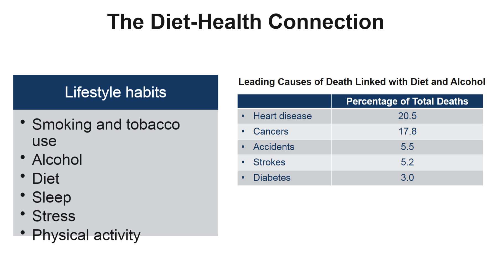

### Human body

Energy come from the **sun** -> plant -> animal -> human

Pic: Nutrient = water / minerals / Vitamin / Fat / Carbonhydrate / protein  
micronutrients = minerals / Vitamin
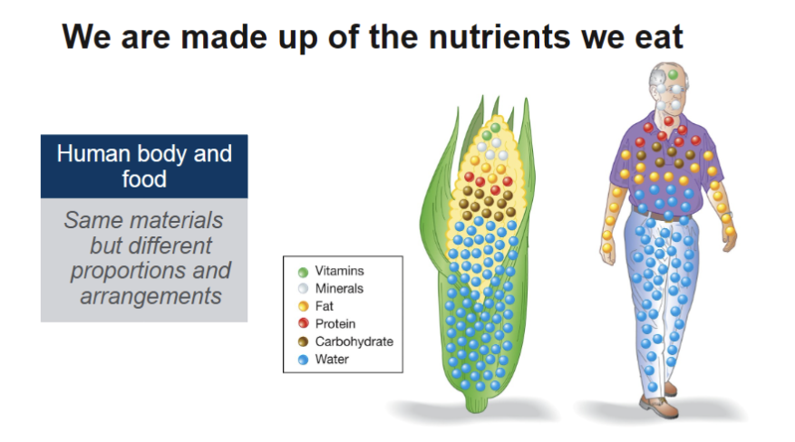

> Note: Alcohol is not classified as a nutrient because it interferes with growth, maintenance, and repair of body tissues.

1. kilocalories,(kcal) units of heat

2. The calories (kcal) provided by a food equal the sum of its calories from carbohydrate, protein, and fat, measured in grams (g)

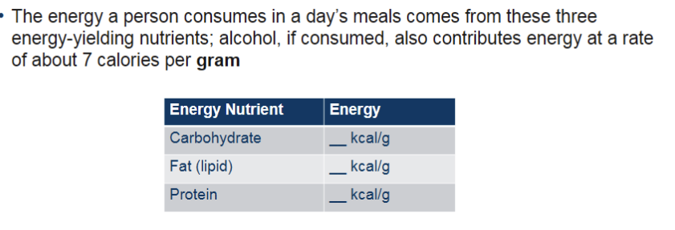

> Note: minerals / Vitamin have no energy.
> Note: About water: The body constantly loses water, mainly through sweat, breath, and urine, and that water must constantly be replaced

Summary: People eat food (food = energy + nutrients), some of them cannot be generated by human itself.

> Term: Dietary supplements are pills, liquids, or powders that contain purified nutrients or other ingredients
> 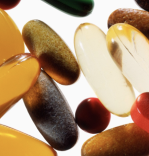

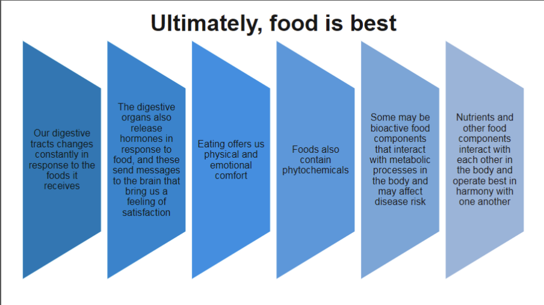

### Which food to eat

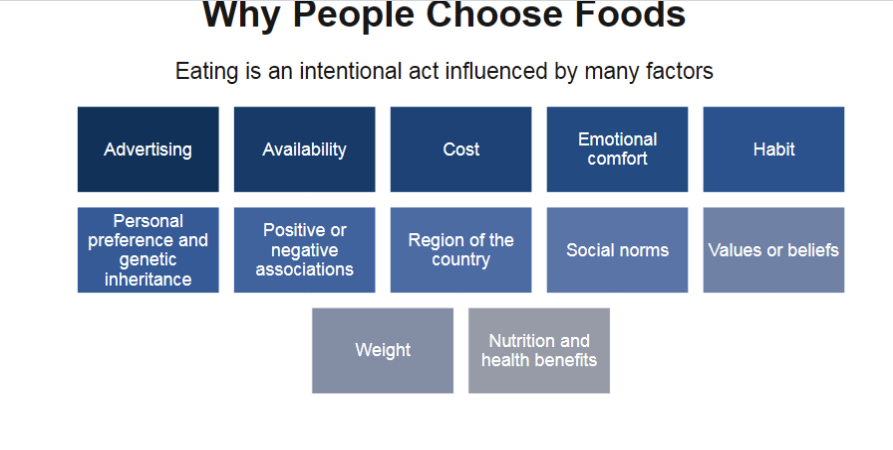

1. General definition of categories of foods  
   | Food Types | Description |
   | ---------------------------------- | -------------------------------------------------------------------------------------------------------------------------------------------------------------------------------------------------------------------------------------------------------- |
   | Enriched Foods and Fortified Foods | Foods to which nutrients have been added If the starting material is a whole, basic food such as milk or whole grain, the result may be highly nutritious If the starting material is a concentrated form of sugar or fat, the result is less nutritious |
   | Fast Foods | Fast provided. Nutrients depends on the ingredients |
   | Functional Foods | A marketing term for foods that contain bioactive food components believed to provide health benefits, such as reduced disease risks, beyond the benefits that their nutrients confe |
   | Medical Foods | AFoods specially manufactured for use by people with medical disorders and administered on the advice of a physician |
   | Natural Foods | A term that has no legal definition but is often used to imply wholesomeness |
   | Organic Foods | Understood to mean foods grown without synthetic pesticides or fertilizers In chemistry, however, all foods are made mostly of organic (carbon-containing) compounds |

2. Process or not
   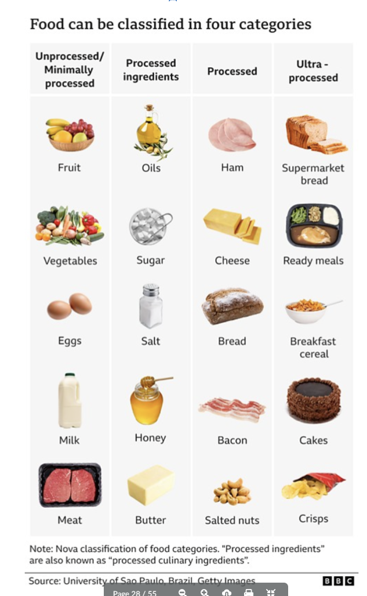

Now we start choosing Nutritious food:

### Some mindset towards knowledge of nutrition

1. Nutrition is an active, changing, and growing body of knowledge
2. Nutrition related news/influencers: better not believe because most findings are released before confirmed .
   1. First:
      - Who: what group conducted the study?
      - Purpose: Was the study funded by a company or corporation that stands to profit from the results?
   2. Second: evaluate:
      1. Research methods is valid or not? scientific or not?
      2. How many people are there?
      3. Advertisement or not: Are financial contributors? Are they selling something?
      4. Is it current?
      5. Check sources of information
         > Look for ".gov"/".edu"/".org" as reliable designation
      6. credentials: Registered dietitian nutritionist (RDN)−Accredited college−Registration and licensure•"Nutritionist" has no legal definition or laws regulating. 

### Research 

Nutrition is a experimental science!!!

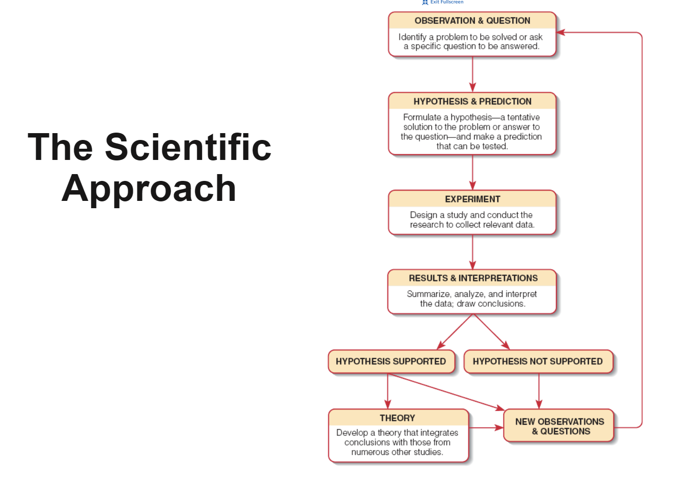

#### Terms
* placebo effect: healing effect that the act of treatment, rather than the treatment itself
* Types of studies: 

How to study?
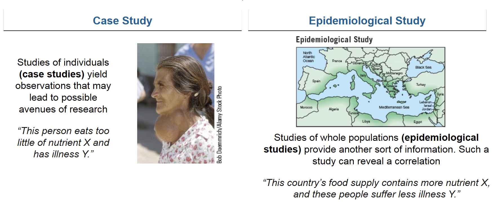 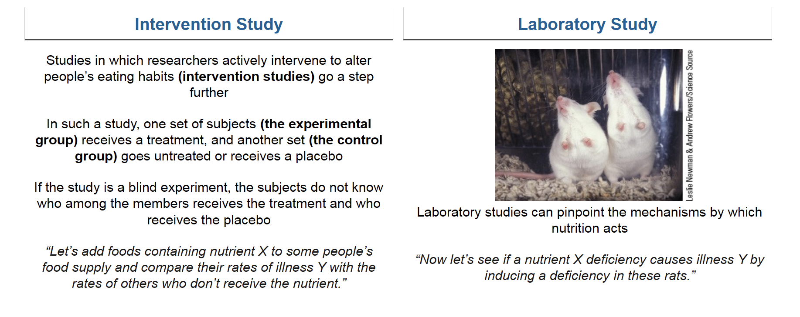
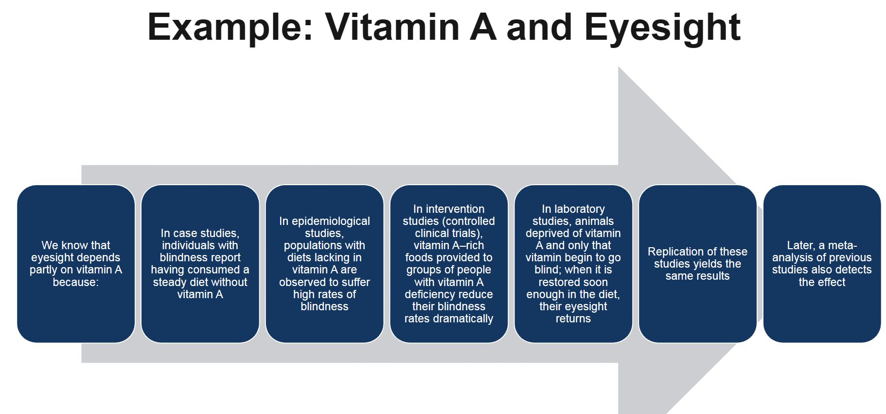

lack of eyesight from vitamin A? -> report: they lack of vitamin A -> epidemiological: people lack vitamin A does have blindness -> intervention: with vitamin A, people are good to go -> laboratory: animals ~ -> 

Where to collect data? 
* National Health and Nutrition Examination Surveys (NHANES) 

### Extra material

https://time.com/7007857/ultra-processed-foods-advocate/
Why One Dietitian is Speaking Up for ‘Ultra-Processed’ Foods

> She swapped her morning eggs for soy chorizo and replaced her thrown-together lunches—sometimes as simple as beans with avocado and hot sauce—with Trader Joe’s ready-to-eat tamales. She snacked on cashew-milk yogurt with jam. For dinner she’d have one of her beloved Costco pupusas, or maybe chicken sausage with veggies and Tater-Tots. She wasn’t subsisting on Fritos, but these were also decidedly not whole foods.

exchange health food with ultra-processed food like chips, soda, bagged bread, frozen food, and cereal -> had more energy and less anxiety and more motivated -> conclude that ultra-processed food is unfairly demonized. 

About **processed** food or not processsed food  -> quite debated like milk 

NOVAt defines an unprocessed food as one that comes directly from a plant or animal, like a fresh-picked apple.

### Link  
first: https://time.com/7007857/ultra-processed-foods-advocate/
second: https://time.com/6245237/ultra-processed-foods-diet-bad/

1. What do these articles define ultra-processed foods as? Do you see any differences between the two articles in their definitions?

Ans: 
The first article suggests a fairly vague explanation towards "ultra-processed food" by saying different people (mostly different scientists, nutritionists) hold different opinions. It finally refers to definition from NOVA, which saying food that is made largely or entirely from oils, sugars, starches, and ingredients you wouldn’t buy yourself at the grocery store. Second article suggests it as food "made mostly or entirely from substances derived from foods and additives". 

I found that the first definition put more focus on ingredients like "oils, sugars, starches". 

2. Why are ultra-processed foods deemed harmful? What are some health outcomes linked to their consumption? 
Ans: Most food after ultra processing even lost the original health benefits from their ingredients (vegetables included) and even contributes to bad outcomes. And there is high risk of gaining extra weight when consuming untra-processed food. One experiment in Article one suggests for same amount of nutrition profile for both unprocessed food and ultra-processed food, people tend to eat more ultra-processed ones, which lead to high risk of obesity

3. What are some situations where ultra-processed foods can be seen as less harmful or even practical in someone's diet?
Ans: 
Some ultra-processesd food like whole grain just mean to reformulate food but not like traditional "junk food" with lots of bad ingredients like salt and unsatuated fat added. Furthermore, A wrapper that contain many more nutritious ingredients is better than eat rice only. And for family with tight budget, ultra-processesd food is always a better option than hard-to-cook fresh meal that can't even make your family full. It is cheap and easy.

4. What are your opinions on ultra-processed foods? Did either of these articles change your opinions?
Ans: 

1. Considering the convineience and low-cost of the ultra-processed food, I think it is irreplaceable type of food that family in low economic status.
2. Considering the junk food that depicts what we generally think what "ultra-processed food" means, I realized it should be overall avoided because some bad stuff is happening during the manufacturing process. 
3. And another thing I just realized is that "ultra" term is over exaggerated for its horrorness. This term originally means to process food heavier. If we put nutritious thing together in a safe way, it is "ultra-processed", but it is still nutritious and healthy.   

## Lecture 2 

### Link 
*Dietary Guidelines for Americans 2020 - 2025 
*Dietary Guidelines for Americans 2025 - 2030

1. What is the same? 
ans: 

Both guidelines ask us to focus on 1. chronic diseases possibly casued by diet especially cardiovascular disease in all types of population. 2. "healthy dietary pattern" which askes us to consume more vegetables, fruits, while avoiding food with added sugars, sodium, and saturated fats. 3. Use lifespan approach in designing methogologies, It is essential "from growth and development during pregnancy and childhood through healthy aging during adulthood." Generally both suggest it is more important to focus on nutrition of food when you are young. 4. cultural responsiveness. Both enbcourage dietary guidance that respects cultural food preferences and traditions varied in differnt culture. 

2. What is different? 
ans: I think overall the second one is more detailed in the methodologies in all aspects. Here are how --  
a. In healthy dietary pattern design, it suggests what exact food should appear and what food you should avoid. The second one concerns more on Beverages and food of saturated fat. (I guess it is because it is harmful and often ignored by the public). Take an example, the new guidelines reinforce that water and other good baverages should be the primary beverage choice while discouraging high consumption of sugary drinks

b. The second introduces new strategies for individuals and families to improve diet quality and manage weight, like Frequency of Meals and/or Snacking, Portion Size. 

c. Culturally more inclusive in 2025 HUSS. For example, in diet simulation population target includes American Indian and Alaska Native populations. 

3. What are your thoughts on what has changed and what has stayed the same? 
ans: 
The most important quality of The 2025 to 2030 guideline is that it is more **detailed**, and easy for people to design their goals. Specifying the importance is easy but designing specific plans are difficult, like telling people how to control meal frequency, portion are much more educative than just telling people to simply eat less or eat more. Same for the food choices, the expanded focus on avoiding exact beverages and saturated fat is more important than just telling people to eat healthily.

## Lecture 3

In what ways does the microbiome communicate with us? 

Ans: "The brain and gut are in constant communication and that changes in the microbiome are linked to mood and mental health." Explicitly, people with specific biological structures tends to be more resilient in stressful events. Biologically, the microbiome can produce short-chain fatty acids that help maintain the gut barrier and exert an anti-inflammatory effect on the brain, among other things.

What effect does stress have on the microbiome? 

Ans: "In the context of stress, scientists have found even short term exposure to stress can lead to alterations in the microbiome, and that changing the composition of the microbiome could make some mice more resilient to stress." This means that stress can somewhat effect microbiome in gut and microbiome can in turn effect how you response to the stress. It is actually a cycle-like effect. One specific example would be that certain microbiome can generate short-chain fatty acids that "exert an anti-inflammatory effect on the brain". And it turns out that people with depression were found to be lack of those microbiome. 

Based on this article, would you recommend a probiotic supplement to someone looking to have impacts on their mental health? Why or why not?

Ans: As the articlce is saying: 'complexity of the microbiome calls for a different approach than what’s typically used in pharmaceutical development, which tends to focus on finding a single molecule or drug.' Current research only build up the logical connection between guts and brain. It theoretically works but not the effect is not tested well. There are challenges faced during testing stages like how do we exactly detect the 'brain activities' of the testers. So generally my answer would be a mild "not sure". 

What foods are generally recommended to promote a healthy microbiome? 

Ans: In the article, two studies are briefly introduced. They indicate that first --  'certain diets (one rich in fermented foods) can reduce inflammation.' (like yogurt, kefir, fermented cottage cheese, kimchi and other fermented vegetables, vegetable brine drinks, and kombucha tea) Second, in the article mentioned. (link -> https://www.nature.com/articles/s41380-022-01817-y)'whole grains, prebiotic fruits and vegetables, fermented foods, and legumes' can effectly influence microbes and positively relieve stress.

## Lecture 4

Match

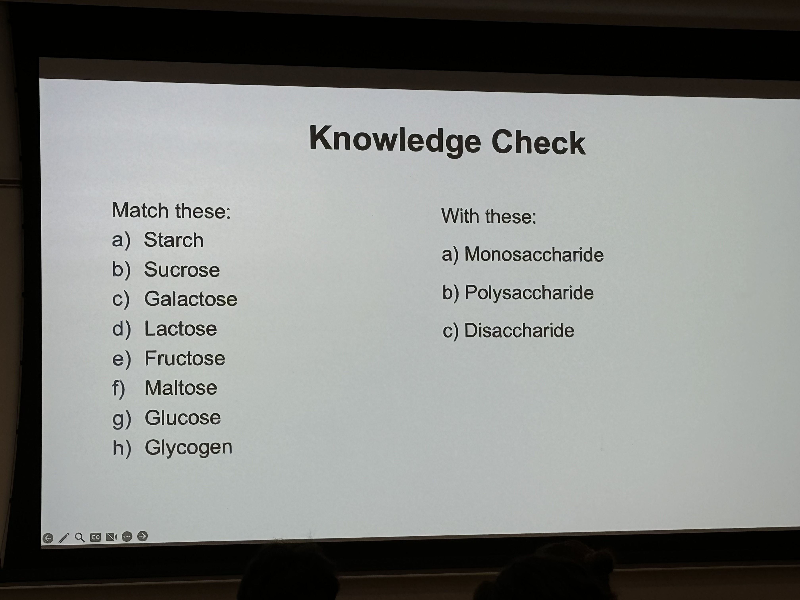

exam: 
* photothessis
* soluable fibers: what it is ? Waht types does it have? 