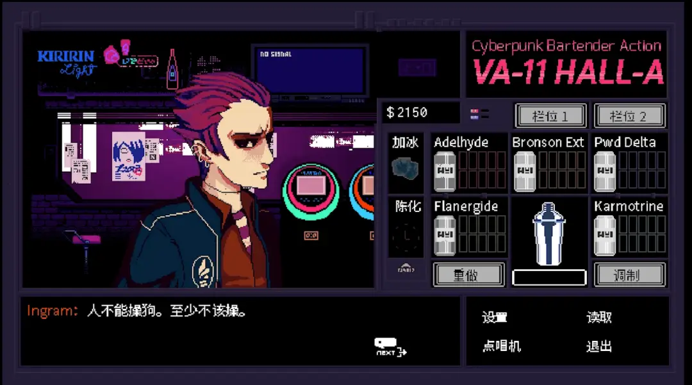

这个游戏温馨，包容。

_作者在一开始的时候就告诉你要边吃零食边玩。:D_

是不是有种青楼大妈跟你说我是绿色健康小清新的既视感？？放荡不羁的朋克怎么就跟温馨一词搭上边了? 文字冒险游戏最重要的部分就是他的氛围（绘画，BGM）和文字。而这个游戏在这三方面都有属于自己另类的特色，所以他朋克。

*毕竟这个游戏有这个史诗级名场面*

迎面走来的顾客论种族有人类，lilim（游戏设定中的像人类的智能体），还有嵌入各种智能系统的人类。社会身份有每次喝的烂醉尝试用黄色笑话遮掩悲伤过去的人，也有杀人如麻但是内心温暖的人类杀手，有满口黄腔，把卖淫当作一番事业的可爱lilim，也有为了歌迷愿意奉献自己一生去当偶像的lilim。在过去的哲学课上Chalmers教授一直提醒过的objection就是沙文主义。在很多围绕Value的哲学问题上，比如电车难题总是能做出一些魔改，让哲学家们思考机器产生意识的时候，他们存在的Value相比于人类的存在是什么。而这个游戏给我的观点就是：对表现得极像人类的机器来讲，我反而prefer把他们当作人类。

这个游戏有种相当洒脱的气质，这个气质主要来自于主人公jill。虽然va-hall-11a是一个充满“狗尿和肥皂”味道的酒吧，但是jill的服务总是和理想中的服务员的状态不同 -- 她几乎是钢铁直女！！！！她只展露她最真实的一面。jill的很多话都给了深夜疲惫不堪的我不少的慰藉。比如jill当上调酒师的经历就不是什么中二的远大理想，而是因为生活受阻，但是又想做自己稍微感兴趣一些的事情的妥协。

*我真的很想把jill掰直*

因此，我对赛博朋克酒保行动中**朋克**的理解就是 --- 这个抽象世界中jill平平淡淡的但是真实又中二的性格。接受了身处于抽象的赛博世界中的平淡，其实就是一种朋克精神。