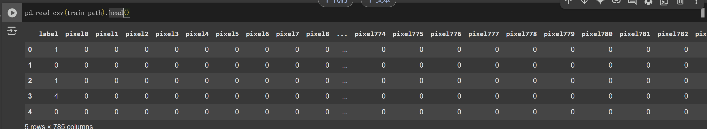

我认为对dl这个东西，每人都有自己的职责：scientist实验这些框架能否解决新的问题（太上老君/生物学家）；engineer搭建快速框架/硬件（怎么造炉子/工程师）；mathematicians/physics people思考这个炉子的可解释性（永远的好奇宝宝/物理学家）；最后data scientist套现有的公式炼丹解决问题（炼丹童子/做题家）；

上dl课每次学完玄乎的丹方总是想着自己实践一下，最后总是发现其实没啥可实践的，除了一些infra的东西（框架/infra for ml）engineer可以做做；给data scientist留下的工程实践不难，但是却需要对问题有深刻的理解，套正确的公式。

kaggle是一个很好的训练套公式理解的平台，并且很适合我这种算力不够的学生写一些小比赛练手，遂写博客总结一下pipeline和常用的框架，省的之后思考。

## 炼丹童子的自我修养

### 处理data

#### 1. 预处理
下载data
``` py
path = # download 
os.listdir(path)
 ```

例子：minst


``` py 
train_data = pd.read_csv(digit_recognizer_path + "/train.csv", dtype = np.float32)

# split data into features(pixels) and labels(numbers from 0 to 9)
targets_numpy = train.label.values
features_numpy = train.loc[:,train.columns != "label"].values/255 # normalization

# train test split. Size of train data is 80% and size of test data is 20%.
features_train, features_test, targets_train, targets_test = train_test_split(features_numpy,
targets_numpy,
test_size = 0.2,
random_state = 42)

# create feature and targets tensor for train set. As you remember we need variable to accumulate gradients. Therefore first we create tensor, then we will create variable
featuresTrain = torch.from_numpy(features_train)
targetsTrain = torch.from_numpy(targets_train).type(torch.LongTensor) 
featuresTest = torch.from_numpy(features_test)
targetsTest = torch.from_numpy(targets_test).type(torch.LongTensor) # data type is long
```

#### 2. 参数dataloader设置和sample可视化
``` py
# batch_size, epoch and iteration
batch_size = 100
n_iters = 10000
num_epochs = n_iters / (len(features_train) / batch_size)
num_epochs = int(num_epochs)

train = torch.utils.data.TensorDataset(featuresTrain,targetsTrain)
test = torch.utils.data.TensorDataset(featuresTest,targetsTest)

train_loader = DataLoader(train, batch_size = batch_size shuffle = False)
test_loader = DataLoader(test, batch_size = batch_size, shuffle = False)

plt.imshow(features_numpy[10].reshape(28,28))
plt.show()
 ```


### 准备框架
``` py
# 准备i模型
class LogisticRegressionModel(nn.Module):
    def __init__(self, input_dim, output_dim):
        super(LogisticRegressionModel, self).__init__()
        self.linear = nn.Linear(input_dim, output_dim)

    def forward(self, x):
        out = self.linear(x)
        return out

# 模型参数。
model = LogisticRegressionModel(28*28, 10)
error = nn.CrossEntropyLoss()

# 超参。
learning_rate = 0.001
optimizer = torch.optim.SGD(model.parameters(), lr=0.001)
 ```

### 训练
ViT的训练例子：

1. 准备
``` py 
from torch.optim.lr_scheduler import LambdaLR

warmup_epochs = 10
num_epochs = 50
best_val_acc = 0

def warmup_cosine_lr(epoch):
    epoch = torch.tensor(epoch, dtype=torch.float32)  # Cast to tensor
    if epoch < warmup_epochs:
        return (epoch / warmup_epochs).item()  # Linear warmup
    return (0.5 * (1 + torch.cos((epoch - warmup_epochs) / (num_epochs - warmup_epochs) * torch.pi))).item()

scheduler = LambdaLR(optimizer, lr_lambda=warmup_cosine_lr)
```
2. 开始训练 
``` py
for epoch in range(num_epochs):
    # ----------------------Training Step-----------------------------
    model.train()
    for _, data in enumerate(trainloader, 0):
        inputs, labels = data
        inputs, labels = inputs.to(device), labels.to(device)

        optimizer.zero_grad()
        outputs = model(inputs)
        loss = criterion(outputs, labels)
        loss.backward()
        optimizer.step()

    # ----------------------Validation Step-----------------------------
    scheduler.step()
    model.eval()
    correct = 0
    total = 0
    
    with torch.no_grad():
        for data in testloader:
            images, labels = data
            images, labels = images.to(device), labels.to(device)
            outputs = model(images)
            _, predicted = torch.max(outputs.data, 1)
            total += labels.size(0)
            correct += (predicted == labels).sum().item()

    val_acc = 100 * correct / total
    print(f"Epoch: {epoch + 1}, Validation Accuracy: {val_acc:.2f}%")

    if val_acc > best_val_acc:
        best_val_acc = val_acc
        torch.save(model.state_dict(), "best_model.pth")
 ```


## 丹方（常用的框架nn；pytorch）
Regression: nn.Linear
ex: https://www.kaggle.com/competitions/titanic

Classification: (nn.Linear + sigmoid) *n + softmax
ex: 经典的mnist https://www.kaggle.com/competitions/digit-recognizer

