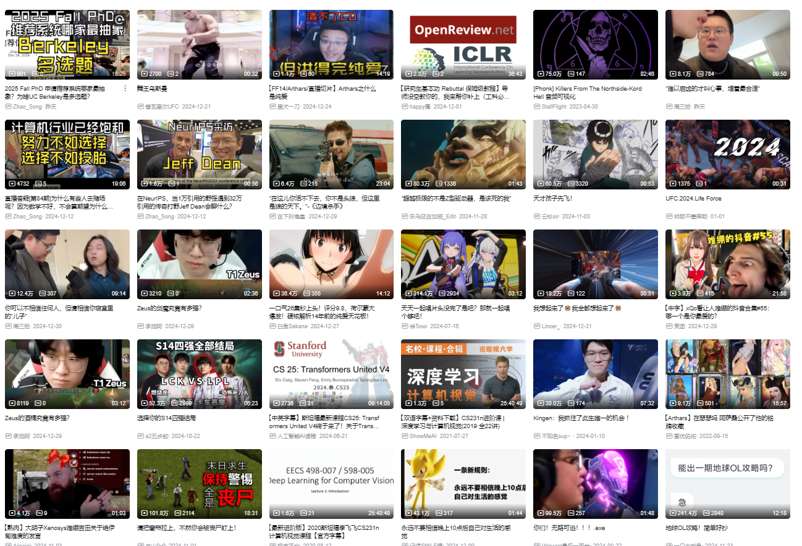

最初的感想来自小岛秀夫桑
> 阅读书籍、观看电影所带来的“疑似体验”，真是非常不错的“体验”啊。
当然，真正地去旅行，直接去感受那片土地的空气自然更好的。与其听人言说，肯定是自己去登山比较好。不过这也是有限度的。所以在书和电影里，体验他人的体验的、疑似般的体验，有着共有的意义。
能够体验不能前往的过去和未来、那样的遥远的世界，还能体验与自己所不同的民族、性别。书虽然是一个人看的，却能在不断展开的故事中的陌生人共有。
虽然孤独，但连结着。
这种感觉，从小以来一直救助着我。所以我想通过这本书，把书所带来的“连结着” 的感觉传达给读者。
而在这连结之中扮演着媒介的是，MEME（模因）。知道这个的人不少吧，这是进化生物学家理查德·道金斯所提出的概念。与生物学上的基因（GENE）不同，是指将文化、习惯、价值观之类的信息继承至下一世代。故事，应该算是MEME的其中一种形式吧。言语相传、文字相传，继承着文化。
如同继承连结着人与人的遗传基因（GENE）一样，人在与书、电影连结之时，继承着MEME。
在这世界上，书、电影和音乐不计其数。把他们全部都体验一遍，到底是不行的。因此，自己至死为止，会与怎样的东西相遇、并留在我的人生中，这有着重要的意义。
相遇，是偶然的、命中注定般的。不知道会在何处与什么、连结着怎样的缘分。因此我，不只会漠然地等待，凭自己的意志行动、有选择地去相遇也是十分重要的。这与人的相遇是一样的。

每天我们都会经历过无数的meme，至少就我来说，

这只是我收藏夹的一页而已，它相当的精彩。meme是数字生命，也是现代人类经过的地方，他让我们原本去不了的地方变得可以接触，在这过程中我们只是经历，却从未驻足过，深深体会过。

每次回头看这些收藏夹中的封面总是感慨万千 -- “啊，一年又过去了啊. ” 就仿佛还记得自己看视频时候的心跳声，脸上的笑容。

但是meme是存在server disk上的，总有一天也会再网络上彻底消失。所以最近买了个5T的硬盘，想把一些至少自己喜欢的meme，至少看过很多次的留下来，让这些数字meme流下去。或者做个可视化模块留下来，应该还是挺有意思的。