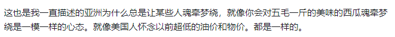
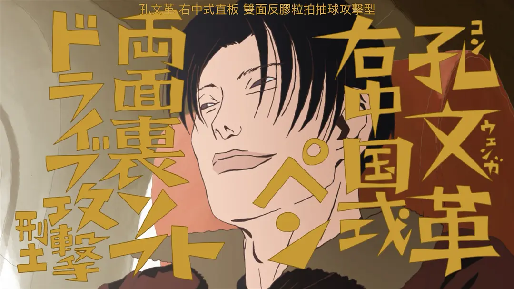
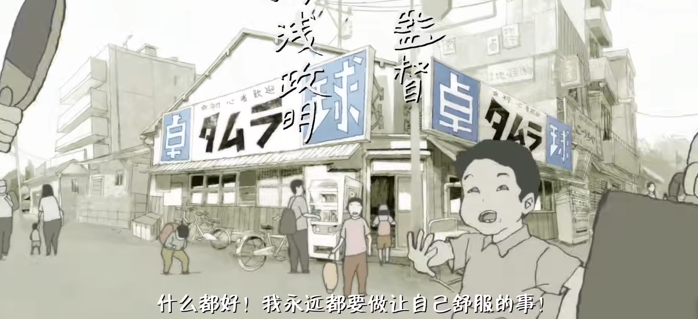

## 大学第二下半年随想日寄

### 有关一些决定的想法

~~**phd**？没有明确的决定，毕竟我还没有一段完整的research。但是目前来看大概率会quit读phd，原因是不赚钱，成就感低，不够热爱。~~

~~**grad**？我认为时间相对于一个**学历**要重要得多，但是本校在选课系统上又有意无意的隔离本科生和研究生的资源。不知道能不能选到研究生的一些核心课程，能选到的话应该不会读本校grad。考虑到opt的问题，我会先把本科的opt用了，之后还有可能读grad。~~

*上面是大二初的想法*

现在的想法就是没有想法，我什么都要掺和一脚，其中我认为几点心态要做好。

1. 要有**势能**。不能停下脚步太久，至少让自己忙起来，可以不知道自己的大目标是什么，但是一定要有目标，不然回归函数怎么跑？

2. **不要怕，不要躲避**。天下没有免费午餐，又失才有得，要多多踩坑，多多失败。
  
对我来说我还不打算做出什么决定性的一步。tech industry，现在不仅仅是科技领域，每行每业都是有风险的，我认为一步一步踏踏实实走就行，grad先申请着，opt申请着，不要太二极管。

重点在于，没有**哪项技术保证你一定赚钱，也没有哪个学术老板能保你稳定的未来**。你的性格和能力会将你导向你应该的结局，至于你现在怎么plan其实不重要，因为往往现实会更加魔幻，市场的沉浮，老板朋友的性格，我认为随机应变做出有利于自己的决策要重要的多。You can’t connect the dots looking forward; you can only connect them looking backwards. 

*11/17 update：最近trump上任了，更加坚定了以上的想法，走一步是一步。*

3. **实践为主**，甚至放弃思考先实践。舍弃了一切不能反哺于自身行动（不论是自己的精神世界还是社会实践）的思考/行为。在之前一段日子曾经很喜欢哲学入门课，还上了一门课，同时也特别喜欢炫耀自己在所谓“哲学”上的精进，其实无非是炫耀装b罢了。不要花费时间在那些假大空的思考上面，除非真心觉得它很有意思，自己喜欢花时间就不亏。（比如建立一个规则完善的世界，这很没用，但是我觉得它很有意思）

4. **大多数时候，关闭自己的共情按钮**。尤其是负面的事情，在什么公交地铁上被琐碎事情浪费自己哪怕是那么一点注意力都是对自己的不善。Same as social media和一些视频平台，别人的节奏少带入，也少评价，问就是没用，对自己仅有负面影响的事情为什么在意，为了炫耀自己有多博学? (除非是真的好朋友，除此之外都是浪费自己的精力去掺和。) 有这点时间不如自己去经历一些事情，玩游戏看番写日记写代码。

### 8.23 五毛一斤的甜西瓜

### 8.23 主体性

典，孝，急，乐，绷。这些词其实是一类群体发出来的。

这些词通常都是用于搪塞一些正常的需要逻辑的回答，用这些词好像就可以回避一般的躲过。但是你要记住，本质是回避。虽然乐子人总是认为自己是赢的，认为这让他们赢了脸面，但是没想到的是这些回答本身就实则降低了他们的主体性，也错失了不少机会。

扔掉这些回避的词吧，踏踏实实地回答，勇敢的面对这个世界。

> 用你自己的范式去定义，而不是被定义。这是基本的主体性的道德。

### 8.23 推荐一些用户
[tim未来之光](https://www.zhihu.com/people/maple-syrup-41/answers)

这个博主，最近我一直看，感受挺深的，对改变我的性格和行为有指导性的作用。

### 8.14 乒乓 -- 一部浓缩了人生的群像动漫

*我也好想再去一次江之岛啊。*

上下班抽空看的，但是不妨碍感受深。这部番是我今年，甚至取代了近几年的megalobox2，成为了我最喜欢的运动番。

> "看似乒乓，实则人生。"

（**剧透警告**！！！！）

这部番讲的故事非常简单，和大部分的运动番的设定一样，有一个青少年职业赛，一群热血的少年在里面搏杀，最后的人夺得冠军。但是这番不太一样是，他是（我认为）一部群像番，他对每个主要参赛的选手都刻画了性格。

**这部剧很现实**。

虽然乒乓互杀的时候会有艺术的加工。剧中的所有的剧情都是按照设定的战力来的，你上场，能不能赢，完全就是靠天赋 + 汗水，假设你练少了，输，练多了但是没天赋，一样输。就那我最能感同身受的孔文革举例吧。

孔爷在这部剧里的设定就是年少苦练乒乓球的少年天才，但是距离星野的天赋还是有一定距离的选手。

所以在开局，他和星野的第一战，他毫无保留地秒杀了还没有刻苦训练的星野。但是在之后和比他天分高，但是有比他加倍努力的风间比赛时，他能感受到一种即使自己再努力，也无法挽回的局面。这，就是竞技项目的残酷。

因此，这部剧的很多笔墨是放在败者的心态上的，看他们会怎么在失败中调整心态，迎接之后的人生。

随后与星野的第二场比赛，孔彻底释怀了，他在失败中看清了自己的道路。他有爱他的妈妈，懂他的教练，有他半生不熟但是渐渐打上交道的队友们。他知道他输了这场比赛也许会回不了祖国，但绝对不是他的终点。

Akuma，甚至风间这几个属于天才级别的选手都选择在之后的人生中离开了乒乓的主线，但是孔文革，也许是为了他的梦想，在最终并没有选择放弃竞技乒乓，他咬住牙关继续了，并且获得了奥运会的门票。这也许就是我们很多人心里都有的傲气的展现吧 -- 那份年少时曾经为了成王的傲气。年长后输过，但是依然傲气不减，反是多了份沉稳的心气 -- 对成王不再执着，为了发挥出自己全部实力而打球的样子，只是为了不辜负年少时的自己。这就是孔。

其他所有选手的心理和设定都有类似孔爷一样的交代，比如akuma，看海哥，教练，风间。。他们独有自己的背景故事，也讲述了每个人人生中所承担的东西，月本的胆小，风间的责任，星野的颓废，akuma的绝望。所以在这部动漫里，虽然只有11集，但是你能看到每个角色在里面都有模有样地通过一些场景刻画了性格，并且毫不突兀。每个角色反映到现实里，其实都倒映成了自己的影子。

**这部剧有互相救赎**。我称Akuma为救赎的王，开导的神。

Akuma在输球给星野后清晰地意识到了自己和星野的天赋和热爱的差距 -- 星野超过他太多了。他一把把颓废的星野拉了回来，因为Akuma清晰地知道，乒乓对于星野来说是星光大道，他既有几近痴狂的热爱，又有孔都难以企及的天赋。他只要继续努力一下，绝对能在其中找到人生的意义。

他也知道风间背负了太多，他魔鬼般的训练完全不是为了自己，而是为了团队和家庭，某些巨型意识形态的脸面。但是akuma看的出来风间这样做，自己心里始终放不下自己丢脸的那一刻。而他经历过失败，经历过心里被天赋选手彻底撕碎的绝望。他知道龙一其实就是难以释怀有一个和他一样的天才出现而已。正是因为如此，风间需要一个选手来打败自己。

而之后风间也被hero击败了，得到了救赎。

人生中总是充满了努力和天赋的选择。对每个人来说，至少每个人都经历过考试吧。考试就是一项有输有赢的竞技。有人会发扬自己的天赋，有人会因为喜欢而坚持，有人会去看海，有人。。只是会去干除了乒乓球以外的事情，而无论你选择了什么，只要称心如意，那就是正确的。这部番之所以让人共情，就是在告诉每个人都经历的过的，在不可避免的竞技中受到的挫折中，你应该活出怎么样的属于自己的一生。

答案也许就是op中的歌词一样吧，不论是因为责任，童年，爱的家人，还是就是纯粹的喜爱，我都要**永远做让自己舒服的事**！（现实中应该不太会，番剧感动一下就好了）

总的来说，这部番的完成度太高了，是一个浪漫和现实夹杂的艺术品。光立意就很丰富，更别说他炫技一般的分镜了。

**神中神**。

### 8.3 - 8.10 想法 IV -- 接近离职期间

事业上的想法，

1. 不论是混社会还是自己创业其实跟你周边混的近的社会圈子高度相关，在有能力的情况下，成功也是大概率依附**运气**。 

从攀附权势（不论是学术圈，科技公司圈，还是政府圈）都是极大取决于**导师**的，遇到个好导师/老板会极大程度的提升你获得某种程度的成功。创业也是，最近也看了《硅谷》S1，即使是创业也是要看运气的，万一出来一个Hooli的人员，复刻了一个性能都ok的piepiper把你搞了，你咋办？

当然，话说成这样了，前提也是在你有能力去争这个运气的情况下。

**圈子很重要**。因为它会有许多意外之喜，遇上正确的人也会提升你的眼界，这就是名校/好公司/好组的好处之一。所以**不要妄自尊大。多和业界，硬核cs学生交流**。我之前觉得在FGPA板子上跑自己的os已经是强的不能再强了，但是跟几千人，几十年的os研发相比，个人重复的造轮子都是不足一提的。学习可以，要学习那种硬核的技术，当你在这种环境下淫浸过一段时间时候，其实要比什么**认真的态度**重要的多。闭门造车玩可以，别把它当事业，当然，工业含量不高的project也有创业的可能性，比如说独立游戏，或者是一个实验室研发的新架构等等，但是成功的概率就不好说了。

所有都视情况而定，假如说有紧急要务在身自然还是要务。

1. 因为自己欲望过剩，去在晚上打街霸都是不好的行为。导致明天上班没劲。

生活上的话，公司大多时间都刷知乎了。

2. 人是环境的动物。还是那句话，出门社交的圈子里的人决定了你是什么人，你每天如果呆在家里那么对你人格的塑造会很有限。（当然有些圈子还是不要碰的好，这时候不如宅在家里）

3. 要多去女仆店学日语。

4. 生活中的一些良心资产我归档一下。 
   1. **身心健康**属于超良性资产。所以为了鸡毛小事，类似地铁上和人因为三观不合吵架，或者是网上游戏剧情好坏这种事情抢夺了自己的注意力就不好了。
   2. 注意力。在平时的通勤时少刷那种负面新闻，让自己的注意力放空，上班鸡毛会议的时候不要投入过多心思，份内事做好，组会正常交流就行。我现在除了一些特殊时刻几乎都会给自己的注意力一点喘息的空间，这份空间能保持我的精神持久的80%专注。

### 7.25 有关游戏中的人物塑造

直奔例子，这个暑假的游戏几乎是被二游包揽了，zzz，铁和mc。

我对真实女性的觉察力更现实了一点，以至于我几乎完全代入不了一些媚宅的人物或者情节。一些角色的诞生之初我就知道这是套啊宅的钱的计划而已，我会不自觉的有种被欺骗，犯恶心的感觉。我觉得有媚宅属性当然可以，但是前提是人物得**立体**，不自然的想我示好就会有种**茶**的恶心感。

真理 --> 
> 流萤，真的是理想中的女友吗? （当然是）

> *女人的话不可以信哦*

我喜欢立体的角色。立体的角色不一定是要和现实中有相似处，而是能够有令人感到信服的人设，三观，在游戏世界观的中逻辑自洽就行。举个铁的例子，**青雀**就是一个立体人物的例子，前期因为不涉及主要纠纷，她就是喜欢打牌摸鱼，但是给人感觉就是一个喜欢摸鱼的事务员的角色，在之后的的支线言行举止都是如此，就现在来看其实挺单薄的；但是之后和符玄的剧情里却是愿意担上责任，救回符玄的性格，我回头才发现其实青雀不只是喜欢摸鱼，她其实是有能力去做好很多事情的，但是自己更加喜欢打牌而已，在不同的情景下她能做出依据她的三观做出不同的决策。这个角色就很立体，同时她的三观也说明了是一个拎得清的人，她就会很讨喜。

有关戏剧。我认为，合理之中加上赌博成功 = 戏剧性，所以我认为戏剧本质还是赌博。

哦对了，肉腿天下第一。

### 7.25 感受III

最近有几点**人生**感受，挑重点讲下吧。

第一点是**Take some time to listen to your inner voice**。 我发现最近不论是工作还是生活都是相对被动地被牵着走。工作上等着导师的下发的工作，刷着leetcode，看着网课。生活上刷视频想乐子而不自觉。当我完全无聊下来的这段时间反而会很享受，我会感觉我是自由的。谨记生活中给自己留点幻想和思考的空间，这很享受。（阅读其实是这样的一种活动，大脑是会脑补一些）

其次的一点是**个人的价值不依托于工作**，重视自己的观点，无关对错，这本身就很重要。之前认为工作极大程度的代表了自己，于是give up了很多在自己身上的活动，人生中想做的事情也少了很多，像一潭死水。这一个月过去感觉更甚，毕竟底层软件开发几乎看不到自己的影响力。更加让我理解了为什么，有些人要去吃三个月黄油拌饭做一个自己真正喜欢的游戏；spotify创始人也说了，其实人生中最令他影响深刻的事情就是在电脑面前演奏吉他。所以有些事情看似平淡如水，自己身处其中时可能不经意间就让时间流去了，但是正是这些事情给自己留下了极深的印象。

> 对我来说就是登一座山，打爆一个沙袋，练上维吉尔的科目一，学会快速拔枪精准射击，然后和电脑交互。。。我当然不知道为什么，也不想知道为什么。

社会规则使得人生不会自由，但是人生一开始是旷野，要记住。 

### 7.21 感受II -- 螺丝丁的感觉

首先生化幻彩算了，出国商法医算了。（商累不喜欢，法医没路子）

不知道对不对，connection和混圈子是必不可少的了，这在哪都是一样，销售VC创业科研科技管理公务员政要机关人员bankeranalyst，人情味啊人情味~。

### 7.4 感受I -- 入职一会了，谈谈实习感受以及有关事业的想法

有关氛围：
* 技术氛围好到爆炸，geek风非常浓，随处可以听到人讨论技术细节。
* 个人难窥全局，作为一个技术小兵能做到的事情非常非常非常有限，想要除了公司之外的事业成长几乎不可能。
* 周围前辈都很卷，互相push。

1. 码农965的牛马风味。

即使是实习生每天都是呆在工位上8小时，虽然一周的实际工作2小时就可以写完。但是一周5天如此谁也受不了。一开始我会非常兴奋，但是之后可能热情会急速下降。我感觉如果是这样一周五天我真的会受不了，经历过了便有了run的动力，希望自己之后记住这种感觉。

<!-- TODO，写自己对创业感兴趣。 -->
1. 总算大概明白了开源社区怎么work的。

一开始非常不理解，开源这种事情不是纯纯的自杀行为吗？把自己的核心技术卖给其他人，那不是纯纯的割自己肉煮给别人吃？

看了会linux内核，大概理解了为什么开源也有钱赚，本质上也是核心服务卖给别的商业公司提供支持，比如linux会维护不少商用处理器的微内核支持，然后那些公司客户给linux foundation钱，同时大公司的支持也能进一步扩大自己的影响力。不得不说linux真的是一个伟大的开源项目（same as GNU），不仅仅做到了linux的特性不变，因为可部署性太强了，也能起到很大的商业价值，也造福了每一个个人开发者。

如果之后作为一个爱好的话非常乐意成为喜欢的开源社区的维护者。

3. 学习的确需要一点意志力。

所以我认为我现在我缺少的不是什么没学过什么屠龙之术，arch相关的造芯技术啊，或者是少打榜cf啊，或者是成为内核大神协议大神nvlink信手拈来啊这种。科技圈子里，想成为耀眼的rockstar，目前我认为要找到最适合自己的那条路，最重要的永远是适合自己。系统核心软件，数据库，网络协议不熟悉，那学啊，愣着干什么，没用吗? 这些是基础中的基础，前沿技术，云啊什么的基本都是在用这些部件搭建起来；没做过科研，不知道ai科研和产业界的联系在哪里，ai都要融进各行各业了（包括华为无线基站lol），还不学? 对系统这么喜欢为什么不研究mlsys？ 

说到底这些都是开图工作，是学习为核心的工作，相比于面对一个从未被解决过的问题来说，做一个课堂project其实是最简单的。最重要的是**持续前进不要犹豫**，犹豫成本还是很大的，要在做了30%的时候犹豫思考一下而不是3%的时候就早早停下。

### 6.28 有关财务管理

### 6.15 时常思考自己的identity / 一些三观问题吧

我认为一个人的**强大**在于**内核有多稳定**。强大与否并不代表了我能否赚钱（虽然赚钱很大程度上需要内核的稳定，但是也有很多其他因素的原因），而是我在过自己的生活的时候是否能够和自己当时的心态自洽。

不轻易的动摇自己的价值观是很重要的。不论与他人的价值观的差异与否，正确与否，内核稳定总是让一个人能够稳定向前。

Identity基因论是纯纯的无稽之谈。随着生理结构的改变，identity自然会改变不少，这也是我blog随时记录的原因。

### 6.10 杂想 I

在旅途中和假期中思考了不少事情，产生了一些对自己的新认知，我认为有些也适用于大众。

有关个人性格：
* 个人性格**能改变**。这是心理学的结论。
* MBTI是纯纯的收钱机器，不要相信，相信也会容易钉死自己的前途，把自己置于模版之中。

有关IT：
* 要赚钱的话请**老实的相信市场**，与其信奉一些宗教不如老实做市场调研。实实在在的需求 + scalability（比如计算机网络给互联网加的buff） = money。现在就依然是互联网和上游的芯片可以搞点钱。
* 我认为创新是需要时间的，但是结果可能是工程上的一个更为精妙的设计。而领悟到这些需要“悟”知识，在cs领域的设计博物馆中不断的从良好的工程项目中汲取灵感，这也是在学习过程中最重要的一步，**有灵感灵性其实要比死的科技只是有用的多**，这些需要一些灵性和很多的experience。

有关个人生活组成：
* 不要**每天**刷视频（最近在闲的时候就会喂自己吃一点电子垃圾）。
  * 刷视频的**记忆优先级**是非常低的 -- 你少有会记得自己刷过的视频，但是你一定会记得今天创造了什么，健身破了什么记录。
  * 刷视频是感官刺激，你对那些淡而悠长的刺激的事情会忽略，比如读书，研究一道数学题，健身等。
  * 但是不得否认这些视频是让你知道一些新鲜事的途径，我觉得一周一次的频率是可以的。
* 在自己一个人的时候，注意力放在自己的肉体和精神世界：
  * 实体化自己的精神世界就是这个blog，日记本，和电脑中的code，鉴赏的文艺作品，喜欢的世界观（东方，黑魂）等等。
  * 即使无聊也不要浪费时间，无聊其实才会让人幻想，才会产生一些创造的灵感。

有关社交：
* 在没有近距离接触人的时候都**不要抱有太深的好感**，这种是作死行为。在现实生活中想了解一个人几乎不可能。
* 有的时候不在意一件事情就是最优解。他人会渐渐的不在意这些事情，而你也没有被内耗，是一个双赢的局面。

### 5.17：围城

在自己身上和网络的言论身上总是能看见对过去的日子的怀念。毕竟人会在自己失去某些好处的时候开始怀念起过去。比如说在美国的日子一个人会很容易变得孤独，毕竟没有家的感觉，漂泊在外。

后面我自己翻了翻之前的日记发现其实现在过的并不比过去过的差。所以人总是要向前看的，不要忘记围城的原理 -- 你只是不记得过去吃过的苦罢了，以及选择性的忽视了现在生活的幸福感。

要保持**感恩**的心态。

### 5.15：黑客和玩家

在飞机上特别无聊，看了不少经典的lecture。早就因为《黑客和画家》听闻过Paul Graham的大名，虽然没有创业的想法，但是也对创业这个话题稍感兴趣，于是就在飞机上补完YC在Stanford的那个经典lecture，我觉得对科技相关创业者启发非常大。听下来有几点非常好，我写点笔记:

[Lecture 3 - Before the Startup](https://www.bilibili.com/video/BV1V84y1Q7pT/?spm_id_from=333.337.search-card.all.click)‘

1. 大学生不能创业。因为创业是很累的要全身心投入的，一旦你创业了，你就不是大学生。
2. 为了准备科技创业，黑客们最好学习到最硬核的技术和思考方式。
3. 创业的目的应当是做好一个产品。
4. 创业的起点总不是脑子里有“我要开始创业了！”或者“这个想法很不错！”这个想法的时候。（对于骗投资人这个方法，我认为这是投机，并且会给投资人非常差的印象）。起点总是一个小的，但是充满激情的。（比如paul的挚友morris手捏蠕虫病毒，又或者是他用packet编程来免费给女友通话）。
5. 个人观点：创业者通常是个**热爱生活**的人，绝不是那种**闭门造车**的纯nerd。因为跟生活社会贴的进了，一个人才有可能洞察到机会。科技行业更是如此，你如果在某处洞察到了开发需求，各种为了便利而生的框架便应运而生。

### 5.8：把注意力放在内心世界

注意力这个东西，或者说是时间，对每个人都是公平的，每个人都有一天24个小时，你选择把时间花在哪里决定了这段按时间的价值。

而我觉得把注意力放在自己的内心世界是博取快乐的一种方式。比如现在，我正在梳理自己的想法，其实是和自己的内心世界交互的一种方式。

刚刚在想刚刚过去的这一年是不是太过于关注“事业”上的成功了，而少了关注自己的生活。在复习ait的时候突然想到，还有这么多值得学习和探索的system的东西，自己没有专门买硬件来玩过，没去过日本，这辈子还没去过宇宙。

在这一瞬间，我发现人生太值得期待了，为了游戏，编程，和一些等待实现的最终幻想。

### 5.5：回忆 -- 友情

还记得初中的时候和死党，每次下课和体育课，最重要的事情都是跑到教学楼前的栏杆上开始畅聊当前的动漫，欧拉欧拉什么的、游戏实况，以及各种b站独有的文化 -- 兄贵、鬼畜等等；步入高中的时候，身边依旧有因为喜欢一个游戏聚到一起玩的一群朋友，也是正式入坑了fps，也是因为有了自己的笔记本，玩一些主流的主机游戏，交流其中的彩蛋、音乐、剧情，成为了为数不多的快乐。

回头想想如果当时如果变得更加“成熟”了，是可以为了升学的效率完全可以优化掉很多东西，比如说出宿舍自己住啊，周末回家也不打游戏花更多的时间学习啊。但是就主观来看，不得不承认，那段时间的友谊是最为纯粹不掺杂利益纠纷的，虽然短暂，但是它就是我认为人生中T0的快乐。很有幸，我在人生的前一小部分经历了这些。

游戏真的太好了家人们，但是最好的还是因为这些传达美好，传达感受的作品而聚到一起的朋友们，大家一起交流，这对我来说是最重要的，这也是为什么我会入坑狒狒14这种网游的原因，现实中实在是找不到能够交流游戏亚文化的朋友。也时刻提醒自己这辈子其实深交的朋友很少，要好好珍惜那些懂你的人。

### 4.29 剑风传奇 -- 人主观的行动和命运的关系

上个暑假吧，我感觉我是很信命的，我认为一切都被安排好了，剩下我要做的就是**等待**就好了。等待，剩下的究竟是好命还是一个悲惨的命运。但是我在一天上课走神的时候突然联想到了这件想法。如果一直等待，那不就是坐以待毙了吗，迎接我的不自然是一个悲惨的命运了吗？

面对命运的时候，我想，一个健康的心态是，不论结局如何，一定要向运气发起挑战，向剑风里的格斯那样顽抗不屈，至少自己的精神永远都是胜利的。

信命？不是不信，而是争取证明自己有更好的命。

### 4.23：木已成舟。

事情刚刚发生的时候我惊呆了，这是我第一次吃到零蛋，为了之前的偷懒暗自窃喜。Everything has a price. 在人类社会里哪有天上掉下来的馅饼可说?

但是木已成舟，现在能做的最好的抉择就是p/f这门课，让我的选课依旧不受限制，并且之后保持一定的势能继续前进。在绝望之后，能继续站起来的才是英雄。当头一棒让我真正的感悟到了一些道理。

1. 不要相信天上的馅饼
2. 对所有人的建议都要保持谨慎，不要被欢愉冲昏了头脑，以及

生活还是要继续的。

### 4.14 有关休息。

**休息是什么?** 我的答案是: 绝不是干自己喜欢干的事情，比如**写代码打游戏健身**，这些事情还是需要花费巨额的注意力的。休息本质是转移注意力到 **根本不需要注意力或者是不带有剧烈感情的地方去。**，最好还有些成就感。感性的说，休息是“泄气” -- 让连轴转的自己脱离周围的浮躁的环境，让轴子停下来。

这学期我意识到了连轴转是没有可持续性的，适当的休息反而是让一个人更加健康地生活的不可缺少的一部分，至少对我来说：

- 每天都要休息。一天的休息是很重要的。对我来说，在一天中合理的休息和继续是持续维持动力的关键，而不是积压在那么几天疯狂的学，或者疯狂的休息。

- 我打算找一些“正常的”娱乐方式作为一天中的休息 -- **看日常向的动漫 / 日剧，写影评，养花草，打扫，做手帐，冥想。**。

### 4.9 人与人之间的隔阂是很大的。

因为教育环境的不同，人对周遭世界产生的认知几乎是无法被改变的，你对他的行为言语也是。所以想要把一件带有合作性质的事情变好的最好方法就是换另一个合适的人。

这并不是什么“坏”的事情，就和遇到命中注定的爱人一样，合拍是很重要的，而这是很**难**的。

但是，在时间t的时候，总会诞生一段时间，中间有一段不和谐的你必须和不合拍的人合作的时间，还有了解一个素未蒙面的陌生人的时间，这些都是需要一段不愉快的时间成本的，所以：

- **隔离能力很重要**。除了和你有亲密关系的人。
- **稳重一点，做好陌生人之间的礼仪。**如果是朝夕相处的人，比如同事，做好相互尊重就好了，之后过了时间你想要换一些人共事再换就是了。

### 3.25小记有关个人管理 -- 不要忍耐太久。

_今天看了影视飓风的一个视频，同时也是我改lab4的第四天了，感触良多_。

~~“当你迷茫焦虑的时候，不如尝试着直接扯掉自己身上的标签，毕竟，一切的开始都是开始于那条因为兴趣发的视频。”~~

~~因为擅自给自己贴上标签，导致一律不是计算机相关的事情我都会衡量再三之后再思考是不是要做。不是说这是不对的，为了效率，的确把精力完全投入到自己热爱并且擅长的领域是正确的。~~

~~我第一次开始思考自己是不是太把自己锁在计算机领域（尤其是偏向底层技术开发）之内了。大部分的时候我认为计算机底层开发的工作都是违背人性的，因为它太需要耐心和和忍耐力~~

*8.13补录*，说到底还是想骂一下4个月前的自己。长时间分心就是代表自己不喜欢。但是计算机我是一只很喜欢的。短时间内受挫是很正常的，没必要写篇blog来矫情地发泄，沉着冷静，实事求是就行。

<!-- 
### ?.?? 对cs学生的刻板影响belike

CS本质是大杂烩，你很难用一个计算机科学这个词去定义一个学计算机科学的人。

> - 一些人学cs是为了进公司赚些能用的钱，他们本质是背上了责任的工作者。
> - 一些人学cs是为了创业，想做成一件事情，他们本质是entrepreneur。
> - 一些人学cs是为了打比赛，纯粹的想赢，他们本质是运动员。
> - 一些人学cs是为了通过软件去透视计算机硬件和某种软件架构（某某net），他们本质是业余的物理学家 or 工程师。
> - 一些人学cs是为了通过高层架构python去优化计算，他们本质是搞应数的。
> - 一些人学cs是为了实现自己的梦想，抑或是做机器人，做游戏，他们本质是玩家 / 艺术家。我认为这种人学cs其实是最快乐的。 -->

## 最喜欢的meme！

**游戏**：暑假打完了只狼，入坑了米家的铁和绝。

**音乐**：

- 主要是Nujabes的歌。健身的时候一直听，特别有感觉。
- ff14的BGM。写作业和放松的时间一直听，很放松。

**番剧**：
- 迷宫饭。特别治愈，特别乌托邦，感觉跟小时候看童话故事那种感觉。
- 轻音少女/ 孤独摇滚。特别乌托邦，特别燃。
- jojo黄金之风。想不到吧，jojo开始二周目了，探险题材 + 情节紧凑 + 适量智斗 + 丰满的人物塑造 = 最喜欢的番剧。

**其他**。
1. **lol比赛以及T1全部选手和教练**。从年初的时候就一直开始看lck和lpl的比赛，我整体感觉t1队内氛围还是比较好的，同时全员几乎都把身心放在了比赛上。比较喜欢的是zeus和faker选手。
