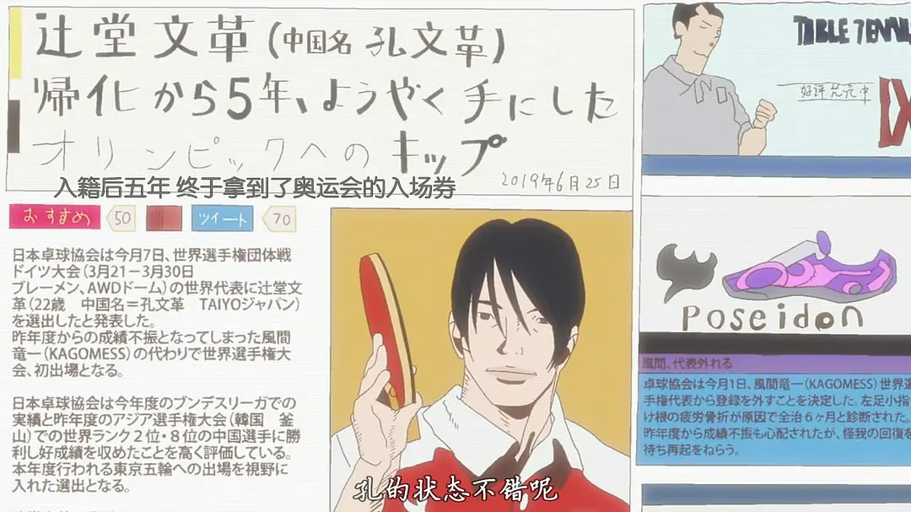

*我也好想再去一次江之岛啊。*

上下班抽空看的，但是不妨碍感受深。这部番是我今年，甚至取代了近几年的megalobox2，成为了我最喜欢的运动番。

> "看似乒乓，实则人生。"

（**剧透警告**！！！！）

这部番讲的故事非常简单，和大部分的运动番的设定一样，有一个青少年职业赛，一群热血的少年在里面搏杀，最后的人夺得冠军。

但是这番不太一样是，他是一部群像番，他对每个主要参赛的选手都刻画了非常立体的性格，然后把他们放到一个世界中，感觉就像真实发生过的一样，但是动漫的分镜和线条又给了它无与伦比的戏剧张力。我特别喜欢这种塑造一个完整世界感的作品。（虽然这个世界在《乒乓》这部作品中相对小）

**这部剧很现实**。

虽然乒乓互杀的时候会有艺术的加工。剧中的所有的剧情都是按照设定的战力来的，你上场，能不能赢，完全就是靠天赋 + 汗水，假设你练少了，输，练多了但是没天赋，一样输。就那我最能感同身受的孔文革举例吧。

孔爷在这部剧里的设定就是年少苦练乒乓球的少年天才，但是距离星野的天赋还是有一定距离的选手。

所以在开局，他和星野的第一战，他毫无保留地秒杀了还没有刻苦训练的星野。但是在之后和比他天分高，但是有比他加倍努力的风间比赛时，他能感受到一种即使自己再努力，也无法挽回的局面。这，就是竞技项目的残酷。

因此，这部剧的很多笔墨是放在败者的心态上的，看他们会怎么在失败中调整心态，迎接之后的人生。

随后与星野的第二场比赛，孔彻底释怀了，他在失败中看清了自己的道路。他有爱他的妈妈，懂他的教练，有他半生不熟但是渐渐打上交道的队友们。他知道他输了这场比赛也许会回不了祖国，但绝对不是他的终点。

Akuma，甚至风间这几个属于天才级别的选手都选择在之后的人生中离开了乒乓的主线，但是孔文革，也许是为了他的梦想，在最终并没有选择放弃竞技乒乓，他咬住牙关继续了，并且获得了奥运会的门票。这也许就是我们很多人心里都有的傲气的展现吧 -- 那份年少时曾经为了成王的傲气。年长后输过，但是依然傲气不减，反是多了份沉稳的心气 -- 对成王不再执着，为了发挥出自己全部实力而打球的样子，只是为了不辜负年少时的自己。这就是孔。

其他所有选手的心理和设定都有类似孔爷一样的交代，比如akuma，看海哥，教练，风间。。他们独有自己的背景故事，也讲述了每个人人生中所承担的东西，月本的胆小，风间的责任，星野的颓废，akuma的绝望。所以在这部动漫里，虽然只有11集，但是你能看到每个角色在里面都有模有样地通过一些场景刻画了性格，并且毫不突兀。每个角色反映到现实里，其实都倒映成了自己的影子。

**这部剧有互相救赎**。我称Akuma为救赎的王，开导的神。

Akuma在输球给星野后清晰地意识到了自己和星野的天赋和热爱的差距 -- 星野超过他太多了。他一把把颓废的星野拉了回来，因为Akuma清晰地知道，乒乓对于星野来说是星光大道，他既有几近痴狂的热爱，又有孔都难以企及的天赋。他只要继续努力一下，绝对能在其中找到人生的意义。

他也知道风间背负了太多，他魔鬼般的训练完全不是为了自己，而是为了团队和家庭，某些巨型意识形态的脸面。但是akuma看的出来风间这样做，自己心里始终放不下自己丢脸的那一刻。而他经历过失败，经历过心里被天赋选手彻底撕碎的绝望。他知道龙一其实就是难以释怀有一个和他一样的天才出现而已。正是因为如此，风间需要一个选手来打败自己。

而之后风间也被hero击败了，得到了救赎。

人生中总是充满了努力和天赋的选择。对每个人来说，至少每个人都经历过考试吧。考试就是一项有输有赢的竞技。有人会发扬自己的天赋，有人会因为喜欢而坚持，有人会去看海，有人。。只是会去干除了乒乓球以外的事情，而无论你选择了什么，只要称心如意，那就是正确的。这部番之所以让人共情，就是在告诉每个人都经历的过的，在不可避免的竞技中受到的挫折中，你应该活出怎么样的属于自己的一生。

答案也许就是op中的歌词一样吧，不论是因为责任，童年，爱的家人，还是就是纯粹的喜爱，我都要**永远做让自己舒服的事**！（现实中应该不太会，番剧感动一下就好了）

总的来说，这部番的完成度太高了，是一个浪漫和现实夹杂的艺术品。光立意就很丰富，更别说他炫技一般的分镜了。

**神中神**。